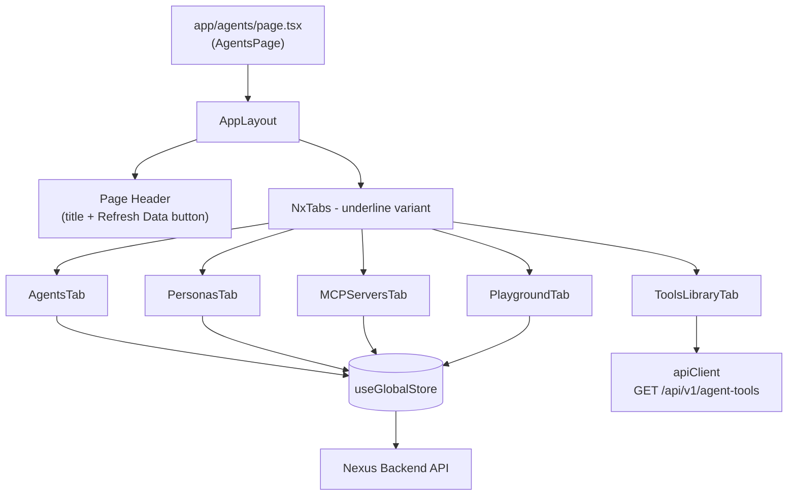
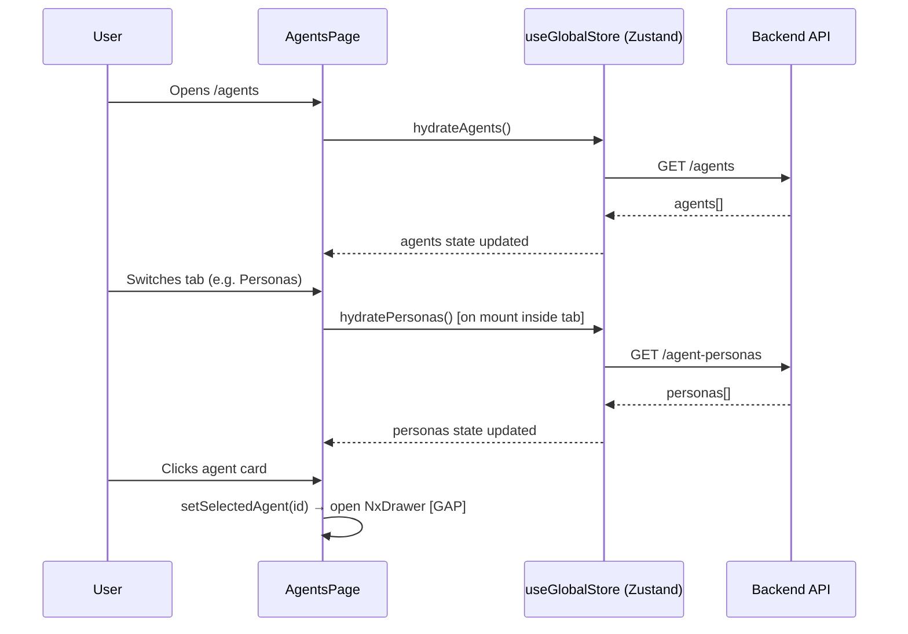

# Design Document: Agents Hub

## Overview

AgentsHub is the central administration interface for managing AI agents in the Nexus system. It is implemented as a Next.js page at `app/agents/page.tsx` and is composed of five tabbed panels — Agents, Personas, Tools, MCP Servers, and Playground — each backed by the global Zustand store (`useGlobalStore`) and a shared component library (the `Nx*` component family).

The feature is largely implemented. This document captures the existing architecture faithfully, identifies the four gaps that remain against the requirements, and specifies the targeted additions required to close them.

---

## Architecture

### High-Level Component Tree



### Data Flow



---

## Components and Interfaces

### AgentsPage (`app/agents/page.tsx`)

**Purpose**: Root page shell. Renders `AppLayout`, the page header, and the tab switcher. Calls `hydrateAgents()` on mount.

**Interface**:
```typescript
// Internal state
const [activeTab, setActiveTab] = useState<string>('agents')

// Tab definitions
const tabs = [
  { id: 'agents',      label: 'Agents',      icon: <Cpu /> },
  { id: 'personas',    label: 'Personas',    icon: <Settings2 /> },
  { id: 'tools',       label: 'Tools',       icon: <Wrench /> },
  { id: 'mcp-servers', label: 'MCP Servers', icon: <Network /> },
  { id: 'playground',  label: 'Playground',  icon: <Terminal /> },
]
```

**Responsibilities**:
- Mount-time data hydration via `hydrateAgents()`
- Tab state management (`activeTab`)
- Routing `onSelectAgent` callback from `AgentsTab` (currently a no-op — see Gap 1)
- Rendering the global "Refresh Data" button

---

### AgentsTab (`app/agents/components/AgentsTab.tsx`)

**Purpose**: Displays the fleet stats panel and the responsive agent card grid.

**Current interface**:
```typescript
interface AgentsTabProps {
  onSelectAgent: (id: string) => void
}
```

**Rendered sections**:
1. Stats panel — three metric cards (Active Agents, Total Executions, Quarantined)
2. Agent grid — `NxAgentCard` components; empty state with "Sync Registry" button

**Gap 1 — Agent Detail Drawer (missing)**: Clicking a card currently calls `onSelectAgent(id)` with no downstream handler. The requirements mandate opening an `NxDrawer` for inline editing of: name, temperature, max tokens, guidelines/system prompt, and persona assignment, plus a "Reset to Defaults" action.

**Gap 2 — Quarantine Action (missing)**: No quarantine button exists on agent cards or in the drawer. The requirements mandate a quarantine trigger calling `POST /agents/{id}/quarantine` via `store.quarantineAgent(id, reason)`.

**Required additions**:
```typescript
// New local state inside AgentsTab
const [selectedAgentId, setSelectedAgentId] = useState<string | null>(null)
const [isDrawerOpen, setIsDrawerOpen]       = useState(false)

// Drawer form state
interface AgentEditForm {
  name: string
  temperature: number
  max_tokens: number
  guidelines: string        // maps to Agent.guidelines (new field — see Gap 4)
  persona_id: string | null
}
```

**Agent detail drawer layout**:
- `NxDrawer` with `side="right"` and `size="lg"`
- Fields: Name (text), Temperature (number 0–2), Max Tokens (number), Guidelines/System Prompt (textarea), Persona Assignment (select from `personas[]`)
- Footer actions: "Save Changes" (calls a new `updateAgent(id, data)` store action), "Reset to Defaults", "Quarantine Agent"

---

### PersonasTab (`app/agents/components/PersonasTab.tsx`)

**Purpose**: Lists personas as cards and provides an inline creation form.

**Current interface**: No props. Reads `personas`, `loading.personas` from store.

**Implemented**:
- `hydratePersonas()` on mount
- Inline creation form (name, description, temperature, max_tokens, reasoning_effort, system_prompt)
- Delete via hover icon → `deletePersona(id)`

**Gap 3 — Edit persona (missing)**: The edit icon (`Edit2` is imported but not rendered). Clicking an edit icon should pre-fill the existing creation form with the selected persona's values and switch the form into "update" mode, submitting via `updatePersona(id, data)`.

**Required additions**:
```typescript
// New local state
const [editingPersona, setEditingPersona] = useState<AgentPersona | null>(null)

// Modified handleSubmit logic
if (editingPersona) {
  await updatePersona(editingPersona.id, formData)
  setEditingPersona(null)
} else {
  await createPersona(formData)
}

// Edit icon rendered on persona card (alongside existing delete icon)
<button onClick={() => { setEditingPersona(persona); setIsCreating(true) }}>
  <Edit2 className="w-4 h-4" />
</button>
```

---

### MCPServersTab (`app/agents/components/MCPServersTab.tsx`)

**Purpose**: Displays registered MCP servers and provides inline registration, connect/disconnect, and delete.

**Current interface**: No props. Reads `mcpServers`, `loading.mcpServers` from store.

**Fully implemented per requirements**:
- `hydrateMCPServers()` on mount
- Inline form: Server Identifier, Server Type (local/remote), Connection Config (JSON textarea with type-specific hints)
- JSON validation with `alert()` on parse failure
- Server cards: identifier, type badge, online/offline status indicator, raw config preview
- Connect → `connectMCPServer(name)`, Disconnect → `disconnectMCPServer(name)`, Delete → `deleteMCPServer(id)`

No gaps in this tab.

---

### ToolsLibraryTab (`app/agents/components/ToolsLibraryTab.tsx`)

**Purpose**: Fetches and displays all available tools as a responsive card grid.

**Current interface**: No props. Uses local state (not the global store).

**Data fetching**:
```typescript
// Direct apiClient call — intentionally bypasses the store
const res = await apiClient.get('/api/v1/agent-tools')
setTools(res.data.data)
```

**Fully implemented per requirements**:
- Loading spinner
- Empty state
- Responsive grid: `grid-cols-1 md:grid-cols-2 xl:grid-cols-3`
- Tool cards: name, category badge, description (3-line clamp), optional config schema JSON

No gaps in this tab.

---

### PlaygroundTab (`app/agents/components/PlaygroundTab.tsx`)

**Purpose**: Interactive sandbox for running or simulating an agent against a custom prompt.

**Current interface**: No props. Reads `agents` and store actions from `useGlobalStore`.

**Layout**: Two-panel — settings (1/3 width) + execution output (2/3 width).

**Fully implemented per requirements**:
- Target Agent selector (`NxSelect`, populated from `agents[]`)
- Task Prompt textarea
- "Simulate Execution" → `simulateAgent(id, payload)` + `fetchAgentStatus(id)`
- "Run Real Execution" → `runAgent(id, payload)` + `fetchAgentStatus(id)`
- Both buttons disabled when no agent selected or prompt empty
- Shared `isSimulating` state disables the idle button during execution
- Log entries: type label, timestamp, JSON body; error entries have red styling, success entries have blue tint
- "Waiting for execution..." placeholder when logs are empty

No gaps in this tab.

---

## Data Models

### Agent (store)

```typescript
interface Agent {
  id: string
  name: string
  role: string                                          // mapped from type_label || type
  status: 'online' | 'busy' | 'offline' | 'error'
  tokenUsage: number                                    // mapped from execution_count
  model: string                                         // mapped from settings.ai_model_id
  temperature: number
  memorySync: boolean
  capabilities: string[]
  assignedTasks: string[]
  // GAP 4 — field does not yet exist:
  guidelines?: string                                   // custom system prompt / instructions
}
```

### AgentPersona (store)

```typescript
interface AgentPersona {
  id: string
  name: string
  description: string
  system_prompt: string
  temperature?: number
  max_tokens?: number
  reasoning_effort?: string                             // 'low' | 'medium' | 'high'
  tone_preferences?: Record<string, any>
  created_at?: string
  updated_at?: string
}
```

### MCPServer (store)

```typescript
interface MCPServer {
  id: string
  name: string
  type: 'local' | 'remote'
  status: 'online' | 'offline' | 'error' | 'connected' | 'disconnected'
  connection_config: Record<string, any>
  created_at?: string
  updated_at?: string
}
```

### AgentTool (local ToolsLibraryTab state — not in global store)

```typescript
interface AgentTool {
  id: string
  name: string
  category: string
  description: string
  config?: Record<string, any>
}
```

---

## API Endpoints

| Method | Path | Store Action | Used By |
|--------|------|-------------|---------|
| GET | `/agents` | `hydrateAgents()` | AgentsTab (via page mount) |
| POST | `/agents/{id}/quarantine` | `quarantineAgent(id, reason)` | AgentsTab drawer (GAP 2) |
| GET | `/agent-personas` | `hydratePersonas()` | PersonasTab |
| POST | `/agent-personas` | `createPersona(data)` | PersonasTab |
| PUT | `/agent-personas/{id}` | `updatePersona(id, data)` | PersonasTab (GAP 3) |
| DELETE | `/agent-personas/{id}` | `deletePersona(id)` | PersonasTab |
| GET | `/api/v1/agent-tools` | Direct `apiClient.get()` | ToolsLibraryTab |
| GET | `/mcp-servers` (inferred) | `hydrateMCPServers()` | MCPServersTab |
| POST | `/mcp-servers` (inferred) | `createMCPServer(data)` | MCPServersTab |
| DELETE | `/mcp-servers/{id}` (inferred) | `deleteMCPServer(id)` | MCPServersTab |
| POST | `/mcp-servers/{name}/connect` (inferred) | `connectMCPServer(name)` | MCPServersTab |
| POST | `/mcp-servers/{name}/disconnect` (inferred) | `disconnectMCPServer(name)` | MCPServersTab |
| POST | `/agents/{id}/simulate` (inferred) | `simulateAgent(id, payload)` | PlaygroundTab |
| POST | `/agents/{id}/run` (inferred) | `runAgent(id, payload)` | PlaygroundTab |
| GET | `/agents/{id}/status` (inferred) | `fetchAgentStatus(id)` | PlaygroundTab |

---

## Gap Analysis and Closure Plan

Four gaps exist between the current implementation and the requirements. All are contained to `AgentsTab`, `PersonasTab`, and `store/index.ts`.

### Gap 1: Agent Detail Drawer (Req 1, criteria 8–9)

**What is missing**: `AgentsTab` has no drawer. Clicking a card calls `onSelectAgent(id)` but `AgentsPage` passes a no-op handler.

**How to close**:
1. Add local state to `AgentsTab`: `selectedAgentId`, `isDrawerOpen`, `editForm` (name, temperature, max_tokens, guidelines, persona_id).
2. On card click, populate `editForm` from the selected agent and open the `NxDrawer`.
3. The drawer form submits via a new `updateAgent(id, data)` store action (PUT `/agents/{id}`).
4. "Reset to Defaults" calls a new `resetAgentDefaults(id)` action or re-fetches the agent from the API.
5. The `AgentsPage` `onSelectAgent` prop can be removed or repurposed for Playground pre-selection.

### Gap 2: Quarantine Action (Req 1, criterion 10)

**What is missing**: No UI trigger for `quarantineAgent(id, reason)`.

**How to close**:
1. Add a "Quarantine" button to the agent detail drawer (Gap 1 drawer footer).
2. On click, show a confirmation prompt or inline reason field, then call `quarantineAgent(id, reason)`.
3. The store action calls `POST /agents/{id}/quarantine` and sets the agent's `status` to `'error'` optimistically.
4. `NxAgentCard` already renders a red `NxStatusBadge` for `status === 'error'` — no card changes needed.

### Gap 3: Persona Edit (Req 2, criterion 10)

**What is missing**: `PersonasTab` imports `Edit2` but never renders it. `updatePersona()` exists in the store but is never called.

**How to close**:
1. Add `editingPersona: AgentPersona | null` to local state.
2. Render the `Edit2` icon alongside the existing `Trash2` icon in the card hover actions.
3. On edit click: `setEditingPersona(persona)`, populate `formData` with persona values, `setIsCreating(true)`.
4. Update the form header to read "Edit Persona" when `editingPersona !== null`.
5. Update `handleSubmit` to branch: if `editingPersona` → call `updatePersona(editingPersona.id, formData)`, else call `createPersona(formData)`.
6. On cancel, clear `editingPersona` as well as collapsing the form.

### Gap 4: Agent `guidelines` Field (Req 1, criterion 8)

**What is missing**: The `Agent` interface in `store/index.ts` has no `guidelines` (custom system prompt) field. The drawer form (Gap 1) requires it.

**How to close**:
1. Add `guidelines?: string` to the `Agent` interface in `store/index.ts`.
2. Map it from the backend response in `hydrateAgents()` (e.g. from `a.settings?.guidelines` or equivalent backend field).
3. Include `guidelines` in the PUT payload sent by the drawer's save handler.

---

## Shared Component Contracts

### NxDrawer

```typescript
interface NxDrawerProps {
  isOpen: boolean
  onClose: () => void
  title?: React.ReactNode
  children: React.ReactNode
  side?: 'left' | 'right'           // default: 'right'
  size?: 'sm' | 'md' | 'lg' | 'xl' // default: 'md'
  className?: string
}
```

Behaviour: locks body scroll when open, renders a backdrop overlay that calls `onClose` on click, slides in from the configured side with `animate-in` transitions.

Recommended size for the agent edit drawer: `size="lg"` (`max-w-md`).

### NxAgentCard

```typescript
interface NxAgentCardProps {
  id: string
  name: string
  role: string
  status: 'online' | 'busy' | 'offline' | 'error'
  tokenUsage?: number
  className?: string
  onClick?: (id: string) => void
}
```

Status → badge variant mapping (already implemented in card):
- `online` → `success` (green pulse)
- `busy` → `warning` (amber pulse)
- `offline` → `neutral` (gray)
- `error` → `danger` (red) — also used for quarantine state

---

## Error Handling

### AgentsTab

| Scenario | Response |
|----------|----------|
| `hydrateAgents()` fails | Store calls `addNotification('error', ...)`. Grid shows previously-loaded state or empty state. |
| `quarantineAgent()` fails | Optimistic status update is rolled back; error notification shown. |
| `updateAgent()` fails | Drawer stays open; error notification shown; field values preserved. |

### PersonasTab

| Scenario | Response |
|----------|----------|
| `createPersona()` / `updatePersona()` fails | Form stays open; error notification shown. |
| `deletePersona()` fails | Card is restored; error notification shown. |

### MCPServersTab

| Scenario | Response |
|----------|----------|
| Invalid JSON in connection config | Caught in `handleSubmit` via `JSON.parse()`, `alert('Invalid JSON format in connection config.')` shown. |
| `connectMCPServer()` / `disconnectMCPServer()` fails | Error notification from store. |

### PlaygroundTab

| Scenario | Response |
|----------|----------|
| `simulateAgent()` / `runAgent()` throws | Error appended to `logs` as `{ type: 'error', error: String(e) }` with red styling. |
| No agent selected or empty prompt | Buttons are `disabled` — action cannot be triggered. |

---

## Testing Strategy

### Unit Testing

Each tab component should be tested in isolation using React Testing Library with a mocked `useGlobalStore`.

Key unit test cases:
- `AgentsTab` renders stat panel values derived from the agents array
- `AgentsTab` empty state renders "Sync Registry" button when `agents.length === 0`
- `AgentsTab` drawer opens on card click (once Gap 1 is implemented)
- `PersonasTab` form validation — submit disabled when name or system_prompt is empty
- `PersonasTab` edit mode pre-fills form fields from selected persona (Gap 3)
- `MCPServersTab` shows JSON validation error for malformed config
- `PlaygroundTab` Simulate and Run buttons are disabled when agent or prompt is missing
- `PlaygroundTab` error log entry has red styling; success entry has blue styling

### Property-Based Testing

**Property test library**: fast-check

Properties worth encoding:
- For any array of agents, the stats panel active count must satisfy: `activeCount <= agents.length`
- For any array of agents, quarantined count must equal the count of agents with `status === 'error'`
- For any non-empty string `system_prompt` and non-empty `name`, persona form submission must not be blocked
- Temperature values outside `[0, 2]` must be rejected by the persona form inputs

### Integration Testing

- Page-level smoke test: `/agents` renders without crashing, `hydrateAgents()` is called once on mount
- Tab switching renders each tab's content without errors
- Full create → display → delete flow for personas (requires backend mock or MSW handler)
- Full register → connect → disconnect → delete flow for MCP servers

---

## Performance Considerations

- `ToolsLibraryTab` fetches directly from `apiClient` rather than the global store. This means it re-fetches every time the tab is mounted (tab switch). If the tool list is large or the tab is frequently revisited, the tools data should be migrated into the global store with a loading key to benefit from caching.
- The agent card grid can render up to N agent cards with Framer Motion `whileHover` animations. For fleets with > 50 agents, a virtualised list (e.g. `react-window`) should be considered to prevent layout thrashing.
- Each tab hydrates its own data on mount. The global "Refresh Data" button only calls `hydrateAgents()`, not all slices. A full refresh handler should call all hydrate actions in parallel.

---

## Security Considerations

- The quarantine action (`POST /agents/{id}/quarantine`) is a destructive, emergency operation. The UI should require a confirmation before dispatching (e.g. an inline confirmation prompt inside the drawer).
- Connection configs for MCP servers are stored as raw JSON. Secrets (API keys, tokens) embedded in `connection_config` must not be echoed back in plain text in the card UI. A masking strategy (e.g. showing `"***"` for string fields matching key patterns like `token`, `key`, `secret`) should be applied to the JSON preview.
- All API calls are routed through `apiClient`, which should attach the authenticated session token automatically. No credentials are managed at the component level.

---

## Correctness Properties

These properties define invariants that must hold regardless of the data or user action in question. They are suitable targets for property-based tests (using **fast-check**) and for assertions in unit tests.

### Property 1: Stats panel active count never exceeds total agents

**Validates: Requirements 1.4**

```typescript
// For all non-empty agents arrays:
fc.assert(
  fc.property(fc.array(agentArbitrary, { minLength: 0, maxLength: 200 }), (agents) => {
    const active = agents.filter(a => a.status === 'online' || a.status === 'busy').length
    return active <= agents.length
  })
)
```

### Property 2: Quarantined count equals agents with status 'error'

**Validates: Requirements 1.4**

```typescript
fc.assert(
  fc.property(fc.array(agentArbitrary), (agents) => {
    const quarantined = agents.filter(a => a.status === 'error').length
    const derived = computeQuarantinedCount(agents)
    return quarantined === derived
  })
)
```

### Property 3: Persona form is blocked when name or system_prompt is empty

**Validates: Requirements 2.4**

```typescript
// For any combination of blank/non-blank name and system_prompt:
fc.assert(
  fc.property(
    fc.string(),   // name — may be empty
    fc.string(),   // system_prompt — may be empty
    (name, system_prompt) => {
      const canSubmit = name.trim().length > 0 && system_prompt.trim().length > 0
      const formResult = validatePersonaForm({ name, system_prompt })
      return canSubmit === formResult.valid
    }
  )
)
```

### Property 4: Temperature values outside [0, 2] must be rejected

**Validates: Requirements 2.4**

```typescript
fc.assert(
  fc.property(
    fc.oneof(
      fc.float({ min: -100, max: -0.01 }),   // below range
      fc.float({ min: 2.01, max: 100 })      // above range
    ),
    (temperature) => {
      const result = validateTemperature(temperature)
      return result.valid === false
    }
  )
)
```

### Property 5: Playground action buttons are disabled unless agent and prompt are both set

**Validates: Requirements 5.4**

```typescript
// For all combinations of selectedAgentId and taskInput:
fc.assert(
  fc.property(
    fc.option(fc.uuid()),   // selectedAgentId — null or a valid id
    fc.string(),            // taskInput — may be empty
    (agentId, taskInput) => {
      const shouldBeEnabled = agentId !== null && taskInput.trim().length > 0
      const buttonsEnabled = arePlaygroundButtonsEnabled(agentId, taskInput)
      return buttonsEnabled === shouldBeEnabled
    }
  )
)
```

### E1 — Drawer opens when a valid agent card is clicked (example)

When `AgentsTab` receives an agents array with at least one item and the user clicks a card, the `NxDrawer` must be rendered with `isOpen={true}` and the selected agent's id must match the clicked card's id.

### E2 — Error log entries render with red styling (example)

When a log entry has `type === 'error'`, the rendered container must include the `bg-red-500/10` and `border-red-500/20` CSS classes. All other entry types must include `bg-nexus-blue/5` and `border-nexus-blue/20`.

---

## Dependencies

| Package | Purpose |
|---------|---------|
| `zustand` | Global state management (`useGlobalStore`) |
| `axios` (via `apiClient`) | HTTP client for all backend API calls |
| `motion/react` (Framer Motion) | Card hover animations in `NxAgentCard` |
| `lucide-react` | Icon set used throughout all tab components |
| `tailwindcss` | Utility-first styling |
| `next` (App Router) | Page routing and server/client component model |

All shared UI components (`NxDrawer`, `NxAgentCard`, `NxGlassCard`, `NxActionButton`, `NxTabs`, `NxSelect`, `NxInput`, `NxEmptyState`, `NxStatusBadge`, `AppLayout`) are available in `components/` and require no new dependencies.
