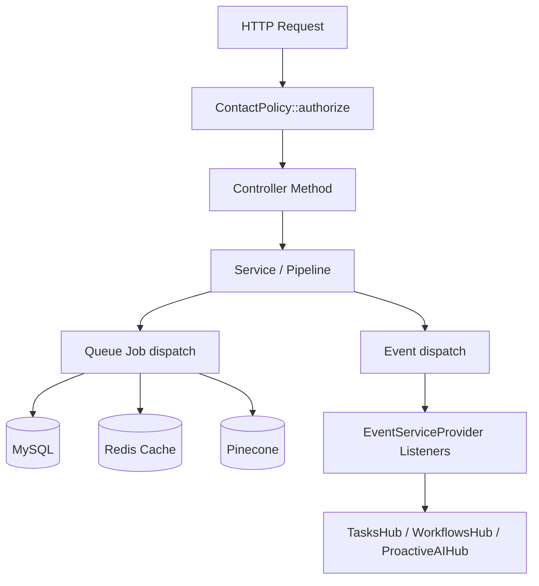

# ContactHub Complete Implementation — Design

## Overview

This document is the technical design for the `contact-hub-complete` spec, which brings the
Nexus ContactHub from ~35% completion to a production-ready feature set across two codebases:

- **Nexus-backend** — Laravel 11, PHP 8.2, located at `Nexus-backend/`
- **Nexus-Frontend** — Next.js 14, TypeScript, located at `Nexus-Frontend/`

The work spans 18 requirements covering: critical bug fixes, an asynchronous import pipeline,
WhatsApp/Facebook message views, AI analysis with evidence-backed findings and a review UI,
global and per-contact memory maintenance, hub event wiring, authorization policies, privacy
operations, Contact360 intelligence panels, relationship graph visualization, and production
hardening.

### Design Principles

1. **Fix before build** — All critical bugs (clone fatal error, hardcoded URLs, mock data
   fallback, route conflicts) are resolved in Phase 1 before new features are layered on top.
2. **Async by default** — Import, analysis, maintenance, export, and erase operations are
   always dispatched to the Laravel queue and never block the HTTP request cycle.
3. **Evidence everywhere** — Every AI-derived fact carries `evidence_references`,
   `source_message_ids`, `confidence_score`, and `last_validated_at`. No fabricated data.
4. **Single API client** — All frontend components use `apiClient` from `@/lib/api/client`.
   No raw `fetch()` calls, no hardcoded hostnames.
5. **Policy-first** — Every ContactHub route is gated by `ContactPolicy` before processing.

---

## Architecture

### Backend Architecture

The backend follows the existing Nexus layered architecture:

```
Routes (api.php)
  └── Controllers (app/Http/Controllers/)
        └── Services (app/Services/Contact/)
              └── Jobs (app/Jobs/)
                    └── Models / Eloquent
```

ContactHub-specific classes live in `app/Services/Contact/`. Cross-cutting services
(`ContactAuditService`, `ContactPrivacyService`, `ContactAnalyticsService`,
`ContactStatsService`, `ContactReplyModeService`) live in `app/Services/` directly.

Authorization is handled via `app/Policies/ContactPolicy.php`, registered in
`AuthServiceProvider`. Rate limiting is applied via named middleware in `api.php`.

Events in `app/Events/` are dispatched at service/job boundaries and mapped to listeners
in `EventServiceProvider`. All long-running work goes through named queue jobs in
`app/Jobs/`.



## Components and Interfaces

### Backend Components

#### Phase 1 Bug Fixes (Req 2, 5)

**`ContactImportController::importMessages()` — clone bug fix**

The line:
```php
clone $result['batch']->messages()->count()
```
must be replaced with:
```php
$result['batch']->messages()->count()
```
`clone` applies to objects, not integers. This is a PHP fatal error on every import commit.

**Zero-byte route files — deletion**

Files `routes/ContactImportController.php` and `routes/ContactMessage.php` are empty and
must be deleted. They are not valid route files and will break the routes bootstrap.

**Route conflict — erase**

The current `api.php` registers both:
```php
Route::delete('/contacts/{id}/erase', ...);
Route::post('/contacts/{id}/erase', ...);
```
The `DELETE` variant conflicts with `Route::apiResource`'s own `DELETE /contacts/{id}`.
The `DELETE` variant is removed; only `POST /contacts/{id}/erase` is kept.

**`ContactIntelligenceExtractionPipeline` — mock data fallback removal**

The catch block that writes fabricated findings when the AI gateway fails must be replaced
with a proper failure path: update run status to `failed`, set `error_message`, dispatch
no findings. See service design below.

**`contact_analysis_runs` migration — `error_message` column**

A new migration adds:
```php
$table->text('error_message')->nullable()->after('completed_at');
```

**`ContactController::messages()` — cache key whitelist**

The cache key is currently `md5(json_encode($request->query()))` — unbounded. It must be:
```php
$allowedParams = ['channel', 'search', 'page', 'per_page', 'date_from', 'date_to'];
$cacheKey = "contact_{$id}_messages_" . md5(json_encode(
    array_intersect_key($request->query(), array_flip($allowedParams))
));
```
Additionally, when a new import batch is committed for a contact, the cache for that
contact's messages is explicitly invalidated:
```php
Cache::forget("contact_{$id}_messages_*"); // pattern delete via Redis SCAN
```

#### New Standalone Services (Req 6, 9, 13)

**`ContactImportPreviewService`** — `app/Services/Contact/ContactImportPreviewService.php`

Extracted from `ContactImportPipeline::preview()`. Injectable, independently testable.
Parses import content in memory (using the existing `WhatsAppImportParser`,
`FacebookImportParser`, `ContactMessageNormalizer`) and returns a preview array with no
DB writes. Takes `Contact`, `string $source`, `string $content`, `string $format`,
`string $timezone`.

**`ContactImportRollbackService`** — `app/Services/Contact/ContactImportRollbackService.php`

Extracted from `ContactImportPipeline::rollback()`. Wraps the rollback in a DB transaction.
Deletes all messages for a given `ContactImportBatch`, sets status to `rolled_back`, and
dispatches a `ContactImportCompleted` event with outcome `rolled_back`. Takes
`ContactImportBatch $batch`. Independently testable.

**Global scope in `ContactMemoryMaintenancePipeline`**

The `else { throw new Exception("Global maintenance runs are currently disabled.") }` block
is replaced with a full implementation that queries all contacts (or a scoped subset based
on `scope['filter']`) and applies the requested operation to each within a DB transaction:

```php
} else {
    // Global scope: query contacts based on scope filter
    $query = Contact::query();
    if (($scope['filter'] ?? 'all') === 'stale') {
        $query->where('memory_freshness', '<', now()->subDays(30));
    } elseif (($scope['filter'] ?? 'all') === 'conflicted') {
        $query->whereHas('identityConflicts');
    }
    DB::transaction(function () use ($query, $operation, $isDryRun, &$results) {
        $query->chunkById(100, function ($contacts) use ($operation, $isDryRun, &$results) {
            foreach ($contacts as $contact) {
                // apply operation per contact with per-contact error tracking
            }
        });
    });
}
```

#### New Queue Jobs (Req 6, 9, 12, 13)

All new jobs extend `App\Jobs\BaseJob` and are dispatched to the named `contacts` queue.

| Class | Queue | Description |
|---|---|---|
| `ImportContactMessagesJob` | contacts | Calls `ContactImportPipeline::commit()` for a pre-created batch |
| `NormalizeContactImportBatchJob` | contacts | Deduplication pass on a committed batch |
| `ResolveContactImportIdentitiesJob` | contacts | Identity resolution for imported participants |
| `RollbackContactImportBatchJob` | contacts | Delegates to `ContactImportRollbackService` |
| `ExportContactDataJob` | contacts-privacy | Builds export archive, stores in S3/local disk, writes download URL to audit record |
| `EraseContactDataJob` | contacts-privacy | Deletes messages/memories/identifiers/vectors within a transaction, writes audit tombstone |
| `RebuildContactMemoryJob` | contacts-maintenance | Rebuilds contact memory from source messages |
| `RecomputeContactEmbeddingsJob` | contacts-maintenance | Re-vectorizes memories via Pinecone |
| `DetectContactMemoryConflictsJob` | contacts-maintenance | Detects conflicting fact values |
| `RecalculateContactBaselineJob` | contacts-maintenance | Recalculates emotional baseline from findings |
| `PruneContactMemoryJob` | contacts-maintenance | Prunes low-confidence stale memories |

Each job implements `failed(Throwable $e)` to update the associated run record status to
`failed` and write a `ContactAuditEvent` record with the exception message.

**`ImportContactMessagesJob` — async contract**

`ContactImportController::importWhatsApp()` and `::importFacebook()` no longer call
`$this->importPipeline->commit()` directly. Instead:

```php
// 1. Create batch record immediately
$batch = ContactImportBatch::create([
    'contact_id' => $contact->id,
    'source' => $source,
    'status' => 'queued',
    'total_records' => 0,
    'imported_records' => 0,
]);

// 2. Dispatch job
ImportContactMessagesJob::dispatch($batch, $content, $format, $timezone);

// 3. Dispatch start event
event(new ContactImportStarted($contact, $batch));

// 4. Return 202 with batch ID
return response()->json(['data' => ['batch_id' => $batch->id, 'status' => 'queued']], 202);
```

**File size limit (Req 6.6, 12.5)**

Added to `importWhatsApp()` and `importFacebook()` validation:
```php
'file' => ['nullable', 'file', 'max:51200'], // 50 MB in kilobytes
```
Returns HTTP 422 if exceeded.

#### Authorization — `ContactPolicy` (Req 12)

New file: `app/Policies/ContactPolicy.php`

```php
namespace App\Policies;

use App\Models\Contact;
use App\Models\User;

class ContactPolicy
{
    public function viewAny(User $user): bool  { return true; }
    public function view(User $user, Contact $contact): bool { return true; }
    public function create(User $user): bool { return true; }
    public function update(User $user, Contact $contact): bool { return true; }
    public function delete(User $user, Contact $contact): bool { return $user->hasRole('admin') || $user->id === $contact->user_id; }
    public function importMessages(User $user): bool { return true; }
    public function runAnalysis(User $user): bool { return true; }
    public function applyAnalysis(User $user, Contact $contact): bool { return true; }
    public function runMaintenance(User $user): bool { return $user->hasRole('admin') || $user->hasRole('manager'); }
    public function export(User $user, Contact $contact): bool { return true; }
    public function erase(User $user, Contact $contact): bool { return $user->hasRole('admin'); }
}
```

Registered in `AuthServiceProvider`:
```php
protected $policies = [
    \App\Models\Contact::class => \App\Policies\ContactPolicy::class,
];
```

Every ContactHub controller method calls `$this->authorize(action, $contact)` at the top.

#### Rate Limiting (Req 8.9, 12.3, 12.4)

In `api.php`, updated route middleware:
```php
Route::post('/contacts/import/whatsapp', ...)->middleware('throttle:5,1');
Route::post('/contacts/import/facebook', ...)->middleware('throttle:5,1');
Route::post('/contacts/{id}/analysis-runs', ...)->middleware('throttle:10,1');
```

For the analysis batch endpoint (per-user, not per-IP), a custom `RateLimiter` definition
in `AppServiceProvider::boot()`:
```php
RateLimiter::for('analysis', function (Request $request) {
    return Limit::perMinute(10)->by($request->user()?->id ?: $request->ip());
});
```

#### Hub Event System (Req 11)

**New event classes** (in `app/Events/`):

| Event Class | Payload |
|---|---|
| `ContactImportStarted` | `Contact $contact, ContactImportBatch $batch` |
| `ContactMemoryMaintenanceStarted` | `ContactMemoryMaintenanceRun $run, ?Contact $contact` |
| `ContactMemoryMaintenanceCompleted` | `ContactMemoryMaintenanceRun $run, ?Contact $contact` |
| `ContactReplyModeChanged` | `Contact $contact, string $previousMode, string $newMode, int $actorId` |
| `ContactMessageImported` | `Contact $contact, ContactMessage $message` |
| `ContactIdentityConflictDetected` | `Contact $contact, array $conflictingContactIds` |

Events `ContactImportCompleted` and `ContactAnalysisCompleted` already exist.

**`EventServiceProvider::$listen` additions**:

```php
ContactImportCompleted::class => [
    \App\Listeners\CreateContactImportCompletedTask::class,
    \App\Listeners\TriggerContactWorkflows::class,
],
ContactAnalysisCompleted::class => [
    \App\Listeners\NotifyContactAnalysisComplete::class,
],
ContactIdentityConflictDetected::class => [
    \App\Listeners\CreateIdentityConflictTask::class,
],
ContactReplyModeChanged::class => [
    \App\Listeners\LogReplyModeChange::class,
],
```

Each listener is a thin wrapper that creates a Task in TasksHub or updates a log entry,
keeping ContactHub decoupled from downstream hub internals.

#### Missing Backend Routes (Req 10)

All routes added to `api.php` in the protected group before `Route::apiResource('contacts')`:

```php
// Analytics & Operational routes (Req 10.1-10.3)
Route::get('/contacts/analytics', [\App\Http\Controllers\ContactController::class, 'hubAnalytics'])
    ->name('contacts.hub-analytics');
Route::get('/contacts/conflicts', [\App\Http\Controllers\ContactController::class, 'conflicts'])
    ->name('contacts.conflicts');
Route::get('/contacts/stale-memory', [\App\Http\Controllers\ContactController::class, 'staleMemory'])
    ->name('contacts.stale-memory');

// Per-contact memory maintenance run history (Req 9.7)
Route::get('/contacts/{id}/memory-maintenance/runs',
    [\App\Http\Controllers\ContactController::class, 'contactMaintenanceRuns'])
    ->name('contacts.memory-maintenance.contact.runs');
```

Routes for `/messages/whatsapp`, `/messages/facebook`, `/threads`, `/threads/{thread}`,
and `/intelligence` already exist in `api.php`. The controllers' method implementations
are already in `ContactController`.

**`hubAnalytics()` implementation**:
Returns aggregated statistics: contact counts by type, channel distribution from
`contact_messages`, reply mode distribution from `contact_reply_rules`, import
success/failure rates from `contact_import_batches`, analysis cost totals from
`contact_analysis_runs`.

**`conflicts()` implementation**:
```php
return Contact::whereHas('identifiers', fn($q) => $q->where('conflict_detected', true))
    ->orWhereHas('aliases', fn($q) => $q->where('confidence', '<', 0.7))
    ->paginate($request->integer('per_page', 20));
```

**`staleMemory()` implementation**:
```php
$threshold = config('contacts.memory_staleness_days', 30);
return Contact::where('memory_freshness', '<', now()->subDays($threshold))
    ->orWhereNull('memory_freshness')
    ->paginate($request->integer('per_page', 20));
```

**`intelligence()` — structured response (Req 14.6)**

The current implementation returns raw `metadata` JSON. It must be refactored to assemble
structured objects from `contact_analysis_findings`:

```php
public function intelligence($id)
{
    $contact = Contact::with(['analysisFindings', 'topics', 'preferences', 'replyRules'])
        ->findOrFail($id);

    $persona = $this->assemblePersona($contact);
    $talkSpecs = $this->assembleTalkSpecs($contact);
    $emotionalBaseline = $this->assembleEmotionalBaseline($contact);

    return response()->json(['data' => compact('persona', 'talkSpecs', 'emotionalBaseline')]);
}
```

Each assembler reads `contact_analysis_findings` records with `finding_type = 'persona'`
(or `talk_specs`, `emotional_baseline`) and returns:
```json
{
  "relationship_context": "...",
  "confidence": 0.87,
  "evidence_references": ["msg_123", "msg_456"],
  "last_validated_at": "2025-01-15T10:00:00Z"
}
```

#### Analysis Findings — Evidence Storage (Req 5, 8)

**`ContactIntelligenceExtractionPipeline` — full rewrite of finding storage**

1. Before calling the AI gateway, collect all message IDs used in the context window.
2. After receiving AI response, map each finding to its source messages.
3. On AI failure, do NOT write mock findings — fail the run cleanly:

```php
} catch (\Throwable $e) {
    // No mock fallback — record as failed
    $run->update([
        'status' => 'failed',
        'completed_at' => now(),
        'error_message' => $e->getMessage(),
    ]);
    $this->logService->error('Contact analysis failed — AI unavailable', [
        'run_id' => $run->id,
        'error'  => $e->getMessage(),
    ]);
    return;
}
```

4. Finding records must include:
```php
$run->findings()->create([
    'contact_id'         => $contact->id,
    'finding_type'       => $findingType,
    'content'            => $content,
    'confidence_score'   => $confidence,
    'evidence_references'=> $evidenceRefs,   // array of source message body excerpts
    'source_message_ids' => $sourceMessageIds, // array of ContactMessage IDs
]);
```

**Migration — add evidence columns to `contact_analysis_findings`**:
```php
$table->json('evidence_references')->nullable()->after('confidence_score');
$table->json('source_message_ids')->nullable()->after('evidence_references');
```

**`ContactStatsService` — fix failed counts (Req 18.8)**

```php
'failed_imports'       => ContactImportBatch::where('status', 'failed')->count(),
'failed_analysis_runs' => ContactAnalysisRun::where('status', 'failed')->count(),
```
Not from queue job records.

**`ContactController::exportBundle` — Eloquent relationship name verification (Req 5.4)**

The `Contact` model exposes `analysisFindings()` and `auditEvents()` as Eloquent
relationships (camelCase). The `exportBundle` method already uses these names. A unit test
will verify both relationships are accessible and return collections.

#### Topics with Evidence (Req 16)

A new route is added for topic-mention evidence:
```php
Route::get('/contacts/{id}/topics/{topic}/mentions',
    [\App\Http\Controllers\ContactController::class, 'topicMentions'])
    ->name('contacts.topics.mentions');
```

**`topicMentions()` implementation**:
```php
public function topicMentions(Request $request, $id, $topicId)
{
    $topic = ContactTopic::where('contact_id', $id)->findOrFail($topicId);
    return response()->json([
        'data' => $topic->mentions()->with('message')->paginate(20),
    ]);
}
```

The existing `topics()` method is updated to eager-load `mentions` with a count:
```php
ContactTopic::withCount('mentions')->with(['mentions' => fn($q) => $q->limit(3)])
    ->where('contact_id', $id)->orderBy('topic')->get()
```

---

### Data Models

The following models and their corresponding tables are in scope:

| Model | Table | Status |
|---|---|---|
| `Contact` | `contacts` | Existing — add `error_message` awareness |
| `ContactImportBatch` | `contact_import_batches` | Existing |
| `ContactMessage` | `contact_messages` | Existing |
| `ContactMessageThread` | `contact_message_threads` | Existing |
| `ContactAnalysisRun` | `contact_analysis_runs` | Add `error_message TEXT NULL` column |
| `ContactAnalysisFinding` | `contact_analysis_findings` | Add `evidence_references JSON NULL`, `source_message_ids JSON NULL` |
| `ContactMemoryMaintenanceRun` | `contact_memory_maintenance_runs` | Existing — verify `processed_count`, `error_count`, `completion_percentage` columns |
| `ContactAuditEvent` | `contact_audit_events` | Existing — used for privacy tombstones |
| `ContactTopic` | `contact_topics` | Existing |
| `ContactTopicMention` | `contact_topic_mentions` | Existing — verify `message_id` FK |
| `ContactReplyRule` | `contact_reply_rules` | Existing |
| `ContactMemory` | `contact_memories` | Existing |

**Migrations to create/modify:**

1. `add_error_message_to_contact_analysis_runs` — adds `error_message TEXT NULL`
2. `add_evidence_to_contact_analysis_findings` — adds `evidence_references JSON NULL`,
   `source_message_ids JSON NULL`
3. `add_progress_columns_to_maintenance_runs` — ensures `processed_count`, `error_count`,
   `completion_percentage DECIMAL(5,2)` exist on `contact_memory_maintenance_runs`

### API Contract Summary

All endpoints are prefixed with `/api/v1` and require `Authorization: Bearer {token}`.

**New endpoints added by this spec:**

| Method | Path | Controller::method | Notes |
|---|---|---|---|
| `GET` | `/contacts/analytics` | `ContactController::hubAnalytics` | Hub-level aggregated stats |
| `GET` | `/contacts/conflicts` | `ContactController::conflicts` | Contacts with identity conflicts |
| `GET` | `/contacts/stale-memory` | `ContactController::staleMemory` | Contacts with stale memory |
| `GET` | `/contacts/{id}/memory-maintenance/runs` | `ContactController::contactMaintenanceRuns` | Per-contact run history |
| `GET` | `/contacts/{id}/topics/{topic}/mentions` | `ContactController::topicMentions` | Topic-mention evidence |

**Endpoints that exist but need implementation fixes:**

| Method | Path | Fix Required |
|---|---|---|
| `POST` | `/contacts/import/whatsapp` | Dispatch async job, return 202 |
| `POST` | `/contacts/import/facebook` | Dispatch async job, return 202 |
| `POST` | `/contacts/imports/{batch}/rollback` | Dispatch `RollbackContactImportBatchJob` |
| `POST` | `/contacts/{id}/export` | Dispatch `ExportContactDataJob` |
| `POST` | `/contacts/{id}/erase` | Dispatch `EraseContactDataJob`; remove DELETE variant |
| `GET` | `/contacts/{id}/intelligence` | Return structured objects, not raw metadata JSON |
| `POST` | `/contacts/{id}/analysis-runs` | Dispatch `AnalyzeContactMessagesJob`, return `status=queued` |

---

### Frontend Architecture

The frontend follows the existing Next.js 14 App Router pattern:

```
app/contacts/page.tsx             — ContactHub list page
app/contacts/[id]/page.tsx        — Contact360 detail page
components/                       — Shared Nx* components
lib/api/client.ts                 — Centralized apiClient (Axios)
store/store-provider.tsx          — Zustand global store
```

All API calls go through `apiClient` from `@/lib/api/client`. The client is pre-configured
with `NEXT_PUBLIC_API_BASE_URL` and injects Bearer tokens via its request interceptor. No
component makes raw `fetch()` calls or embeds hostnames.

New components follow the Nx prefix convention, use `NxGlassCard` as their container,
`NxActionButton` for primary actions, `NxModal`/`NxDrawer` for overlays, and
`NxSkeleton` for loading states.

### Components and Interfaces — Frontend

#### Fix 1 — `NxMessageViewer` (Req 1.1, 1.2)

Replace raw `fetch()` with `apiClient`:

```typescript
// BEFORE (broken)
const response = await fetch(
  `http://localhost:8000/api/v1/contacts/${contactId}/messages?...`,
  { headers: { Accept: 'application/json' } }
);

// AFTER (correct)
const response = await apiClient.get(`/contacts/${contactId}/messages`, {
  params: queryParams,
});
const data = response.data?.data ?? [];
```

The component also gains a `channel` prop (`'whatsapp' | 'facebook_messenger' | 'all'`)
so that the WhatsApp tab and Facebook tab can mount `NxMessageViewer` with the correct
channel pre-set, and `endpoint` prop so channel-specific endpoints can be used:
`/contacts/${id}/messages/whatsapp` vs `/contacts/${id}/messages/facebook`.

#### Fix 2 — `NxRulesViewer` (Req 1.3, 1.4, 1.5, 1.6)

Replace `setTimeout` mock with real API calls:

```typescript
// Load on mount
useEffect(() => {
  setIsLoading(true);
  apiClient.get(`/contacts/${contactId}/reply-rules`)
    .then(res => setRules(res.data?.data ?? []))
    .catch(err => setError('Failed to load rules'))
    .finally(() => setIsLoading(false));
}, [contactId]);

// Add rule
const handleAddRule = async () => {
  if (!newRule.trim()) return;
  try {
    const res = await apiClient.post(`/contacts/${contactId}/reply-rules`, { rule: newRule });
    setRules(prev => [...prev, res.data.data]);
    setNewRule('');
  } catch {
    setError('Failed to add rule');
  }
};

// Remove rule
const handleRemoveRule = async (id: number) => {
  try {
    await apiClient.delete(`/contacts/${contactId}/reply-rules/${id}`);
    setRules(prev => prev.filter(r => r.id !== id));
  } catch {
    setError('Failed to remove rule');
    // rules list stays unchanged on error
  }
};
```

The `eslint-disable-next-line react-hooks/set-state-in-effect` comment and the unconditional
`setIsLoading(true)` inside `useEffect` are removed. Loading state is managed correctly
within the async handler.

#### Fix 3 — `NxAiAnalysisModal` (Req 3)

Add the missing `suggest_rules` checkbox to the UI and add a model/agent selector:

```typescript
// Added to options state initialization
const [options, setOptions] = useState({
  extract_topics: true,
  infer_persona: true,
  detect_emotion: true,
  suggest_rules: true,  // already in state, now has a visible checkbox
});

// Added scope and agent selectors
const [scope, setScope] = useState<'all' | 'whatsapp' | 'facebook' | 'date_range'>('all');
const [selectedAgentId, setSelectedAgentId] = useState<number | null>(null);
```

The modal renders 4 checkboxes (Extract Topics, Infer Persona, Emotional Baseline,
Suggest Rules) and adds a scope `<select>` (All Messages, WhatsApp only, Facebook only,
Date Range) and an agent selector using the existing `NxModelSelector` component
pointing to `/api/v1/agents`.

The payload sent to the API:
```typescript
await apiClient.post(`/contacts/${contactId}/analysis-runs`, {
  options,          // reflects actual checkbox state
  scope,
  agent_id: selectedAgentId,
});
```

#### Fix 4 — Contact360 Tab Data Loading (Req 4)

In `app/contacts/[id]/page.tsx`, the `useEffect` switch is missing `topics` and `audit`
cases. Add them:

```typescript
useEffect(() => {
  const load = async () => {
    if (!contact) return;
    switch (activeTab) {
      case 'timeline':     await loadTimeline(); break;
      case 'analytics':    await loadAnalytics(); break;
      case 'notes':        await loadNotes(); break;
      case 'identifiers':  await loadIdentifiers(); break;
      case 'relationships':await loadRelationships(); break;
      case 'preferences':  await loadPreferences(); break;
      case 'aliases':      await loadAliases(); break;
      case 'rules':        await loadContactReplyMode(); break;
      case 'topics':       await loadTopics(); break;   // NEW
      case 'audit':        await loadAuditEvents(); break; // NEW
      // New tabs (whatsapp, facebook, conversations, memories, intelligence)
      // delegate data loading entirely to their child components
    }
  };
  void load();
}, [contact, activeTab, /* all load deps */]);
```

`loadTopics` calls `apiClient.get(`/contacts/${contact.id}/topics`)`.  
`loadAuditEvents` calls `apiClient.get(`/contacts/${contact.id}/audit`)`.

#### New Tab Components in Contact360

Contact360 gains six new tabs: WhatsApp, Facebook, Conversations, Memories, Intelligence,
and the existing Messages tab is kept as a unified fallback view.

**Tab list update in `[id]/page.tsx`:**

```typescript
const tabs = [
  { value: 'timeline',       label: 'Timeline',        icon: <Activity /> },
  { value: 'whatsapp',       label: 'WhatsApp',        icon: <MessageCircle /> },
  { value: 'facebook',       label: 'Facebook',        icon: <MessageSquare /> },
  { value: 'conversations',  label: 'Conversations',   icon: <MessagesSquare /> },
  { value: 'analytics',      label: 'Analytics',       icon: <BarChart3 /> },
  { value: 'intelligence',   label: 'Intelligence',    icon: <Brain /> },
  { value: 'memories',       label: 'Memories',        icon: <Database /> },
  { value: 'notes',          label: 'Notes',           icon: <FileText /> },
  { value: 'identifiers',    label: 'Identifiers',     icon: <Link2 /> },
  { value: 'relationships',  label: 'Relationships',   icon: <Users /> },
  { value: 'preferences',    label: 'Preferences',     icon: <Settings /> },
  { value: 'rules',          label: 'Rules',           icon: <ListChecks /> },
  { value: 'topics',         label: 'Topics',          icon: <MessageCircle /> },
  { value: 'aliases',        label: 'Aliases',         icon: <User /> },
  { value: 'audit',          label: 'Audit',           icon: <Shield /> },
];
```

**WhatsApp tab** — renders `<NxMessageViewer>` with `endpoint="/contacts/{id}/messages/whatsapp"` and a fixed header showing the WhatsApp import shortcut.

**Facebook tab** — renders `<NxMessageViewer>` with `endpoint="/contacts/{id}/messages/facebook"`.

**Conversations tab** — new component `NxConversationsViewer` (described below).

**Memories tab** — new component `NxMemoriesViewer` (described below).

**Intelligence tab** — new component `NxIntelligencePanel` (described below).

#### New Component — `NxConversationsViewer` (Req 7.3)

File: `components/NxConversationsViewer.tsx`

Props: `{ contactId: number; contactName: string }`

Renders a unified cross-channel message timeline. Group-by controls allow switching between
thread, channel, topic, or date groupings. Fetches from
`GET /api/v1/contacts/{id}/messages` with the user-selected grouping parameter.

```
NxConversationsViewer
  ├── Group-by segmented control (Thread | Channel | Topic | Date)
  ├── Search bar
  ├── Date range picker
  └── Message stream (NxMessageBubble per message)
       └── Thread header when group = thread
```

Empty state: `NxEmptyState` with "No imported conversations yet" and an Import button.

#### New Component — `NxMemoriesViewer` (Req 9.6)

File: `components/NxMemoriesViewer.tsx`

Props: `{ contactId: number }`

Fetches `GET /api/v1/contacts/{contactId}/memory` and displays `contact_memories` records.
Each memory shows: content summary, confidence, created_at, version indicator.
Clicking a memory expands it to show version history and evidence.

Empty state: prompt to run AI analysis.

#### New Component — `NxIntelligencePanel` (Req 14)

File: `components/NxIntelligencePanel.tsx`

Props: `{ contactId: number }`

Fetches `GET /api/v1/contacts/{contactId}/intelligence` and renders three structured cards:

1. **ContactPersona** — relationship context, interests, communication style, boundaries,
   trust level. Each field shows confidence badge and `last_validated_at`.
2. **ContactTalkSpecs** — preferred language, formality, message length, emoji tolerance,
   topics to avoid. Each field with evidence link.
3. **EmotionalBaseline** — sentiment range chart using `NxEmotionRadar`, common mood
   markers, recent deviation indicator.

Evidence links open a `NxSourceCitation` popover showing the source message excerpt and
analysis run ID.

Empty state (no intelligence data): `NxEmptyState` with "No intelligence data yet" message
and "Run AI Analysis" `NxActionButton`.

#### New Component — `NxAnalysisFindingsReview` (Req 8.6)

File: `components/NxAnalysisFindingsReview.tsx`

Props: `{ contactId: number; runId: number; onClose: () => void }`

Fetches `GET /api/v1/contacts/{contactId}/analysis-runs/{runId}` and renders each finding
with:
- Finding type badge
- Content summary
- Confidence score (`NxConfidenceBadge`)
- Source evidence citations (`NxSourceCitation`)
- Three action buttons: Apply, Ignore, Rollback

Apply calls `POST /analysis-runs/{run}/apply`.  
Rollback calls `POST /analysis-runs/{run}/rollback`.  
Ignore marks the finding in local state without an API call.

Integrated into Contact360 AI Analysis tab: after a run reaches `status = 'completed'`,
the tab automatically shows this component.

#### `NxContactCard3D` — Completeness (Req 15.1, 15.2)

**Additional props added to interface:**

```typescript
export interface NxContactCard3DProps {
  contact: {
    // ... existing fields ...
    gender?: string;
    tags?: string[];
    emotional_baseline?: string;
    conflict_count?: number;
    last_interaction_at?: string;
  };
  onOpenProfile?: () => void;
  onStartAnalysis?: () => void;
  onImportMessages?: () => void;
  onViewConversations?: () => void;
  onEditReplyMode?: () => void;
  onMerge?: () => void;
  onArchive?: () => void;
}
```

The card renders a collapsible quick-actions row at the bottom that appears on hover,
with icon buttons for each of the 7 required actions. Existing display fields
(WhatsApp number, contact type, gender badge, reply mode, profile confidence,
memory freshness, last interaction, emotional baseline chip, conflict indicator) are all
rendered when data is present.

#### `ContactHubTopbarControls` — Completeness (Req 15.3, 15.4, 15.5, 15.6)

**Fix 1 — Maintain button opens modal (Req 15.3)**

The `onMaintenanceClick` fallback currently shows a toast. The contacts list page
`app/contacts/page.tsx` must pass a real `onMaintenanceClick` handler that sets state
to open `NxMemoryMaintenanceModal` in global scope:

```typescript
const [isMaintenanceModalOpen, setIsMaintenanceModalOpen] = useState(false);

<ContactHubTopbarControls
  onMaintenanceClick={() => setIsMaintenanceModalOpen(true)}
  onImportClick={() => setIsImportModalOpen(true)}
/>
<NxMemoryMaintenanceModal
  isOpen={isMaintenanceModalOpen}
  onClose={() => setIsMaintenanceModalOpen(false)}
  scope="global"
/>
```

**Fix 2 — typed response accessor (Req 15.4)**

The batch-analyze handler currently uses:
```typescript
contactsResp.data?.data?.data ?? []
```
This must be typed:
```typescript
interface ContactListResponse {
  data: { data: { id: number }[] };
}
const contactsResp = await apiClient.get<ContactListResponse>('/contacts', { params });
const contactIds = contactsResp.data.data.data.map(c => c.id);
```
Or more robustly using the `ApiResponse` wrapper type to avoid triple-nesting.

**Fix 3 — Import button opens NxImportModal (Req 15.6)**

The `onImportClick` fallback shows a toast. The contacts page must pass a handler that
opens `NxImportModal`:
```typescript
onImportClick={() => setIsImportModalOpen(true)}
```
`NxImportModal` already exists with the full multi-step flow.

**Queue/progress indicator (Req 15.5)**

The existing `pendingRuns > 0` indicator is extended to also show active import jobs and
maintenance jobs, sourced from the `/contacts/stats` response.

#### `NxTopicsViewer` — Evidence (Req 16)

The existing `NxTopicsViewer` component is updated to support expanding topics to show
`ContactTopicMention` evidence:

```typescript
const expandTopic = async (topicId: number) => {
  const res = await apiClient.get(
    `/contacts/${contactId}/topics/${topicId}/mentions`
  );
  setMentions(prev => ({ ...prev, [topicId]: res.data.data }));
};
```

Each mention renders a `NxSourceCitation` showing: message excerpt, sender, timestamp,
and analysis run ID (clickable to the analysis run).

If the topic has `analysis_run_id`, a confidence badge and run ID link are shown in the
topic header.

#### Relationship Graph Visualization (Req 17)

A graph visualization is added to the Relationships tab using
[`react-force-graph-2d`](https://github.com/vasturiano/react-force-graph) (a lightweight
canvas-based force graph — no WebGL required, runs in Next.js SSR-safe with a dynamic
import).

**New component: `NxRelationshipGraph`**

```typescript
'use client';
import dynamic from 'next/dynamic';
const ForceGraph2D = dynamic(() => import('react-force-graph-2d'), { ssr: false });

interface NxRelationshipGraphProps {
  contactId: number;
  contactName: string;
  relationships: ContactRelationship[];
  onNodeClick: (relatedContactId: number) => void;
}
```

Nodes: current contact (center) + related contacts.  
Edges: encoded by relationship type (edge `color` from a type→color map) and
relationship `mention_count`/`confidence` (edge `width`).

On node click, either routes to `/contacts/${relatedId}` or shows a mini-profile
popover (using `NxPopover`) with the related contact's name and type.

Empty state (< 2 relationships): `NxEmptyState` with appropriate message.

The tab renders both the existing list view and the graph view, with a toggle:
```
[List view] | [Graph view]
```

#### Empty States and Loading States (Req 18.5, 18.6, 18.7)

All new tab components and page sections implement the following state pattern:

```typescript
// Loading state
if (isLoading) return <NxSkeleton lines={5} />;

// Error state
if (error) return (
  <NxGlassCard className="p-6 text-center">
    <p className="text-error text-sm">{error}</p>
    <NxActionButton variant="ghost" onClick={retry}>Retry</NxActionButton>
  </NxGlassCard>
);

// Empty state
if (data.length === 0) return (
  <NxEmptyState
    title="No messages yet"
    description="Import a WhatsApp or Facebook conversation to get started."
    action={<NxActionButton onClick={openImport}>Import Messages</NxActionButton>}
  />
);
```

The contacts list page also renders:
```typescript
if (contacts.length === 0) return (
  <NxEmptyState
    title="No contacts yet"
    description="Add your first contact or import from a file."
    action={
      <>
        <NxActionButton onClick={openImport}>Import Messages</NxActionButton>
        <NxActionButton variant="secondary" onClick={openCreate}>Add Contact</NxActionButton>
      </>
    }
  />
);
```

### State Management

Zustand store (`useAppStore`) is used for global state: contacts list, current contact,
notifications, and job tracking. Per-component local state handles tab-specific data
(messages, topics, audit events, intelligence) to avoid over-loading the global store
with transient data.

No new Zustand slices are required. Existing `contacts`, `currentContact`, and
`addNotification` patterns are reused throughout.

---

## Correctness Properties

*A property is a characteristic or behavior that should hold true across all valid
executions of a system — essentially, a formal statement about what the system should do.
Properties serve as the bridge between human-readable specifications and machine-verifiable
correctness guarantees.*

### Property 1: Analysis options payload mirrors checkbox state

*For any* combination of checkbox states in `NxAiAnalysisModal`, the `options` object
sent in the API request body should exactly match the current state of every checkbox —
no option should be silently included or excluded.

**Validates: Requirements 3.3**

---

### Property 2: All valid tab values trigger their data-loading function

*For any* valid `activeTab` string in Contact360, switching to that tab should invoke
exactly one data-loading function corresponding to that tab within the `useEffect`, with
no silent no-ops or uncovered cases.

**Validates: Requirements 4.1, 4.2, 4.3**

---

### Property 3: Analysis findings always carry evidence

*For any* analysis run that completes successfully, every `ContactAnalysisFinding` record
created by that run should have non-null, non-empty `evidence_references` and
`source_message_ids` arrays.

**Validates: Requirements 5.1, 8.3**

---

### Property 4: AI failure produces no findings

*For any* analysis run where the AI gateway throws an exception, the resulting
`contact_analysis_findings` count for that run should be exactly zero, and the run's
`status` should be `failed`.

**Validates: Requirements 5.2, 8.2**

---

### Property 5: Import is always asynchronous

*For any* valid WhatsApp or Facebook import request, the HTTP response should return
within a fixed timeout (< 2 seconds) with a `batch_id` and `status = 'queued'`, without
blocking on file parsing or message insertion.

**Validates: Requirements 6.1, 6.2**

---

### Property 6: Preview never persists data

*For any* import content submitted to the preview endpoint, the count of rows in
`contact_messages` before and after the preview call should be identical.

**Validates: Requirements 6.3**

---

### Property 7: Deduplication idempotence

*For any* import content, importing the same file twice (two separate commit operations)
should result in the same final `contact_messages` count as importing it once — no
duplicate records created.

**Validates: Requirements 6.4**

---

### Property 8: Rollback removes all batch messages

*For any* committed import batch, calling rollback should reduce the count of
`contact_messages` with that `import_batch_id` to exactly zero.

**Validates: Requirements 6.5**

---

### Property 9: Error rows are recorded without aborting import

*For any* import content with N total rows where M rows are malformed, after the job
completes: `batch.imported_records + batch.failed_records == batch.total_records`, and
the `error_report` JSON contains exactly M error entries.

**Validates: Requirements 6.7**

---

### Property 10: Message filter params propagate to API

*For any* search query or date range entered in a message viewer filter, the underlying
`apiClient` call should include exactly those filter parameters in the request params,
and no additional or modified parameters.

**Validates: Requirements 7.4, 7.5**

---

### Property 11: Analysis run creation always returns `status=queued`

*For any* valid `POST /contacts/{id}/analysis-runs` request, the response should contain
a run record with `status = 'queued'` and exactly one `AnalyzeContactMessagesJob` should
be dispatched to the queue.

**Validates: Requirements 8.1**

---

### Property 12: Batch analysis dispatches one job per contact

*For any* array of N valid contact IDs submitted to the batch analysis endpoint, exactly
N `AnalyzeContactMessagesJob` instances should be dispatched to the queue.

**Validates: Requirements 8.8**

---

### Property 13: Applied run sets status and updates profile

*For any* completed analysis run with at least one finding, calling apply should set
`run.status = 'applied'` and update at least one field on the associated contact record.

**Validates: Requirements 8.4**

---

### Property 14: Maintenance dry-run writes nothing

*For any* maintenance request with `dry_run: true`, the count of every affected table
(contact_memories, contact_messages, etc.) should be identical before and after the call.

**Validates: Requirements 9.2**

---

### Property 15: Maintenance run history is contact-scoped

*For any* contact C, all `ContactMemoryMaintenanceRun` records returned by
`GET /contacts/{C_id}/memory-maintenance/runs` should have `contact_id = C_id`.

**Validates: Requirements 9.7**

---

### Property 16: ContactHub routes return 403 for unauthorized users

*For any* ContactHub endpoint that requires a policy check, a request from a user lacking
the required role should receive HTTP 403 before any business logic executes.

**Validates: Requirements 12.2**

---

### Property 17: Export is always asynchronous

*For any* contact, `POST /contacts/{id}/export` should dispatch `ExportContactDataJob`
and return a `job_id` without blocking — the response must arrive before the export
archive is built.

**Validates: Requirements 13.1**

---

### Property 18: Erase is always asynchronous

*For any* contact, `POST /contacts/{id}/erase` should dispatch `EraseContactDataJob`
and return a `job_id` without blocking on data deletion.

**Validates: Requirements 13.3**

---

### Property 19: Erase removes personal data and leaves tombstone

*For any* contact with messages, memories, and identifiers, after `EraseContactDataJob`
runs to completion: `contact.messages().count() == 0` and
`contact.memories().count() == 0` and a `ContactAuditEvent` with `action = 'erased'`
exists for that contact.

**Validates: Requirements 13.4**

---

### Property 20: Privacy jobs always write audit events

*For any* execution of `ExportContactDataJob` or `EraseContactDataJob` (success or
failure), a `ContactAuditEvent` record should be created for the associated contact
with the job outcome and timestamp.

**Validates: Requirements 13.5**

---

### Property 21: Intelligence endpoint returns structured objects

*For any* contact, `GET /contacts/{id}/intelligence` should return a JSON object
containing `persona`, `talkSpecs`, and `emotionalBaseline` as separate structured
objects — each with `confidence`, `evidence_references`, and `last_validated_at` fields
— and never return raw metadata JSON blobs or null for these keys.

**Validates: Requirements 14.6**

---

### Property 22: Contact card renders all fields when data is present

*For any* contact object with all specified fields populated,
`NxContactCard3D` should render all required fields: WhatsApp number, contact type badge,
gender badge, main identifier, tags, reply mode indicator, override indicator, last
interaction time, emotional baseline chip, profile confidence, memory freshness, and
conflict count.

**Validates: Requirements 15.1**

---

### Property 23: Topic mentions are fully displayed on expand

*For any* topic with N `ContactTopicMention` records, expanding that topic in
`NxTopicsViewer` should display exactly N source message citations.

**Validates: Requirements 16.2**

---

### Property 24: Cache keys use only whitelisted parameters

*For any* two requests to `GET /contacts/{id}/messages` that share the same whitelisted
parameters (`channel`, `search`, `page`, `per_page`, `date_from`, `date_to`) but differ
only in non-whitelisted parameters, the generated cache key should be identical for both.

**Validates: Requirements 18.1**

---

### Property 25: Import batch commit invalidates message cache

*For any* contact that has a cached message list, committing an import batch for that
contact should invalidate the cache such that the next message list request fetches
fresh data from the database.

**Validates: Requirements 18.2**

---

### Property 26: Maintenance pipeline uses transactions (atomicity)

*For any* maintenance run that throws an exception after partially executing write
operations, the database state of all affected tables should be identical to their state
before the run started (no partial writes committed).

**Validates: Requirements 18.3**

---

### Property 27: Failed jobs update run status and write audit events

*For any* queue job (import, analysis, maintenance, export, erase) that fails after
exhausting all retries, the associated run record's `status` should be `failed` and a
`ContactAuditEvent` should exist for the associated contact recording the failure.

**Validates: Requirements 18.4**

---

### Property 28: StatsService failure counts reflect database state

*For any* number of `ContactImportBatch` records with `status = 'failed'` and
`ContactAnalysisRun` records with `status = 'failed'` in the database,
`ContactStatsService::getStats()` should return `failed_imports` and
`failed_analysis_runs` values that exactly match those database counts.

**Validates: Requirements 18.8**

---

## Error Handling

### Backend

**HTTP Error Contracts**

| Scenario | Status | Body |
|---|---|---|
| Import file > 50 MB | 422 | `{ "message": "File exceeds maximum allowed size of 50 MB." }` |
| Import or analysis rate limit exceeded | 429 | `{ "message": "Too many requests. Please wait before retrying." }` |
| Unauthorized policy action | 403 | `{ "message": "This action is unauthorized." }` |
| Resource not found | 404 | `{ "message": "Resource not found." }` |
| AI gateway unavailable during analysis | — | Run set to `failed`; no HTTP error to client (job boundary) |
| DB transaction failure in maintenance | — | Run set to `failed`; partial writes rolled back |

**Job Failure Handling**

All jobs implement `failed(Throwable $e)`:
```php
public function failed(Throwable $e): void
{
    $this->run?->update(['status' => 'failed', 'error_message' => $e->getMessage()]);
    ContactAuditEvent::create([
        'contact_id' => $this->run?->contact_id,
        'action'     => 'job_failed',
        'actor_type' => 'system',
        'details'    => ['job' => static::class, 'error' => $e->getMessage()],
    ]);
}
```

**Cache Invalidation Strategy**

Message cache keys are scoped to `contact_{id}_messages_{hash}`. On import batch commit,
all keys for that contact are invalidated using `Cache::tags(['contact_messages_{id}'])`
(Redis tag-based invalidation). If tags are not available, a `SCAN`-based delete is used.

### Frontend

Every API call in new components is wrapped in try/catch with:
- Loading state reset in `finally`
- Error message stored in local `error` state
- Error rendered via inline error display (never silent failure)
- Previously loaded data preserved on error (list not wiped)

The existing `logError` utility from `@/lib/utils/error-handler` is used for all error
logging.

---

## Testing Strategy

### Backend Tests

**Unit tests** — Test the pure logic of service classes in isolation:

- `ContactImportPreviewServiceTest` — preview parsing returns correct message counts, date
  ranges, and sender lists for WhatsApp TXT, WhatsApp JSON, and Facebook JSON inputs
- `ContactImportRollbackServiceTest` — rollback deletes batch messages and updates status
- `ContactIntelligenceExtractionPipelineTest` — verify no mock data is written on AI
  failure; verify evidence fields are populated on success (using a fake AI gateway)
- `ContactMemoryMaintenancePipelineTest` — global scope runs without exception; dry-run
  does not modify data; DB transactions roll back on failure
- `ContactStatsServiceTest` — failed counts read from DB tables, not queue records

**Feature tests** — Exercise full HTTP → controller → service → DB stack:

- `ContactImportTest` — POST /import/whatsapp returns 202 with batch_id; 422 on large file
- `ContactAnalysisRunTest` — POST analysis-runs returns status=queued; batch dispatches N jobs
- `ContactPrivacyTest` — POST export dispatches ExportContactDataJob; POST erase dispatches
  EraseContactDataJob; erase job leaves tombstone
- `ContactIntelligenceTest` — GET /intelligence returns structured objects, not metadata JSON
- `ContactMaintenanceTest` — dry_run=true modifies nothing; run history is contact-scoped
- `ContactPolicyTest` — unauthorized users receive 403 on protected routes
- `ContactRateLimitTest` — 6th import request from same user returns 429

**Property-based tests** (using PestPHP + built-in data sets or custom generators):

PBT in PHP uses Pest's `dataset()` generator pattern or a library like
[`ibnusokan/php-property-testing`](https://github.com/ibnusokan/php-property-testing).
For this spec, the PBT properties are implemented as Pest data-driven tests with 100+
randomly generated inputs using PHP's Faker and custom dataset generators.

Each correctness property maps to a dedicated Pest test with the property annotation in
the test description matching the design property number.

Minimum 100 iterations per property test.

Tag format: `Feature: contact-hub-complete, Property {N}: {property_text}`

### Frontend Tests

**Unit/component tests** using Jest + React Testing Library:

- `NxMessageViewer` — no raw `fetch()` in source; `apiClient.get` is called with correct
  URL and params; filter params propagate correctly
- `NxRulesViewer` — mounts and calls GET; add triggers POST; delete triggers DELETE;
  existing rules preserved on error
- `NxAiAnalysisModal` — 4 checkboxes rendered; payload matches all checkbox states;
  scope selector present; agent selector present
- `NxIntelligencePanel` — renders persona, talk specs, emotional baseline sections;
  shows empty state when data is null
- `NxAnalysisFindingsReview` — per-finding Apply/Ignore/Rollback controls present
- `NxRelationshipGraph` — renders graph when 2+ relationships; shows empty state with < 2
- `NxContactCard3D` — all required fields rendered when populated; all 7 quick actions present

**Integration tests** (Cypress or Playwright — existing setup):

- WhatsApp tab loads and shows messages filtered to whatsapp channel
- Facebook tab loads and shows messages filtered to facebook_messenger channel
- Conversations tab renders unified timeline with group-by controls
- Memories tab renders memories or empty state
- Intelligence tab renders structured panels
- Topics expand to show evidence citations

**Property-based tests** using [fast-check](https://fast-check.dev/) (already in JS ecosystem):

```typescript
// Example: Property 1 — options payload mirrors checkbox state
import fc from 'fast-check';

test('options payload mirrors checkbox states', () => {
  fc.assert(fc.property(
    fc.record({
      extract_topics: fc.boolean(),
      infer_persona: fc.boolean(),
      detect_emotion: fc.boolean(),
      suggest_rules: fc.boolean(),
    }),
    (options) => {
      // Render modal with specific checkbox states and assert payload matches
      // Feature: contact-hub-complete, Property 1: analysis options payload mirrors checkbox state
    }
  ), { numRuns: 100 });
});
```

Minimum 100 runs per property test.
