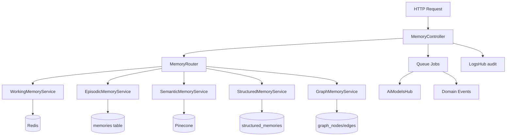

# Design Document — MemoryHub

## Overview

This document is the technical design for the `memory-hub` spec. It brings the Nexus
MemoryHub from its current skeleton state to a fully production-ready feature set across
two codebases:

- **Nexus-backend** — Laravel 11, PHP 8.2 (`Nexus-backend/`)
- **Nexus-Frontend** — Next.js 14, TypeScript (`Nexus-Frontend/`)

The work spans 18 requirements covering: a unified listing API with proper pagination,
per-contact memory endpoints, full CRUD for all five memory types, Pinecone semantic search,
auto-extraction from conversations, confidence scoring with time-decay, a consolidation
pipeline, version history with rollback, graph memory management, working memory TTL
session management, GDPR erasure cascade, hub domain events, and a complete frontend
Memory Bank Explorer UI backed by real API calls.

---

## Design Principles

1. **Router-first** — All memory operations are dispatched through `MemoryRouter`. No
   controller directly touches a type-specific service.
2. **Async by default** — Extraction, vectorization, consolidation, maintenance, and erasure
   are always dispatched to Horizon queues. HTTP threads return immediately.
3. **Confidence as a first-class citizen** — Every structured memory carries a numeric
   `confidence` field on the database row. Decay and reinforcement are atomic DB updates
   tracked in `contact_memory_versions`.
4. **Single API client on the frontend** — All frontend components use `apiClient` from
   `@/lib/api/client`. No raw `fetch()`, no mocks in production code.
5. **Audit everything** — Every create, update, delete, and automated mutation emits a
   structured log entry to LogsHub and a domain event to the event bus.

---

## Architecture

### Backend Layered Architecture

```
Routes (api.php)
  └── MemoryController (HTTP boundary)
        └── MemoryRouter (type dispatcher)
              ├── WorkingMemoryService  → Redis
              ├── EpisodicMemoryService → memories table
              ├── SemanticMemoryService → Pinecone
              ├── StructuredMemoryService → structured_memories table
              └── GraphMemoryService    → graph_nodes / graph_edges tables
                    └── Jobs (async work)
                          ├── ExtractMemoryJob
                          ├── VectorizeMemoryJob
                          ├── SaveToPineconeJob
                          ├── SyncMemoryJob
                          ├── RunContactMemoryMaintenanceJob
                          └── EraseContactMemoryJob (new)
```



---

## Data Models & Schema Changes

### 1. `memories` table (existing — minor additions)

Existing columns: `id`, `contact_id`, `conversation_id`, `source`, `type`, `title`,
`content`, `vector`, `metadata`, `tags`, `expires_at`, `created_at`, `updated_at`.

**New columns** (migration `add_fields_to_memories_table`):
```php
$table->string('source_type')->nullable()->after('source'); // 'extraction' | 'manual' | 'import'
$table->boolean('is_extracted')->default(false)->after('source_type'); // dedup gate
```

### 2. `structured_memories` table (existing — add confidence + soft-delete)

Existing columns: `id`, `contact_id`, `fact_type`, `data`, `metadata`, `created_at`, `updated_at`.

**New columns** (migration `add_confidence_to_structured_memories`):
```php
$table->decimal('confidence', 5, 2)->default(0.80)->after('metadata');
$table->string('status')->default('active')->after('confidence'); // active|low_confidence|expired
$table->timestamp('last_reinforced_at')->nullable()->after('status');
$table->softDeletes(); // for merge/supersede operations
```

**Indexes to add:**
```php
$table->index(['contact_id', 'confidence']);
$table->index(['contact_id', 'fact_type', 'status']);
```

### 3. `contact_memory_versions` table (new)

```php
Schema::create('contact_memory_versions', function (Blueprint $table) {
    $table->id();
    $table->unsignedBigInteger('memory_id');
    $table->string('memory_type')->default('structured'); // for future use
    $table->unsignedBigInteger('contact_id')->nullable();
    $table->integer('version')->default(1);
    $table->json('previous_content')->nullable();
    $table->json('new_content')->nullable();
    $table->json('diff')->nullable();
    $table->decimal('old_confidence', 5, 2)->nullable();
    $table->decimal('new_confidence', 5, 2)->nullable();
    $table->string('source')->nullable(); // 'manual' | 'decay' | 'consolidation' | 'extraction' | 'rollback'
    $table->unsignedBigInteger('actor_id')->nullable(); // user id or null for system
    $table->timestamp('created_at');
    $table->index(['memory_id', 'memory_type']);
    $table->index(['contact_id', 'created_at']);
});
```

### 4. `graph_nodes` / `graph_edges` tables (existing — verified sufficient)

No schema changes needed. Existing columns match spec requirements.

### 5. `settings` table (existing — new key)

A new row with `key = 'memory.last_maintenance_run_at'` is upserted after each maintenance
run. Managed via `SettingCacheService`.

---

## Backend Components

### MemoryController — Full Route Surface

All routes are prefixed `/api/v1` and guarded by `auth:sanctum`.

| Method | Path | Method | Notes |
|--------|------|--------|-------|
| GET | `/memories` | `index()` | Unified listing with type + contact_id filters |
| POST | `/memories` | `store()` | Create any type |
| GET | `/memories/search` | `search()` | Semantic + fallback text search |
| GET | `/memories/stats` | `stats()` | Per-type counts, maintenance status |
| POST | `/memories/maintenance` | `triggerMaintenance()` | Dispatch maintenance job |
| GET | `/memories/maintenance/preview` | `maintenancePreview()` | Dry-run impact estimate |
| GET | `/memories/working/session/{key}` | `workingSession()` | List working keys by prefix |
| DELETE | `/memories/working/flush` | `flushWorking()` | Flush session keys |
| POST | `/memories/graph/edges` | `createEdge()` | Add directed edge |
| GET | `/memories/graph/nodes` | `graphNodes()` | List nodes by related entity |
| GET | `/memories/graph/edges/{nodeId}` | `nodeEdges()` | Inbound + outbound edges |
| GET | `/memories/graph/path` | `graphPath()` | Shortest path |
| GET | `/memories/{id}` | `show()` | Single record (requires `type` param) |
| PUT | `/memories/{id}` | `update()` | Update episodic or structured |
| DELETE | `/memories/{id}` | `destroy()` | Delete any type (requires `type` param) |
| POST | `/memories/{id}/index` | `indexMemory()` | Dispatch ExtractMemoryJob |
| GET | `/memories/{id}/versions` | `versions()` | Version history for structured |
| POST | `/memories/{id}/rollback` | `rollback()` | Rollback structured to version |
| GET | `/contacts/{id}/memories` | `contactMemories()` | All types for one contact |
| DELETE | `/contacts/{id}/memories` | `eraseContactMemories()` | GDPR cascade erasure |

### MemoryController::index() — Implementation Design

```php
public function index(Request $request): JsonResponse
{
    $validated = $request->validate([
        'type'       => 'nullable|in:working,episodic,semantic,structured,graph',
        'contact_id' => 'nullable|integer|exists:contacts,id',
        'per_page'   => 'nullable|integer|min:1|max:100',
        'sort'       => 'nullable|in:confidence,created_at',
        'cursor'     => 'nullable|string',
    ]);

    $result = $this->memoryRouter->listPaginated(
        type:       $validated['type'] ?? null,
        contactId:  $validated['contact_id'] ?? null,
        perPage:    $validated['per_page'] ?? 25,
        sort:       $validated['sort'] ?? 'created_at',
    );

    return response()->json($result);
}
```

`MemoryRouter::listPaginated()` fans out to each type-specific service using cursor
pagination for MySQL tables and returns a merged, sorted, paginated result set.

### MemoryRouter — New `listPaginated()` Method

The existing `MemoryRouter` is missing a unified listing method. Add:

```php
public function listPaginated(?string $type, ?int $contactId, int $perPage = 25, string $sort = 'created_at'): array
{
    $types = $type ? [$type] : ['episodic', 'structured', 'graph']; // working/semantic excluded from default listing
    $results = [];

    foreach ($types as $t) {
        $service = $this->route($t);
        if (method_exists($service, 'paginate')) {
            $results[$t] = $service->paginate($contactId, $perPage, $sort);
        }
    }

    // Merge and return standard paginated envelope
    return $this->mergePaginatedResults($results, $perPage);
}
```

### StructuredMemoryService — Confidence Methods (new)

```php
public function reinforceConfidence(int $id): void
{
    DB::transaction(function () use ($id) {
        $record = DB::table('structured_memories')->where('id', $id)->lockForUpdate()->first();
        if (!$record) return;

        $newConfidence = min(1.00, round($record->confidence + 0.05, 2));
        DB::table('structured_memories')->where('id', $id)->update([
            'confidence'         => $newConfidence,
            'last_reinforced_at' => now(),
            'status'             => $newConfidence >= 0.20 ? 'active' : $record->status,
            'updated_at'         => now(),
        ]);

        // Version record
        $this->recordVersion($id, $record->confidence, $newConfidence, 'reinforcement');
    });
}

public function applyDecay(int $daysThreshold = 30, float $decayAmount = 0.05): int
{
    $cutoff = now()->subDays($daysThreshold);
    $affected = 0;

    DB::table('structured_memories')
        ->where('status', 'active')
        ->where(fn($q) => $q->whereNull('last_reinforced_at')->orWhere('last_reinforced_at', '<', $cutoff))
        ->orderBy('id')
        ->chunk(200, function ($records) use ($decayAmount, &$affected) {
            foreach ($records as $record) {
                $newConf = max(0.00, round($record->confidence - $decayAmount, 2));
                $status = match(true) {
                    $newConf < 0.05 => 'expired',
                    $newConf < 0.20 => 'low_confidence',
                    default         => 'active',
                };
                DB::table('structured_memories')->where('id', $record->id)->update([
                    'confidence' => $newConf,
                    'status'     => $status,
                    'updated_at' => now(),
                ]);
                $this->recordVersion($record->id, $record->confidence, $newConf, 'decay');
                $affected++;
            }
        });

    return $affected;
}
```

### MemoryMaintenanceService — Rewrite

The existing implementation is a stub using naive string similarity. The production version:

```php
public function runConsolidation(int $contactId): array
{
    // 1. Load all active structured memories for the contact
    $memories = DB::table('structured_memories')
        ->where('contact_id', $contactId)
        ->where('status', 'active')
        ->where('updated_at', '<', now()->subHours(24)) // Req 8.7
        ->get();

    if ($memories->count() < 2) return ['merged' => 0, 'superseded' => 0];

    // 2. Ask AiModelsHub to identify duplicate / contradictory pairs
    $gateway = app(\App\Services\AiModelsHub\UniversalAiGatewayService::class);
    $pairs = $gateway->identifyMemoryConflicts($memories->toArray());

    $merged = 0;
    $superseded = 0;

    DB::transaction(function () use ($pairs, &$merged, &$superseded) {
        foreach ($pairs as $pair) {
            if ($pair['relationship'] === 'duplicate') {
                $this->mergeRecords($pair['keep_id'], $pair['remove_id']);
                $merged++;
            } elseif ($pair['relationship'] === 'contradictory') {
                $this->supersede($pair['keep_id'], $pair['remove_id']);
                $superseded++;
            }
        }
    });

    app(LogService::class)->info('Memory consolidation complete', [
        'contact_id' => $contactId, 'merged' => $merged, 'superseded' => $superseded,
    ]);

    return compact('merged', 'superseded');
}

private function mergeRecords(int $keepId, int $removeId): void
{
    $keep   = DB::table('structured_memories')->find($keepId);
    $remove = DB::table('structured_memories')->find($removeId);

    $mergedData = array_merge(
        json_decode($remove->data, true) ?? [],
        json_decode($keep->data, true) ?? []
    );
    $betterConf = max($keep->confidence, $remove->confidence);

    DB::table('structured_memories')->where('id', $keepId)->update([
        'data'       => json_encode($mergedData),
        'confidence' => $betterConf,
        'updated_at' => now(),
    ]);

    DB::table('structured_memories')->where('id', $removeId)->update([
        'deleted_at' => now(),
        'metadata'   => json_encode(array_merge(
            json_decode($remove->metadata ?? '{}', true),
            ['merged_into' => $keepId]
        )),
    ]);

    // Dispatch re-indexing for kept record
    VectorizeMemoryJob::dispatch($keepId, json_decode($keep->data, true)['content'] ?? '');
}
```

### New Job: `EraseContactMemoryJob`

```php
// app/Jobs/EraseContactMemoryJob.php
class EraseContactMemoryJob extends BaseJob
{
    public $queue = 'memory-maintenance';
    public int $tries = 1; // erasure is destructive; no retries

    public function __construct(protected int $contactId) {}

    public function handle(): void
    {
        DB::transaction(function () {
            // 1. Delete episodic memories
            $episodicCount = Memory::where('contact_id', $this->contactId)->count();
            Memory::where('contact_id', $this->contactId)->delete();

            // 2. Delete structured memories (force delete past soft-delete)
            $structuredCount = DB::table('structured_memories')
                ->where('contact_id', $this->contactId)->count();
            DB::table('structured_memories')->where('contact_id', $this->contactId)->delete();

            // 3. Delete version history
            DB::table('contact_memory_versions')->where('contact_id', $this->contactId)->delete();

            // 4. Delete graph nodes (edges cascade via FK)
            $graphCount = DB::table('graph_nodes')
                ->where('related_id', $this->contactId)
                ->where('related_type', 'App\\Models\\Contact')->count();
            DB::table('graph_nodes')
                ->where('related_id', $this->contactId)
                ->where('related_type', 'App\\Models\\Contact')->delete();
        });

        // 5. Flush Redis working memory
        $keys = Redis::keys("working_memory:contact_{$this->contactId}:*");
        if (!empty($keys)) Redis::del($keys);

        // 6. Delete Pinecone namespace
        app(SemanticMemoryService::class)->deleteNamespace((string) $this->contactId);

        // 7. Audit log
        app(LogService::class)->info('Contact memory erased', [
            'contact_id' => $this->contactId,
            'channel'    => 'memory',
            'type'       => 'gdpr_erasure',
        ]);
    }
}
```

### API Contract Summary

All endpoints require `Authorization: Bearer {token}` and return the standard
`{ data: any, meta?: object, errors?: array }` envelope.

**Pagination envelope:**
```json
{
  "data": [...],
  "current_page": 1,
  "per_page": 25,
  "total": 142,
  "last_page": 6,
  "meta": { "timestamp": "iso8601", "schema_version": "1" }
}
```

**Search response:**
```json
{
  "data": [
    { "id": "m-123", "type": "structured", "score": 0.94, "snippet": "...", "contact_id": 5 }
  ],
  "meta": { "took_ms": 48, "fallback": false }
}
```

**Stats response:**
```json
{
  "data": {
    "total": 312,
    "by_type": { "episodic": 120, "semantic": 80, "structured": 90, "graph": 22, "working": 0 },
    "low_confidence": 14,
    "expired": 3,
    "last_maintenance_run_at": "2025-06-01T03:00:00Z",
    "maintenance_status": "idle"
  }
}
```

---

## Frontend Architecture

The frontend follows the existing Next.js 14 App Router pattern. All API calls use
`apiClient` from `@/lib/api/client`. No Zustand mock store is used for production data.

```
app/memory/page.tsx               — Memory Bank Explorer (upgraded)
components/NxMemoryCard.tsx       — Memory card (episodic/structured/working)
components/NxStructuredMemoryCard.tsx — Card with confidence badge + version expand
components/NxGraphNodeCard.tsx    — Graph node card with edge expand
components/NxMemoryVersionPanel.tsx   — Inline version history + rollback
components/NxMaintenanceModal.tsx     — Maintenance trigger modal
components/NxMemoryMiniGraph.tsx  — Existing — keep, wire to real stats
components/NxTagCloud.tsx         — Existing — keep, wire to real stats
```

### `app/memory/page.tsx` — Architecture

State management moves from Zustand mock to direct `apiClient` calls with local React
state. The component tree:

```
MemoryPage
  ├── Header (title, Flush Cache, Synthesize Knowledge, Run Maintenance)
  ├── TabBar (All Cache | Semantic | Episodic | Structured | Working | Graph)
  ├── SearchInput (debounced 300ms → /memories/search)
  ├── ContentGrid (lg:col-span-3)
  │     ├── EpisodicTab    → GET /api/v1/memories?type=episodic
  │     ├── SemanticTab    → GET /api/v1/memories?type=semantic
  │     ├── StructuredTab  → GET /api/v1/memories?type=structured
  │     │     └── NxStructuredMemoryCard (confidence badge, expand versions)
  │     ├── WorkingTab     → GET /api/v1/memories?type=working
  │     └── GraphTab       → GET /api/v1/memories/graph/nodes
  │           └── NxGraphNodeCard (expand edges)
  └── StatsSidebar (col-span-1)
        ├── NxMemoryMiniGraph  → GET /api/v1/memories/stats
        └── NxTagCloud         → derived from listing results
```

### `NxStructuredMemoryCard` — Design

```typescript
interface NxStructuredMemoryCardProps {
  memory: StructuredMemory;
  onDelete: (id: number) => void;
  onUpdate: (id: number, data: Partial<StructuredMemory>) => void;
}

// Confidence badge color logic
function confidenceColor(score: number): string {
  if (score >= 0.70) return 'text-green-400 bg-green-400/10 border-green-400/20';
  if (score >= 0.20) return 'text-amber-400 bg-amber-400/10 border-amber-400/20';
  return 'text-red-400 bg-red-400/10 border-red-400/20';
}
```

When the card is expanded, it fetches `GET /api/v1/memories/{id}/versions` and renders
a `NxMemoryVersionPanel` with diff entries and per-version rollback buttons.

### `NxMaintenanceModal` — Design

```typescript
interface NxMaintenanceModalProps {
  isOpen: boolean;
  onClose: () => void;
}

type Scope = 'all' | 'single' | 'dry_run';

// On submit:
// 1. If dry_run: GET /api/v1/memories/maintenance/preview?contact_id={id}
//    → render impact preview (merge_count, prune_count, decay_count)
// 2. If all/single: POST /api/v1/memories/maintenance { contact_id?, dry_run: false }
//    → show spinner with job id, poll GET /api/v1/memories/stats until maintenance_status === 'idle'
//    → show summary toast on completion
```

### `NxContactMemoryPanel` — Design

New component added to ContactsHub Contact360 page (Memories tab).

```typescript
// components/NxContactMemoryPanel.tsx
interface NxContactMemoryPanelProps {
  contactId: number;
  contactName: string;
}
// Fetches: GET /api/v1/contacts/{contactId}/memories
// Renders 4 collapsible sections: Episodic, Semantic, Structured, Graph
// Footer actions: Run Maintenance (POST /api/v1/memories/maintenance)
//                 Erase All Memories (DELETE /api/v1/contacts/{id}/memories) — admin only
```

---

## Domain Events

All events implement `ShouldBroadcastNow` and conform to the standard Nexus envelope.

| Event Class | File | Payload fields |
|---|---|---|
| `MemoryCreated` | `app/Events/MemoryCreated.php` | `memory_id`, `contact_id`, `type`, `fact_type?`, `confidence?` |
| `MemoryConfidenceChanged` | `app/Events/MemoryConfidenceChanged.php` | `memory_id`, `contact_id`, `old_confidence`, `new_confidence`, `reason` |
| `MemoryDeleted` | `app/Events/MemoryDeleted.php` | `memory_id`, `type`, `contact_id` |
| `MemoryBatchExtracted` | `app/Events/MemoryBatchExtracted.php` | `conversation_id`, `contact_id`, `count` |
| `MemoryMaintenanceCompleted` | `app/Events/MemoryMaintenanceCompleted.php` | `contact_id?`, `merged`, `pruned`, `decayed` |

`EventServiceProvider` registers `MemoryCreated` to `App\Listeners\NotifyAgentsOfNewMemory`.

---

## Performance Considerations

- **Listing queries** use composite indexes `(contact_id, confidence)` and
  `(contact_id, fact_type, status)` to avoid full table scans.
- **Semantic search** response target is 500 ms. Scoping to a single contact's Pinecone
  namespace is the primary optimization; fallback to MySQL full-text uses `FULLTEXT` index
  on `memories.content`.
- **Stats endpoint** results are cached in Redis for 60 seconds and invalidated on any
  write operation to memory tables.
- **Consolidation jobs** chunk 200 records at a time to avoid memory exhaustion.
- **Frontend** debounces search 300 ms and uses `React.memo` on memory cards to prevent
  full re-renders on tab switch.

---

## Security Considerations

- All MemoryHub routes are guarded by `auth:sanctum`.
- The `DELETE /contacts/{id}/memories` (GDPR erasure) endpoint requires `admin` role via
  a `MemoryPolicy::eraseContact()` check.
- `LogService` calls do NOT log the memory `content` field in plain text — only `id`,
  `type`, `contact_id`, and operation are logged.
- Pinecone namespace keys use hashed contact ids (SHA-256 prefix) to prevent enumeration.
