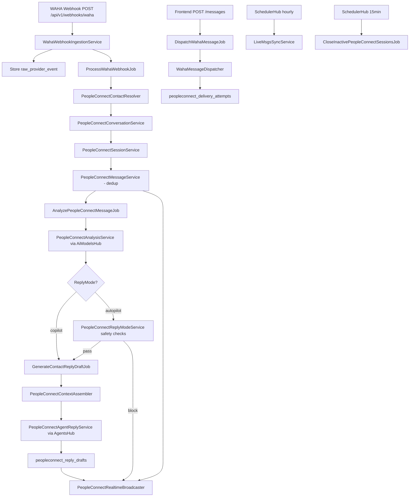

# PeopleConnectHub — Technical Design

## Overview

This document is the technical design for the `people-connect-hub` spec. PeopleConnectHub is built from scratch across two codebases:

- **Nexus-backend** — Laravel 11, PHP 8.2 (`Nexus-backend/`)
- **Nexus-Frontend** — Next.js 14, TypeScript (`Nexus-Frontend/`)

The work spans 24 requirements: fixing the broken WAHA webhook handler, creating 13 dedicated database tables, building the full sync/ingestion pipeline, reply mode with copilot/autopilot safety, message analysis, context assembly, agent reply drafting, realtime broadcasting, and a complete standalone frontend hub at `/people-connect`.

### Design Principles

1. **Database is source of truth** — Frontend reads from Nexus DB via API. WAHA is a provider only.
2. **Async by default** — Webhook ingestion, sync, analysis, send, and draft generation are always queued.
3. **Fix before build** — The broken `WebhookController` is rewritten before any new feature is layered on.
4. **Dedup at every boundary** — Provider message ID and payload hash are checked before any insert.
5. **Single API client** — All frontend components use `apiClient` from `@/lib/api/client`. No raw `fetch()`.
6. **Safety-first autopilot** — All 7 autopilot safety checks run atomically before any automated send.

---

## Architecture

### Backend Architecture

```
routes/api.php  (/api/v1/peopleconnect/*)
  └── app/Http/Controllers/PeopleConnect/
        └── app/Services/PeopleConnect/
              └── app/Jobs/  (queue workers)
                    └── app/Models/  (Eloquent)
                          └── MySQL + Redis + Reverb
```



All new backend classes live in `app/Services/PeopleConnect/` and `app/Http/Controllers/PeopleConnect/`.

---

## Components and Interfaces

See detailed component interface definitions in the Frontend Architecture section below.

---

## Data Models

### 13 PeopleConnect Tables

### `peopleconnect_conversations`
| Column | Type | Notes |
|---|---|---|
| id | bigIncrements | PK |
| contact_id | unsignedBigInt | FK contacts.id |
| channel | string(50) | `whatsapp` |
| provider | string(50) | `waha` |
| provider_conversation_id | string(255) | nullable, WAHA chatId |
| status | string(30) | `active`, `archived` |
| last_message_at | timestamp | nullable |
| last_message_preview | string(255) | nullable |
| unread_count | unsignedInt | default 0 |
| reply_mode_effective | string(20) | `manual`, `copilot`, `autopilot` |
| agent_status | string(30) | nullable |
| timestamps | — | created_at, updated_at |

Unique index: `(contact_id, channel, provider)`.

### `peopleconnect_sessions`
| Column | Type | Notes |
|---|---|---|
| id | bigIncrements | PK |
| conversation_id | unsignedBigInt | FK |
| contact_id | unsignedBigInt | FK |
| status | string(20) | `open`, `closed` |
| opened_at | timestamp | — |
| closed_at | timestamp | nullable |
| closed_reason | string(50) | nullable: `inactivity`, `manual` |
| message_count | unsignedInt | default 0 |
| summary | text | nullable, AI-generated |

### `peopleconnect_messages`
| Column | Type | Notes |
|---|---|---|
| id | bigIncrements | PK |
| conversation_id | unsignedBigInt | FK |
| session_id | unsignedBigInt | FK nullable |
| contact_id | unsignedBigInt | FK |
| sender_type | string(20) | `user`, `contact`, `agent`, `system` |
| sender_id | unsignedBigInt | nullable |
| direction | string(10) | `inbound`, `outbound` |
| body | text | — |
| body_format | string(20) | `text`, `html`, `markdown` |
| status | string(20) | `queued`, `sending`, `sent`, `delivered`, `read`, `failed` |
| provider | string(50) | — |
| waha_message_id | string(255) | nullable, unique per conversation |
| provider_payload_hash | string(64) | nullable, SHA-256 |
| topic_id | unsignedBigInt | nullable FK |
| intent | string(100) | nullable |
| tone | string(100) | nullable |
| sentiment | string(50) | nullable |
| emotional_baseline_snapshot | json | nullable |
| tone_mirroring_snapshot | json | nullable |
| context_snapshot_id | unsignedBigInt | nullable FK |
| trace_id | string(100) | nullable |
| sent_at / delivered_at / read_at / failed_at | timestamp | nullable |
| error_message | text | nullable |
| timestamps | — | — |

Unique index: `(conversation_id, waha_message_id)` where not null. Index on `provider_payload_hash`.

### Remaining Tables (summary)

| Table | Key Columns |
|---|---|
| `peopleconnect_message_analyses` | message_id, topic, intent, tone, sentiment, language, urgency, safety_flags (json), reply_needed (bool), analyzed_at |
| `peopleconnect_message_tags` | message_id, tag |
| `peopleconnect_context_snapshots` | conversation_id, session_id, payload (json), token_estimate, agent_id, model_id |
| `peopleconnect_reply_drafts` | conversation_id, message_id, agent_id, body, status, context_snapshot_id, trace_id, approved_by, approved_at, sent_at, rejected_at |
| `peopleconnect_delivery_attempts` | message_id, attempt_number, status, waha_response (json), attempted_at, error_message |
| `peopleconnect_sync_runs` | type, status, started_at, completed_at, contacts_found, conversations_found, messages_found, errors (json), triggered_by |
| `peopleconnect_raw_provider_events` | event_type, payload (json), session_name, received_at, processed_at, processing_status |
| `peopleconnect_processing_logs` | conversation_id, event_type, description, payload (json) |
| `peopleconnect_conversation_topics` | conversation_id, name, first_message_id, last_message_id, message_count, first_seen_at, last_seen_at |
| `peopleconnect_reply_mode_overrides` | contact_id, reply_mode, set_by, reason |

---

## Backend Components

### Phase 1 — Fix WAHA Webhook Handler

**`app/Http/Controllers/WebhookController.php` — rewrite `handleWahaWebhook()`**

Real WAHA payload structure:
```json
{ "event": "message", "session": "default",
  "payload": { "id": "wamid.xxx", "chatId": "96150xxxxxx@c.us",
    "from": "96150xxxxxx@c.us", "body": "Hello", "timestamp": 1700000000 } }
```

New validation:
```php
$data = $request->validate([
    'event'           => ['required', 'string'],
    'session'         => ['required', 'string'],
    'payload'         => ['required', 'array'],
    'payload.chatId'  => ['required', 'string'],
    'payload.from'    => ['required', 'string'],
    'payload.body'    => ['nullable', 'string'],
    'payload.id'      => ['nullable', 'string'],
    'payload.timestamp' => ['nullable', 'integer'],
]);
// Validate shared secret header
// Store raw event
// Dispatch ProcessWahaWebhookJob
return response()->json(['status' => 'accepted'], 202);
```

### Phase 2 — Ingestion Pipeline Services

**`WahaWebhookIngestionService`** (`app/Services/PeopleConnect/`)
- `ingest(array $payload): void` — validates secret, stores raw event, deduplicates by `session+payload.id`, dispatches `ProcessWahaWebhookJob`

**`ProcessWahaWebhookJob`** (`app/Jobs/`)
- `handle()` — orchestrates: `PeopleConnectContactResolver::resolve()` → `PeopleConnectConversationService::resolveOrCreate()` → `PeopleConnectSessionService::resolveOrOpen()` → `PeopleConnectMessageService::insert()` → dispatch `AnalyzePeopleConnectMessageJob` → `PeopleConnectRealtimeBroadcaster::messageReceived()`

**`PeopleConnectContactResolver`** (`app/Services/PeopleConnect/`)
- `resolve(string $chatId, string $phone, string $displayName): Contact`
- Searches `contact_identifiers` by type `whatsapp` and `phone`
- Creates new ContactHub contact via `ContactHubService` if not found

**`PeopleConnectConversationService`** (`app/Services/PeopleConnect/`)
- `resolveOrCreate(int $contactId, string $channel, string $chatId): PeopleConnectConversation`
- Unique constraint on `(contact_id, channel, provider)`

**`PeopleConnectSessionService`** (`app/Services/PeopleConnect/`)
- `resolveOrOpen(PeopleConnectConversation $conv, Carbon $messageTime): PeopleConnectSession`
- Closes existing session if `last_message_at + 2 hours < $messageTime`
- Creates new session if none open

**`PeopleConnectMessageService`** (`app/Services/PeopleConnect/`)
- `insert(array $data): PeopleConnectMessage`
- Dedup check: `waha_message_id` unique per conversation, `provider_payload_hash` SHA-256 check
- Throws `DuplicateMessageException` on dedup hit, logs `dedup_skipped` in processing_logs

### Phase 3 — Scheduled Sync + Session Lifecycle

**`LiveMsgsSyncService`** (`app/Services/PeopleConnect/`)
- `syncContacts()`, `syncConversations()`, `syncMessages()` — poll WAHA API, use same resolver/service chain as webhook ingestion, write `peopleconnect_sync_runs` record

**Jobs dispatched to `peopleconnect` queue:**
- `SyncWahaContactsJob` — dispatched hourly via SchedulerHub
- `SyncWahaConversationsJob` — dispatched hourly
- `SyncWahaMessagesJob` — dispatched hourly
- `CloseInactivePeopleConnectSessionsJob` — dispatched every 15 min; queries open sessions where `last_message_at < now()-2h`, closes them, broadcasts `session.closed`
- `ReconcileWahaDeliveryStatusJob` — dispatched hourly; fetches acks for undelivered messages >24h old

All jobs implement `failed(Throwable $e)` to write `peopleconnect_processing_logs` and update sync run status.

### Phase 4 — API Routes + Controllers

All routes registered in `routes/api.php` under `Route::prefix('peopleconnect')->group(...)` inside the `auth:sanctum` middleware group:

```php
// Conversations
GET  /peopleconnect/conversations
GET  /peopleconnect/conversations/{id}
PATCH /peopleconnect/conversations/{id}
GET  /peopleconnect/conversations/{id}/header
GET  /peopleconnect/conversations/{id}/sessions
POST /peopleconnect/conversations/{id}/sessions/close
POST /peopleconnect/conversations/{id}/sessions/reopen
GET  /peopleconnect/conversations/{id}/messages
POST /peopleconnect/conversations/{id}/messages
GET  /peopleconnect/conversations/{id}/topics
GET  /peopleconnect/conversations/{id}/logs
GET  /peopleconnect/conversations/{id}/context/latest
GET  /peopleconnect/conversations/{id}/memories/latest
GET  /peopleconnect/conversations/{id}/tasks
GET  /peopleconnect/conversations/{id}/rules
POST /peopleconnect/conversations/{id}/rules
GET  /peopleconnect/conversations/{id}/notes
POST /peopleconnect/conversations/{id}/notes
PATCH /peopleconnect/conversations/{id}/reply-mode

// Messages
POST /peopleconnect/messages/{id}/retry
POST /peopleconnect/messages/{id}/draft-reply
POST /peopleconnect/messages/{id}/create-task
POST /peopleconnect/messages/{id}/save-note
POST /peopleconnect/messages/{id}/save-memory
GET  /peopleconnect/messages/{id}/trace
GET  /peopleconnect/messages/{id}/raw-provider-event

// Rules + Notes (standalone update/delete)
PATCH  /peopleconnect/rules/{id}
DELETE /peopleconnect/rules/{id}
PATCH  /peopleconnect/notes/{id}
DELETE /peopleconnect/notes/{id}

// LiveMsgs
GET  /peopleconnect/livemsgs/status
GET  /peopleconnect/livemsgs/sync-runs
POST /peopleconnect/livemsgs/sync-now
POST /peopleconnect/livemsgs/reconcile
GET  /peopleconnect/livemsgs/pending-outgoing
POST /peopleconnect/livemsgs/retry-failed

// Reply Mode
GET   /peopleconnect/reply-mode
PATCH /peopleconnect/reply-mode

// Search + Stats
GET /peopleconnect/search
GET /peopleconnect/messages/search
GET /peopleconnect/stats
GET /peopleconnect/analytics
```

Controllers live in `app/Http/Controllers/PeopleConnect/`.

### Phase 5 — Reply Mode + Outgoing Queue + Safety

**`PeopleConnectReplyModeService`** (`app/Services/PeopleConnect/`)
- `resolveEffectiveMode(int $contactId): string` — returns contact override or global default
- `checkAutopilotSafety(int $contactId, PeopleConnectMessage $trigger): SafetyResult` — checks all 7 conditions atomically:
  1. Contact rules prohibit automated replies
  2. Current time within contact quiet hours
  3. Automated reply count today >= max_daily_autopilot_replies
  4. Agent confidence below threshold
  5. Message contains sensitive topic without explicit approval
  6. Contact identity confidence below minimum
  7. Global emergency agent pause is active

**`WahaMessageDispatcher`** (`app/Services/PeopleConnect/`)
- `send(PeopleConnectMessage $message): void`
- Calls WAHA API `POST /api/sendMessage`
- Records `peopleconnect_delivery_attempts` per attempt
- Updates message status: `sent` → `failed`
- Enforces rate limit (configurable max per contact per minute)

**`DispatchWahaMessageJob`** — dispatched to `peopleconnect-outgoing` queue; `tries = 3`, exponential backoff; `failed()` hook updates message to `failed` and broadcasts `message.failed`

**`GenerateContactReplyDraftJob`** — assembles context → calls `PeopleConnectAgentReplyService` → stores draft → broadcasts `draft.created`; `failed()` sets draft to `failed` and broadcasts error

### Phase 6 — Analysis + Context + Agent Reply

**`PeopleConnectAnalysisService`** (`app/Services/PeopleConnect/`)
- `analyze(PeopleConnectMessage $message): PeopleConnectMessageAnalysis`
- Calls AiModelsHub with intent `Intent_Detection` and `Contact_Analysis`
- Writes `peopleconnect_message_analyses`, updates message fields, creates/updates `peopleconnect_conversation_topics`
- Recomputes `emotional_baseline_snapshot` from rolling session window

**`PeopleConnectContextAssembler`** (`app/Services/PeopleConnect/`)
- `assemble(PeopleConnectConversation $conv): PeopleConnectContextSnapshot`
- Collects: contact profile snapshot, active rules, pinned notes, relevant memories, last session summary, topic history, recent messages (up to token budget)
- Computes `token_estimate`, truncates oldest messages first if over budget
- Records excluded items + reasons in snapshot `payload`
- Stores frozen `peopleconnect_context_snapshots` record before invoking AgentsHub

**`PeopleConnectAgentReplyService`** (`app/Services/PeopleConnect/`)
- `generateDraft(PeopleConnectContextSnapshot $ctx, int $agentId): string`
- Calls AgentsHub execution endpoint
- Returns draft body + trace_id

### Phase 7 — Realtime Broadcasting

**`PeopleConnectRealtimeBroadcaster`** (`app/Services/PeopleConnect/`)
- All broadcast methods delegate to Laravel's `broadcast()` helper

**Per-conversation channel** — `peopleconnect.conversation.{conversation_id}` (private):
`message.received`, `message.saved`, `message.analyzed`, `reply.draft.created`, `message.queued`, `message.sent`, `message.delivered`, `message.read`, `message.failed`, `session.opened`, `session.closed`, `autopilot.blocked`

**Hub channel** — `peopleconnect.hub` (private):
`waha.connected`, `waha.disconnected`, `livemsgs.sync.started`, `livemsgs.sync.completed`, `pending_outgoing_count_changed`

Laravel event classes in `app/Events/PeopleConnect/` implementing `ShouldBroadcast`. Channel definitions in `routes/channels.php`.

---

## Frontend Architecture

```
app/people-connect/
  page.tsx                     ← Hub shell, Echo subscriptions, state
components/
  NxPeopleConnectTopbar.tsx
  NxLiveMsgsModal.tsx
  NxConversationSidebar.tsx
  NxConversationHeader.tsx
  NxMessagePanel.tsx
  NxComposer.tsx
  NxContactRulesModal.tsx
  NxContactNotesModal.tsx
  NxContextModal.tsx
  NxMemoriesModal.tsx
  NxContactTasksModal.tsx
```

All new components use `apiClient` from `@/lib/api/client`. No raw `fetch()`, no hardcoded URLs.

### `app/people-connect/page.tsx`

Main hub shell. Manages:
- Conversation list state (fetched from `GET /api/v1/peopleconnect/conversations`)
- Active conversation ID
- Modal open/close states
- Laravel Echo subscriptions on mount:
  ```typescript
  window.Echo.private('peopleconnect.hub')
    .listen('.livemsgs.sync.completed', updateStats)
    .listen('.waha.connected', updateWahaStatus);

  window.Echo.private(`peopleconnect.conversation.${activeId}`)
    .listen('.message.received', appendMessage)
    .listen('.message.analyzed', updateMessageAnalysis)
    .listen('.reply.draft.created', showDraftInComposer)
    .listen('.message.delivered', updateDeliveryStatus)
    .listen('.session.opened', insertSessionSeparator);
  ```

### Component Interfaces

#### `NxPeopleConnectTopbar`
```typescript
interface NxPeopleConnectTopbarProps {
  wahaStatus: 'connected' | 'disconnected' | 'syncing' | 'degraded' | 'error';
  globalReplyMode: 'manual' | 'copilot' | 'autopilot';
  pendingOutgoingCount: number;
  failedSendCount: number;
  isSyncing: boolean;
  stats: { activeConversations: number; unread: number; autopilotCount: number };
  onLiveMsgsClick: () => void;
  onReplyModeChange: (mode: 'manual' | 'copilot' | 'autopilot') => void;
  onSyncNow: () => void;
}
```
WAHA status light: green=connected, amber=syncing/degraded, red=disconnected/error.

#### `NxLiveMsgsModal`
```typescript
interface NxLiveMsgsModalProps {
  isOpen: boolean;
  onClose: () => void;
}
```
Fetches `GET /api/v1/peopleconnect/livemsgs/status` and `livemsgs/sync-runs` on open.
Buttons: Sync Now, Reconcile Gaps, Retry Failed Sends.
Diagnostics panel: last 10 processing log entries.

#### `NxConversationSidebar`
```typescript
interface NxConversationSidebarProps {
  conversations: PeopleConnectConversation[];
  activeId: number | null;
  isLoading: boolean;
  error: string | null;
  onSelect: (id: number) => void;
  onRetry: () => void;
}
```
Search input, filter chips (Unread, Manual/Copilot/Autopilot, Failed). Each item: contact name, phone, last message preview (max 60 chars), unread badge, channel icon, reply mode chip, agent status dot, failed delivery warning.

#### `NxConversationHeader`
```typescript
interface NxConversationHeaderProps {
  conversationId: number;
  contactName: string;
  contactId: number;
  onOpenRules: () => void;
  onOpenNotes: () => void;
  onOpenContext: () => void;
  onOpenMemories: () => void;
  onOpenTasks: () => void;
  onJumpToMessage: (messageId: number) => void;
}
```
Fetches `GET .../header` for topic/intent/emotional baseline/tone mirroring/sentiment.
Background log ticker: scrolls latest 3 processing_logs entries; updates via Reverb.
Topic dropdown: searchable, populated from `GET .../topics`, click jumps message panel.

#### `NxMessagePanel`
```typescript
interface NxMessagePanelProps {
  conversationId: number;
  onCreateTask: (messageId: number) => void;
  onSaveNote: (messageId: number) => void;
  onRetryMessage: (messageId: number) => void;
  jumpToMessageId?: number;
}
```
Uses `@tanstack/react-virtual` for virtualized list. Fetches `GET .../messages` with cursor pagination.
- Date separators: before first message of each calendar date
- Session separators: between sessions, shows open/close time
- Sender types: user (right, primary), contact (left, secondary), agent (left, accent), system (center, muted)
- Delivery icons: queued (clock), sending (spinner), sent (single check), delivered (double check), read (blue double check), failed (red X + retry button)
- Message toolbar (hover): topic, intent, tone, sentiment, emotional baseline, copy, draft reply, create task, save note, raw event link

#### `NxComposer`
```typescript
interface NxComposerProps {
  conversationId: number;
  effectiveReplyMode: 'manual' | 'copilot' | 'autopilot';
  pendingDraft?: PeopleConnectReplyDraft;
  wahaStatus: string;
  onMessageSent: () => void;
}
```
Manual mode: plain textarea + Send button → `POST .../messages`.
Copilot mode with pending draft: shows draft body with Edit/Approve/Reject buttons.
Ask Agent button: calls `POST .../messages/{id}/draft-reply` regardless of mode.
WAHA disconnected banner: disables send, shows warning.
File attach: validates against WAHA max attachment size before send.
On send failure: saves draft to local state, shows error + retry.

### Modal Components

| Component | API Source | Key Features |
|---|---|---|
| `NxContactRulesModal` | `GET .../rules` | List + add/edit/deactivate/delete; AI-suggested rules with approve/reject |
| `NxContactNotesModal` | `GET .../notes` | List + add/edit/pin/delete; pinned notes at top |
| `NxContextModal` | `GET .../context/latest` | Context snapshot viewer: profile, rules, notes, messages, memories, token estimate, excluded items |
| `NxMemoriesModal` | `GET .../memories/latest` | Recently extracted, injected, suggested (with approve/reject/edit) |
| `NxContactTasksModal` | `GET .../tasks` | Open/completed/failed tasks; create-task action |

All modals: error state with retry button; no blank or partial views on API failure.

---

## Navigation Update

In `components/AppLayout.tsx` (or equivalent nav config), add:
```typescript
{ label: 'PeopleConnect', href: '/people-connect', icon: <MessageCircle /> }
```

The existing `/conversations` page is **removed** and replaced with a redirect to `/people-connect`.

---

## Correctness Properties

### Property 1: Dedup Idempotence

*For any* sequence of N identical WAHA webhook payloads for the same message, exactly 1 `peopleconnect_messages` record is created.

**Validates: Requirements 6.1, 6.2, 6.5**

---

### Property 2: Session 2-Hour Rule

*For any* session that has been open for 2+ hours with no new message, `CloseInactivePeopleConnectSessionsJob` closes it within 15 minutes.

**Validates: Requirements 5.2, 5.5**

---

### Property 3: New Session After Close

*For any* conversation whose session is closed, the next incoming message always opens a new session before being inserted.

**Validates: Requirements 5.1, 3.5**

---

### Property 4: Canonical Conversation

*For any* contact, `PeopleConnectConversationService::resolveOrCreate()` always returns the same conversation record regardless of how many times it is called.

**Validates: Requirements 3.3**

---

### Property 5: Contact Resolver Unknown Sender

*For any* WAHA message from an unknown chatId, `PeopleConnectContactResolver` creates exactly one new contact and resolves to it on all subsequent calls.

**Validates: Requirements 3.1, 3.2**

---

### Property 6: Effective Mode Resolution

*For any* combination of global mode and contact override, `resolveEffectiveMode(contactId)` returns the contact override when set, and the global default when no override exists.

**Validates: Requirements 8.2, 8.5**

---

### Property 7: Autopilot Safety All Conditions Block

*For each* of the 7 safety conditions individually set to blocking, every autopilot send attempt is blocked with the correct reason.

**Validates: Requirements 10.1, 10.2**

---

### Property 8: Copilot Draft Persisted Before Broadcast

*For any* copilot draft generation, the `peopleconnect_reply_drafts` record is written to the database before `reply.draft.created` is broadcast.

**Validates: Requirements 9.3, 9.4**

---

### Property 9: Webhook Response is Async

*For any* valid WAHA webhook POST, the HTTP response arrives with 202 before `ProcessWahaWebhookJob` has started executing.

**Validates: Requirements 2.1, 2.3**

---

### Property 10: Outgoing Persisted Before Send

*For any* outbound message, the `peopleconnect_messages` record with `status = 'queued'` exists in the database before `DispatchWahaMessageJob` is dispatched.

**Validates: Requirements 11.1**

---

### Property 11: Delivery Attempt Recorded on Every Send

*For any* execution of `DispatchWahaMessageJob`, exactly one `peopleconnect_delivery_attempts` record is written regardless of success or failure.

**Validates: Requirements 11.2**

---

### Property 12: Context Round Trip

*For any* context snapshot, the JSON payload stored in `peopleconnect_context_snapshots` is byte-for-byte identical to the context sent to AgentsHub for that draft.

**Validates: Requirements 13.6**

---

### Property 13: Topbar Updates Without Reload

*For any* `waha.connected` or `livemsgs.sync.completed` event received via Reverb, the topbar WAHA status light and stats update without a page reload.

**Validates: Requirements 14.4**

---

### Property 14: Message Panel Appends Without Full Refetch

*For any* `message.received` Reverb event on the active conversation, the new message is appended to the message panel without re-fetching the full message list.

**Validates: Requirements 14.5, 20.1**

---

### Property 15: Delivery Status Updates In Place

*For any* `message.delivered` or `message.read` Reverb event, the NxMessagePanel updates the delivery status indicator for the matching message ID without reloading any other messages.

**Validates: Requirements 14.6, 20.5**

---

### Property 16: Failed Send Retry Re Queues

*For any* message with `status = 'failed'`, calling `POST /messages/{id}/retry` sets status back to `queued` and dispatches exactly one new `DispatchWahaMessageJob`.

**Validates: Requirements 11.8**

---

### Property 17: Webhook Dedup at Raw Event Level

*For any* pair of identical raw WAHA payloads (same `session` + `payload.id`), only one `ProcessWahaWebhookJob` is dispatched.

**Validates: Requirements 2.6**

---

## Error Handling

### Backend HTTP Contracts

| Scenario | HTTP | Body |
|---|---|---|
| WAHA webhook secret mismatch | 401 | `{ "message": "Invalid webhook signature." }` |
| WAHA webhook missing chatId | 422 | Validation error detail |
| Rate limit exceeded on outgoing | 429 | `{ "message": "Rate limit exceeded." }` |
| Unauthorized API access | 401 | `{ "message": "Unauthenticated." }` |
| Resource not found | 404 | `{ "message": "Not found." }` |
| AI unavailable during analysis | — | Job retried 3x, then marked `failed`; audit log entry |
| WAHA send failure | — | Delivery attempt recorded, message marked `failed`, `message.failed` broadcast |

### Job Failed Hooks
All PeopleConnect jobs implement:
```php
public function failed(Throwable $e): void {
    // Update associated run/message status to 'failed'
    // Write peopleconnect_processing_logs entry
    // Broadcast error event
}
```

---

## Testing Strategy

### Backend
- **Unit tests** for each service class: `WahaWebhookIngestionServiceTest`, `PeopleConnectContactResolverTest`, `PeopleConnectSessionServiceTest`, `PeopleConnectMessageServiceTest`, `PeopleConnectReplyModeServiceTest`, `WahaMessageDispatcherTest`
- **Feature tests**: `PeopleConnectConversationsApiTest`, `PeopleConnectMessagesApiTest`, `PeopleConnectLiveMsgsApiTest`, `PeopleConnectReplyModeApiTest`, `WahaWebhookTest`
- **PBT (Pest data-driven)**: Properties 1-12, minimum 100 iterations each; use Faker for WAHA payload generation

### Frontend
- **Component tests** (React Testing Library): `NxMessagePanel`, `NxComposer`, `NxPeopleConnectTopbar`, `NxConversationSidebar`
- **Integration tests** (Playwright): full send flow, copilot draft approval, session separator rendering
- **PBT (fast-check)**: Properties 13-15 for realtime update behaviors; 100 runs each

### Property Test Tag Format
`Feature: people-connect-hub, Property {N}: {property_text}`
