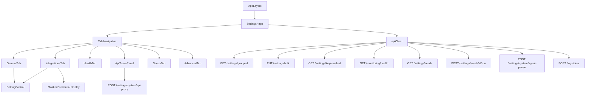

# Settings Hub — Technical Design

## Overview

SettingsHub (`/settings`) is the centralized system configuration and administration interface for Nexus. It provides a single page with six distinct panels — general settings, integrations, health diagnostics, API testing, database seeding, and advanced controls — all mounted inside `AppLayout` and identified by a local tab router.

### Key Design Decisions

**Local state only.** Settings are loaded from the backend on demand and tracked in component-local React state. There is no Zustand slice for settings data. This avoids polluting the global store with large, infrequently-accessed configuration blobs. `editedValues` acts as a local draft layer, diffed against the server state only at save time.

**Single-page, tab-driven layout.** All six functional areas live on one page. Tabs are rendered with plain `<button>` elements styled with Tailwind rather than a shared `NxTabs` component; this is intentional because the tab state drives conditional API calls (health, seeds) that a generic tab component would make harder to wire up cleanly.

**Server-authoritative settings.** The page initializes `editedValues` from the server response on every `loadSettings()` call. After a successful save, `loadSettings()` is called again to re-sync. There is no optimistic update.

**Proxy-based API testing.** The API tester routes all requests through a backend proxy (`POST /settings/system/api-proxy`) rather than making cross-origin calls from the browser. This sidesteps CORS constraints and keeps credentials server-side.

**Encrypted credentials are masked by default.** Credentials with `is_encrypted: true` are never displayed in plain text. Masked values are fetched on demand via a separate endpoint and only shown when the user explicitly requests it.

---

## Architecture



### Page-Level Data Flow

```
Mount → loadSettings() → GET /settings/grouped
                       → setGroupedSettings(data)
                       → setEditedValues(flatMap of all settings)

User edits → handleValueChange(key, value)
           → setEditedValues(prev => {...prev, [key]: value})

Save click → handleSaveSettings()
           → PUT /settings/bulk { settings: [{key, value}...] }
           → loadSettings()   ← re-syncs from server

Tab switch to "health" → loadHealthStatus() → GET /monitoring/health
Tab switch to "seeds"  → loadSeeds()        → GET /settings/seeds
```

---

## Component Hierarchy

```
app/settings/
├── page.tsx                   ← SettingsPage (orchestrator, all state lives here)
└── components/
    ├── ApiTesterPanel.tsx     ← Self-contained, no shared state with page
    ├── SettingControl.tsx     ← Extracted from renderSettingControl()
    ├── GeneralTab.tsx         ← Filtered group cards + key count
    ├── IntegrationsTab.tsx    ← Encrypted credential UI, Show/Hide, Edit flow
    ├── HealthTab.tsx          ← Status card + per-service check cards
    ├── SeedsTab.tsx           ← Warning banner + seed runner cards
    └── AdvancedTab.tsx        ← Danger zone, agent pause toggle, cache clear
```

### Component Responsibilities

| Component | Owns state? | API calls? | Notes |
|-----------|------------|------------|-------|
| `SettingsPage` | Yes — all shared state | Yes — all except API tester | Passes down props + handlers |
| `SettingControl` | No | No | Pure rendering function; extracts `renderSettingControl` |
| `GeneralTab` | No | No | Receives `groupedSettings`, `editedValues`, `onValueChange` |
| `IntegrationsTab` | No | No | Receives `integrations[]`, masked/editing state + handlers |
| `HealthTab` | No | No | Receives `healthStatus`, `isLoading`, `onRefresh` |
| `SeedsTab` | No | No | Receives `seeds`, `isLoading`, `onRunSeed` |
| `AdvancedTab` | No | No | Receives `agentPausedEnabled`, `saving`, action handlers |
| `ApiTesterPanel` | Yes — local panel state | Yes — proxy POST | Standalone; no props from parent |

---

## Components and Interfaces

### SettingsPage (page.tsx)

The root orchestrator. Owns all shared state and exposes handler functions passed down as props to child tab components.

```typescript
// Props passed to tab components
interface GeneralTabProps {
  groupedSettings: GroupedSettings;
  editedValues: Record<string, any>;
  loading: boolean;
  onValueChange: (key: string, value: any) => void;
}

interface IntegrationsTabProps {
  groupedSettings: GroupedSettings;
  editedValues: Record<string, any>;
  loading: boolean;
  showMaskedCredentials: Record<string, boolean>;
  maskedValues: Record<string, string>;
  editingEncrypted: Record<string, boolean>;
  onValueChange: (key: string, value: any) => void;
  onToggleMasked: (key: string) => void;
  onToggleEdit: (key: string) => void;
}

interface HealthTabProps {
  healthStatus: HealthStatus | null;
  isLoadingHealth: boolean;
  onRefresh: () => void;
}

interface SeedsTabProps {
  seeds: Seed[];
  isLoadingSeeds: boolean;
  saving: boolean;
  onRunSeed: (id: string) => void;
}

interface AdvancedTabProps {
  agentPausedEnabled: boolean;
  saving: boolean;
  onToggleAgentPause: () => void;
  onFactoryReset: () => void;
}
```

### SettingControl

A pure rendering component extracted from the inline `renderSettingControl` function in `page.tsx`.

```typescript
interface SettingControlProps {
  setting: SettingEntry;
  value: any;
  onChange: (key: string, value: any) => void;
}

export function SettingControl({ setting, value, onChange }: SettingControlProps): React.ReactElement
```

The type-to-control mapping is the core logic of this component:

| `setting.type` | Rendered control |
|---------------|-----------------|
| `boolean` | `<NxSwitch checked={Boolean(value)} onChange={...} />` |
| `integer` | `<NxInput type="number" value={String(value)} onChange={...} />` |
| `json`, `text` | `<textarea className="...rounded-2xl...min-h-[120px]..." />` |
| `string` | `<NxInput value={String(value)} onChange={...} />` |

### ApiTesterPanel

Self-contained component with no external props. Communicates with the backend only via the proxy endpoint.

```typescript
export function ApiTesterPanel(): React.ReactElement
```

Internal helpers:
- `generateId(): string` — produces a random `id` for `KeyValuePair` entries
- `addHeader()`, `removeHeader(id)`, `updateHeader(id, field, val)` — manage the headers list
- `handleSend()` — validates URL, parses body, calls proxy, sets response/error state
- `getStatusColor(status?: number): string` — pure function mapping HTTP status range to Tailwind color class

---

## Data Models

All interfaces are defined in `app/settings/page.tsx` (to be moved to a shared types file as the refactor progresses).

```typescript
interface SettingEntry {
  id: string;
  key: string;
  value: any;
  type: 'string' | 'integer' | 'boolean' | 'json' | 'text';
  group: string;
  description?: string;
  is_public: boolean;
  is_encrypted: boolean;
}

type GroupedSettings = Record<string, SettingEntry[]>;

type TabType = 'general' | 'integrations' | 'health' | 'api-tester' | 'seeds' | 'advanced';

interface HealthStatus {
  status: string;        // "healthy" | "degraded" | other
  checks: Record<string, { ok: boolean; [key: string]: any }>;
  timestamp: string;     // ISO 8601
}

interface Seed {
  id: string;
  name: string;
  description: string;
  class: string;
  data_count: string;
}

// API Tester internal types
type HttpMethod = 'GET' | 'POST' | 'PUT' | 'PATCH' | 'DELETE';

interface KeyValuePair {
  id: string;   // local UUID for React key
  key: string;
  value: string;
}

// Proxy response shape (from POST /settings/system/api-proxy)
interface ProxyResponse {
  status: number;
  latency: number;       // milliseconds
  body: object | string;
}

// Bulk save request body
interface BulkSavePayload {
  settings: Array<{ key: string; value: any }>;
}
```

---

## State Management

`SettingsPage` holds all shared mutable state. `ApiTesterPanel` holds its own isolated state. There is no Zustand involvement for settings data.

### SettingsPage State Variables

```typescript
// Data
const [groupedSettings, setGroupedSettings] = useState<GroupedSettings>({});
const [editedValues, setEditedValues]         = useState<Record<string, any>>({});
const [healthStatus, setHealthStatus]         = useState<HealthStatus | null>(null);
const [seeds, setSeeds]                       = useState<Seed[]>([]);

// UI / navigation
const [activeTab, setActiveTab]               = useState<TabType>('general');

// Feedback banners
const [successMsg, setSuccessMsg]             = useState('');
const [errorMsg, setErrorMsg]                 = useState('');

// Loading flags
const [loading, setLoading]                   = useState(true);
const [saving, setSaving]                     = useState(false);
const [isLoadingHealth, setIsLoadingHealth]   = useState(false);
const [isLoadingSeeds, setIsLoadingSeeds]     = useState(false);

// Encrypted credential state (Integrations tab)
const [showMaskedCredentials, setShowMaskedCredentials] = useState<Record<string, boolean>>({});
const [maskedValues, setMaskedValues]                   = useState<Record<string, string>>({});
const [editingEncrypted, setEditingEncrypted]           = useState<Record<string, boolean>>({});

// Advanced tab
const [agentPausedEnabled, setAgentPausedEnabled]       = useState(false);
```

### ApiTesterPanel State Variables

```typescript
const [url, setUrl]             = useState('');
const [method, setMethod]       = useState<HttpMethod>('GET');
const [headers, setHeaders]     = useState<KeyValuePair[]>([{ id: '1', key: 'Content-Type', value: 'application/json' }]);
const [body, setBody]           = useState('');
const [activeTab, setActiveTab] = useState<'headers' | 'body'>('headers');
const [loading, setLoading]     = useState(false);
const [response, setResponse]   = useState<ProxyResponse | null>(null);
const [error, setError]         = useState<string | null>(null);
```

---

## API Integration

All calls go through `apiClient` (axios instance from `@/lib/api/client`). The client automatically attaches the `Bearer` token from `localStorage` and handles 401 → token removal.

### Endpoint Reference

| Endpoint | Method | Trigger | Notes |
|----------|--------|---------|-------|
| `/settings/grouped` | GET | Mount, Reload, post-save | Returns `{ data: GroupedSettings }` |
| `/settings/bulk` | PUT | Save Settings button | Body: `{ settings: [{key, value}] }` |
| `/settings/{key}/masked` | GET | Show masked credential | Returns `{ data: { masked: string } }` |
| `/monitoring/health` | GET | Health tab open, Refresh | Returns `HealthStatus` directly (no `.data` wrapper) |
| `/settings/seeds` | GET | Seeds tab open | Returns `{ data: Seed[] }` |
| `/settings/seeds/{id}/run` | POST | Run Seeder (confirmed) | |
| `/settings/system/api-proxy` | POST | Send in API tester | Body: `{ method, url, headers, body }` |
| `/settings/system/agent-pause` | POST | Toggle agent pause | Body: `{ enabled: boolean, reason: string }` |
| `/logs/clear` | POST | Reset Cache (confirmed) | |

### Response Shape Notes

- `GET /settings/grouped` wraps in `response.data?.data ?? {}`. If the backend returns an array (misconfiguration), the page coerces it to `{}`.
- `GET /monitoring/health` returns the health object directly at `response.data` (no `.data` sub-key).
- `GET /settings/seeds` wraps in `response.data?.data ?? []`.
- `POST /settings/system/agent-pause` returns `{ data: { enabled: boolean } }`. The page reads `response.data?.data?.enabled` to update `agentPausedEnabled`.

---

## Tab Implementation Notes

### General Tab

- Filters `groupedSettings` to exclude groups whose key starts with `"integrations"` or equals `"security"`.
- Each group renders as an `NxGlassCard` with a header row (group name in uppercase, "Configuration Group" label, key count) and a list of settings delegated to `SettingControl`.
- The Save Settings and Reload From Server buttons are conditionally rendered in a footer row only when `activeTab === 'general' || activeTab === 'integrations'`.

### Integrations Tab

- Reads `groupedSettings.integrations` directly (exact key match, not prefix).
- For settings with `is_encrypted: true`:
  - A `Shield` icon (yellow) is shown in the header row.
  - A **Show/Hide** button toggles `showMaskedCredentials[key]`. When toggling to `true`, `loadMaskedCredential(key)` is called once. Toggling back to `false` does not re-fetch.
  - An **Edit** button toggles `editingEncrypted[key]`. Entering edit mode clears `editedValues[key]` to `''`. Canceling restores the original value from `groupedSettings.integrations`.
  - The masked string from `maskedValues[key]` is only shown when `showMaskedCredentials[key] === true`, `maskedValues[key]` is populated, and `editingEncrypted[key]` is `false`.
- Non-encrypted settings use the standard `SettingControl` rendering path.

### Health Tab

- Auto-fetches when the tab is activated (via the tab `onClick` handler).
- The "Refresh Health Status" button calls `loadHealthStatus()` and shows a spinning `RefreshCw` icon while loading.
- Status color mapping: `status === "healthy"` → emerald, `status === "degraded"` → yellow, anything else → red.
- Each `healthStatus.checks` entry renders its own `NxGlassCard` with the service name, a colored OK/ERROR badge, and a `<pre>` block containing `JSON.stringify(check, null, 2)`.

### API Tester Tab

- Fully self-contained in `ApiTesterPanel`. `SettingsPage` just renders `<ApiTesterPanel />` with no props.
- Split layout: request config (left / top on mobile) + response viewer (right / bottom).
- **Body parsing**: if the body field is non-empty and the method is not GET/DELETE, the panel attempts `JSON.parse(body)`. If parsing fails, the raw string is sent.
- **getStatusColor** pure function: `undefined` → gray, 2xx → green, 3xx → blue, 4xx → yellow, 5xx → red.
- Response body copy-to-clipboard uses `navigator.clipboard.writeText()` and appears on hover via `group/group-hover` Tailwind classes.

### Seeds Tab

- Auto-fetches when the tab is activated.
- Warning banner is always visible (not dismissable) to alert about production risk.
- `window.confirm()` gates the `POST /settings/seeds/{id}/run` call.

### Advanced Tab

- Agent pause toggle sends `{ enabled: !agentPausedEnabled, reason: "Emergency pause toggled from UI" }`. The new state is read from the response, not derived locally.
- Clear Cache uses `window.confirm()`, calls `POST /logs/clear`, then `loadSettings()`, and shows a 4-second success banner.

---

## Correctness Properties

*A property is a characteristic or behavior that should hold true across all valid executions of a system — essentially, a formal statement about what the system should do. Properties serve as the bridge between human-readable specifications and machine-verifiable correctness guarantees.*

### Property 1: Type-to-Control Mapping Invariant

*For any* `SettingEntry` with a given `type`, `renderSettingControl` (or `SettingControl`) always returns the correct input component: `NxSwitch` for `boolean`, a number `NxInput` for `integer`, a scrollable `textarea` for `json` or `text`, and a string `NxInput` for `string`. No type value may fall through to an incorrect control.

**Validates: Requirements 1.6**

---

### Property 2: General Tab Group Filter Invariant

*For any* `GroupedSettings` object — including one that contains `integrations` or `security` keys — the General tab render must never include a card whose group key starts with `"integrations"` or equals `"security"`.

**Validates: Requirements 1.7**

---

### Property 3: Bulk Save Payload Invariant

*For any* `editedValues` map of arbitrary size and key/value content, the payload sent to `PUT /settings/bulk` must contain a `settings` array where every entry is `{ key, value }` derived from `Object.entries(editedValues)` — no missing keys, no extra keys, no value transformation.

**Validates: Requirements 1.9**

---

### Property 4: Masked Credential Fetch Invariant

*For any* encrypted setting key, toggling `showMaskedCredentials[key]` from `false` to `true` triggers exactly one `GET /settings/{key}/masked` call. Toggling from `true` back to `false` does not trigger any new network call. The fetch is not repeated on subsequent show toggles if `maskedValues[key]` is already populated.

**Validates: Requirements 2.4**

---

### Property 5: Agent Pause State Invariant

*For any* boolean value `enabled` returned in `response.data.data.enabled` from `POST /settings/system/agent-pause`, `agentPausedEnabled` must be set to exactly that value — not the local pre-request negation, not a derived value. The UI reflects whatever the server reports as the authoritative state.

**Validates: Requirements 6.3**

---

### Property 6: API Tester Status Color Invariant

*For any* HTTP status code `s`, `getStatusColor(s)` returns:
- `"text-green-400"` when `200 ≤ s < 300`
- `"text-blue-400"` when `300 ≤ s < 400`
- `"text-yellow-400"` when `400 ≤ s < 500`
- `"text-red-400"` when `s ≥ 500`
- `"text-gray-400"` when `s` is `undefined`

No status code may be mapped to more than one color class.

**Validates: Requirements 4.6**

---

### Property 7: Save Button Visibility Invariant

*For any* `activeTab` value in `TabType`, the Save Settings and Reload From Server buttons are rendered if and only if `activeTab === 'general' || activeTab === 'integrations'`. For all other tab values (`health`, `api-tester`, `seeds`, `advanced`), these buttons must be absent from the DOM.

**Validates: Requirements 7.6**

---

### Property 8: Seeder Card Rendering Invariant

*For any* non-empty `Seed[]` array returned by the backend, every seed in the array must produce exactly one card in the rendered output containing: the seed's `name`, its `description`, the text `"Creates: {data_count}"`, and a "Run Seeder" button. No seed may be omitted or duplicated.

**Validates: Requirements 5.4**

---

## Error Handling

| Scenario | Behavior |
|----------|----------|
| `GET /settings/grouped` fails | `errorMsg` set from `error.message`; `groupedSettings` remains `{}` |
| `PUT /settings/bulk` fails | `errorMsg` set; `saving` flag cleared; settings not reloaded |
| `GET /settings/{key}/masked` fails | `errorMsg` set; `maskedValues[key]` not populated; Show button remains in "Show" state |
| `GET /monitoring/health` fails | `errorMsg` set; `healthStatus` set to `null`; empty state card shown |
| `GET /settings/seeds` fails | `errorMsg` set; `seeds` set to `[]`; empty state card shown |
| `POST /settings/seeds/{id}/run` fails | `errorMsg` set; no state change |
| `POST /settings/system/api-proxy` fails | `error` state in `ApiTesterPanel` set; response panel shows styled error banner; if response body exists in the error, it is still displayed |
| `POST /settings/system/agent-pause` fails | `errorMsg` set; `agentPausedEnabled` not changed (pre-request state preserved) |
| `POST /logs/clear` fails | `errorMsg` set; settings not reloaded |

All `errorMsg` and `successMsg` banners are transient: success messages auto-clear after 3–4 seconds via `setTimeout`. Error messages persist until the next successful action or explicit navigation.

---

## Testing Strategy

### Unit Tests (example-based)

- `SettingControl` renders correct component for each of the five `SettingEntry.type` values.
- `GeneralTab` excludes `integrations` and `security` groups from rendered output.
- `HealthTab` renders correct color class for each of `"healthy"`, `"degraded"`, and unknown status strings.
- `ApiTesterPanel` shows body warning for GET/DELETE, hides it for POST/PUT/PATCH.
- `AdvancedTab` shows "Pause Agents" when `agentPausedEnabled=false` and "Resume Agents" when `true`.
- Loading skeletons appear during each async operation.
- Empty state messages render when data arrays are empty.
- Confirmation dialogs are called before `POST /settings/seeds/{id}/run` and `POST /logs/clear`.

### Property-Based Tests

Use a property-based testing library appropriate for the project's test runner (e.g., `fast-check` for Jest/Vitest). Each property test must run a minimum of **100 iterations**.

Each test should be tagged with:
`// Feature: settings-hub, Property {N}: {property_text}`

| Property | Generator inputs | Assertion |
|----------|-----------------|-----------|
| P1: Type-to-control mapping | Arbitrary `SettingEntry` with sampled `type` | Returned element type matches mapping table |
| P2: General tab group filter | Arbitrary `GroupedSettings` with injected `integrations`/`security` keys | No rendered card has group matching those keys |
| P3: Bulk save payload | Arbitrary `Record<string, any>` of edit values | Captured `PUT` body has `settings` = exact entries |
| P4: Masked credential fetch | Any encrypted `SettingEntry.key` string | Toggle false→true fires exactly 1 call; true→false fires 0 |
| P5: Agent pause state | Any boolean from mocked API response | `agentPausedEnabled` equals exactly that boolean |
| P6: Status color | Arbitrary integers (negative, 0–600+, undefined) | Color class matches range rules, no overlap |
| P7: Save button visibility | All 6 `TabType` enum values | Button present iff tab is `general`/`integrations` |
| P8: Seeder card rendering | Arbitrary `Seed[]` of length 1–20 | Card count equals array length, each contains required fields |

### Integration Tests

- Full settings page loads, edits a value, and saves — verify `PUT /settings/bulk` payload.
- Health tab auto-load on tab switch — verify GET is called exactly once per navigation.
- Seeds tab auto-load on tab switch — verify GET is called exactly once per navigation.
- API tester end-to-end: fill URL + method, click Send, verify proxy is called and response is displayed.
