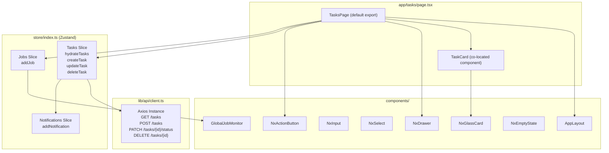
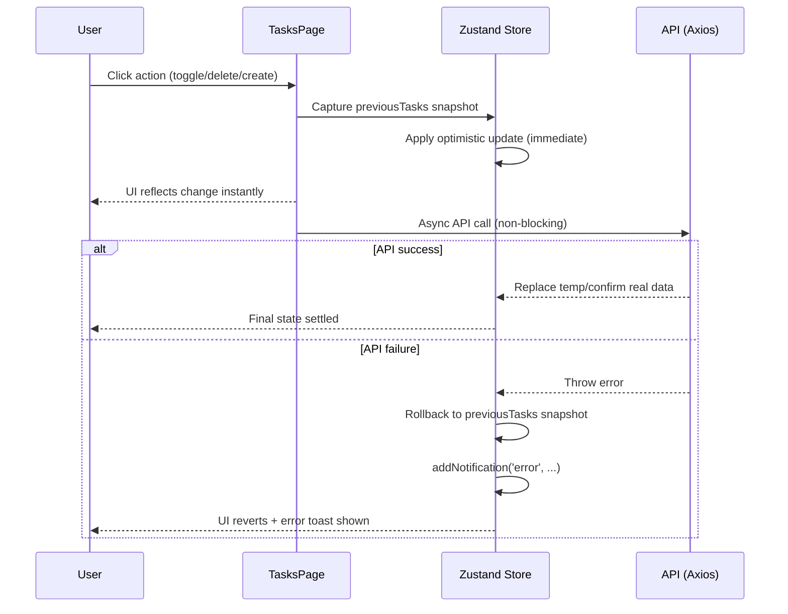

# Tasks Hub — Technical Design

## Overview

TasksHub is a kanban-style task management page in the Nexus Next.js 14 App Router application. It renders a three-column board organized by task status (todo, in-progress, completed), supports full CRUD operations against a REST API, and integrates with the global job monitoring system to reflect agent-driven side effects.

The implementation lives in a single client component file (`app/tasks/page.tsx`) with a co-located `TaskCard` subcomponent. There is no separate service layer — store actions in Zustand call `apiClient` directly. All mutations use an optimistic UI pattern: the UI is updated immediately and rolled back if the API call fails.

### Key Design Goals

- **Responsiveness**: 3-column grid on desktop, single-column stack on mobile.
- **Optimism first**: No loading spinners for mutations; failures are silent-rollback with toast feedback.
- **Simplicity**: Single-file page, no routing state, no server actions — plain client-side data fetching via Zustand.
- **Job monitor integration**: Fire-and-forget `addJob` calls signal the global pipeline on relevant transitions.

---

## Architecture



### Data Flow — Optimistic Mutation Pattern



---

## Components and Interfaces

### `TasksPage` (default export)

The root page component. Responsibilities:

- Calls `hydrateTasks()` on mount via `useEffect`.
- Manages local UI state: `isDrawerOpen`, and the four create-form fields (`newTaskTitle`, `newTaskDesc`, `newTaskPriority`, `newTaskDueDate`).
- Derives three filtered arrays from the store's `tasks` array (one per column).
- Renders the page header, 3-column grid, column empty states, and the `NxDrawer` create form.
- Handles `handleToggleStatus` and `handleAddTask` event callbacks.

**Local State:**

| State variable      | Type                       | Default    | Purpose                      |
|---------------------|----------------------------|------------|------------------------------|
| `isDrawerOpen`      | `boolean`                  | `false`    | Controls NxDrawer visibility |
| `newTaskTitle`      | `string`                   | `""`       | Controlled input: title      |
| `newTaskDesc`       | `string`                   | `""`       | Controlled input: description|
| `newTaskPriority`   | `'low' \| 'medium' \| 'high'` | `'medium'` | Controlled select: priority  |
| `newTaskDueDate`    | `string`                   | `"TBD"`    | Controlled input: due date   |

**Store selectors used:**

```ts
const tasks        = useAppStore(s => s.tasks);
const hydrateTasks = useAppStore(s => s.hydrateTasks);
const createTask   = useAppStore(s => s.createTask);
const updateTask   = useAppStore(s => s.updateTask);
const deleteTask   = useAppStore(s => s.deleteTask);
const addJob       = useAppStore(s => (s as any).addJob);
```

**`handleToggleStatus(id, currentStatus)`:**

Computes `nextStatus` using the cycle:

```
todo → in-progress → completed → todo
```

Calls `updateTask(id, nextStatus)`. If `nextStatus === 'in-progress'`, fires `addJob(`Agent solving task objective: id-${id.slice(-4)}`)` as a fire-and-forget side effect (not awaited).

**`handleAddTask(e)`:**

Validates `newTaskTitle.trim()` is non-empty. Calls `createTask(...)` with the form fields, fires `addJob('Scheduling agent task allocation workflow')`, then resets all form fields and closes the drawer.

---

### `TaskCard` (co-located subcomponent)

Props:

```ts
interface TaskCardProps {
  task: Task;
  onStatusChange: () => void;
  onDelete: () => void;
}
```

Responsibilities:
- Renders the card container with status-aware styling.
- Renders the status toggle button with the correct icon per status.
- Renders title, description (2-line clamp), priority badge, and due date.
- Renders the hover-only delete button.

**Status toggle icon mapping:**

| Status        | Icon                           | Color token  |
|---------------|--------------------------------|--------------|
| `todo`        | No icon (empty bordered box)   | `border-gray-500` |
| `in-progress` | `Clock` (lucide-react)         | `text-amber-500` |
| `completed`   | `ListTodo` (lucide-react)      | `text-white` (on emerald bg) |

**Priority badge color mapping:**

| Priority | Text token        | Border token           | Background token    |
|----------|-------------------|------------------------|---------------------|
| `low`    | `text-gray-400`   | `border-gray-400/20`   | `bg-gray-400/10`    |
| `medium` | `text-amber-400`  | `border-amber-400/20`  | `bg-amber-400/10`   |
| `high`   | `text-red-400`    | `border-red-400/20`    | `bg-red-400/10`     |

**Completed card styling:**

Cards with `status === 'completed'` receive:
- Container: `bg-white/5 border-white/5 opacity-60`
- Title: `text-gray-400 line-through`

**Delete button:**

Positioned `absolute right-3 bottom-3`. Styled `opacity-0 group-hover:opacity-100` — visible only when the parent card has the `group` class and is hovered.

---

### Column Layout

```tsx
<div className="grid grid-cols-1 md:grid-cols-3 gap-6">
  {/* Column: To Do */}
  {/* Column: In Progress */}
  {/* Column: Completed */}
</div>
```

Each column:
- Header: `<h2>` with animated status dot (blue `animate-pulse` for todo, amber `animate-pulse` for in-progress, static emerald for completed).
- Task list: `tasks.filter(t => t.status === columnStatus).map(...)`.
- Empty state: dashed-border `<div>` with column-specific placeholder text.

**Empty state messages:**

| Column      | Placeholder text           |
|-------------|----------------------------|
| To Do       | "No pending objectives."   |
| In Progress | "No running tasks."        |
| Completed   | "No completed objectives." |

---

### `NxDrawer` — Create Form

Opened by the "New Objective" `NxActionButton` in the page header. Title: `"Add Objective"`.

Form fields:

| Field           | Component   | Validation | Notes                            |
|-----------------|-------------|------------|----------------------------------|
| Objective Title | `NxInput`   | required   | `placeholder="e.g. Test upstream servers"` |
| Description     | `<textarea>`| optional   | `min-h-20`, styled with Tailwind tokens |
| Priority        | `NxSelect`  | required   | Values: `low`, `medium`, `high`  |
| Target Date     | `NxInput`   | optional   | Freeform string e.g. "Tomorrow"  |

Footer: Cancel (`variant="secondary"`) and Add Task (`type="submit" variant="primary"`) buttons.

---

## Data Models

### `Task` (from `store/index.ts`)

```ts
interface Task {
  id: string;            // Server-assigned string ID (temp IDs use "temp-{Date.now()}")
  title: string;
  description: string;
  status: 'todo' | 'in-progress' | 'completed';
  priority: 'low' | 'medium' | 'high';
  dueDate: string;       // Freeform: "Tomorrow", "May 25", ISO date string, etc.
}
```

### Priority Integer Mapping

The backend uses integer priority values. The frontend maps to/from string labels:

**Frontend → API (send):**

| Frontend string | API integer |
|-----------------|-------------|
| `'high'`        | `10`        |
| `'medium'`      | `5`         |
| `'low'`         | `1`         |

**API → Frontend (receive):**

| API integer range | Frontend string |
|-------------------|-----------------|
| `>= 7`            | `'high'`        |
| `>= 4`            | `'medium'`      |
| `< 4`             | `'low'`         |

Note: The store implementation uses the range-based receive mapping described above to ensure compatibility per the API spec.

### API Payload Shapes

**`POST /tasks` (createTask):**

```ts
{
  title: string;
  description: string;
  status: 'todo' | 'in-progress' | 'completed';
  priority: 10 | 5 | 1;   // integer
  due_date: string | null; // null if "TBD", "Tomorrow", or empty
}
```

**`PATCH /tasks/{id}/status` (updateTask):**

```ts
{ status: 'todo' | 'in-progress' | 'completed' }
```

**`DELETE /tasks/{id}` (deleteTask):** No body.

### Optimistic ID Strategy

`createTask` generates a temporary ID: `` `temp-${Date.now()}` ``. The temp task is added to the store immediately. On API success, the temp entry is replaced by the server-assigned record via `.map(t => t.id === tempId ? newTask : t)`. On failure, the temp entry is filtered out.

---

## Correctness Properties

*A property is a characteristic or behavior that should hold true across all valid executions of a system — essentially, a formal statement about what the system should do. Properties serve as the bridge between human-readable specifications and machine-verifiable correctness guarantees.*

### Property 1: Column Filter Partition

*For any* array of tasks with arbitrary status values, filtering by each of the three status values produces three disjoint sets whose union equals the full task array. Every task appears in exactly one column.

**Validates: Requirements 1.4**

### Property 2: Status Cycle Invariant

*For any* starting status value in `{ 'todo', 'in-progress', 'completed' }`, applying the `nextStatus` transition function exactly three times must return the original status value.

**Validates: Requirements 2.2**

### Property 3: Optimistic Rollback Preservation

*For any* task list state and any mutation action (status update, creation, deletion), if the underlying API call throws an error, the resulting task list in the store must be deeply equal to the task list snapshot captured immediately before the optimistic update was applied.

**Validates: Requirements 2.4, 2.5, 3.6, 3.8, 4.3, 4.4**

### Property 4: Priority Mapping Roundtrip

*For any* priority string value in `{ 'low', 'medium', 'high' }`, mapping to an integer with `priorityToInt` and then mapping back with `priorityFromInt` must return the original priority string.

**Validates: Requirements 3.5**

### Property 5: Task Card Complete Render

*For any* task object with valid field values, rendering a `TaskCard` must produce output that contains the task's title, a substring of the description, the priority label, the dueDate string, and the icon element corresponding to the task's current status.

**Validates: Requirements 1.6, 2.6**

---

## Error Handling

### API Failures

All three mutation paths (create, update, delete) follow the same error handling pattern:

1. Snapshot `previousTasks = get().tasks` before the optimistic write.
2. Apply optimistic update to the store.
3. `await` the API call inside a `try/catch`.
4. On `catch`: restore `set({ tasks: previousTasks })` and call `addNotification('error', message)`.

The `hydrateTasks` loader uses `setLoading('tasks', true/false)` around the fetch. On failure it shows a toast but does not crash the page — the UI remains with whatever tasks were already in the store (empty array on initial load).

### Error Messages

| Action         | Error notification message                    |
|----------------|-----------------------------------------------|
| hydrateTasks   | `"Failed to load objectives"`                 |
| createTask     | `"Neural grid synchronization failed"`        |
| updateTask     | `"Failed to update task status"`              |
| deleteTask     | `"Failed to delete task"`                     |

### Validation

- Task creation: `newTaskTitle.trim()` must be non-empty. The form uses the HTML `required` attribute on the `NxInput` as a first line of defense; the handler also guards with an early return if the trimmed value is empty.
- No client-side validation for `dueDate` — it is treated as a freeform string and accepted as-is.

---

## Testing Strategy

### Unit Tests (Example-Based)

Focus on concrete behavior that cannot be captured by universal properties:

- **Mount hydration**: `hydrateTasks()` is called once on mount.
- **Column render**: All three column headers render with correct labels and status dots.
- **Empty state**: Each column shows its placeholder when no tasks match.
- **Completed styling**: A completed task card has `opacity-60` class and strikethrough title.
- **Drawer open/close**: "New Objective" button opens the drawer; Cancel closes it.
- **Form submission**: Submitting with a valid title calls `createTask` with the correct payload and closes the drawer.
- **Form reset**: After submission, all form fields are reset to defaults.
- **addJob on in-progress**: Transitioning a task to `in-progress` calls `addJob` with the expected string.
- **addJob on create**: Submitting the form calls `addJob('Scheduling agent task allocation workflow')`.
- **Delete interaction**: Clicking the delete button calls `deleteTask` with the correct task ID.
- **Delete hover visibility**: Delete button has `opacity-0 group-hover:opacity-100` classes.

### Property Tests (Property-Based)

Pick a property-based testing library appropriate for the TypeScript/React stack: **fast-check** (`npm install --save-dev fast-check`). Configure each property test to run a minimum of 100 samples.

Tag format: `// Feature: tasks-hub, Property {N}: {property_text}`

**Property 1 — Column Filter Partition**
```
// Feature: tasks-hub, Property 1: every task appears in exactly one column
fc.assert(fc.property(fc.array(arbTask), (tasks) => {
  const todo       = tasks.filter(t => t.status === 'todo');
  const inProgress = tasks.filter(t => t.status === 'in-progress');
  const completed  = tasks.filter(t => t.status === 'completed');
  const union      = [...todo, ...inProgress, ...completed];
  // disjoint (no overlaps) + union equals full array
  return union.length === tasks.length &&
         todo.every(t => t.status === 'todo') &&
         inProgress.every(t => t.status === 'in-progress') &&
         completed.every(t => t.status === 'completed');
}), { numRuns: 100 });
```

**Property 2 — Status Cycle Invariant**
```
// Feature: tasks-hub, Property 2: cycling status 3 times returns to origin
const nextStatus = (s: Task['status']) =>
  s === 'todo' ? 'in-progress' : s === 'in-progress' ? 'completed' : 'todo';

fc.assert(fc.property(fc.constantFrom('todo', 'in-progress', 'completed'), (status) => {
  return nextStatus(nextStatus(nextStatus(status))) === status;
}), { numRuns: 100 });
```

**Property 3 — Optimistic Rollback Preservation**
```
// Feature: tasks-hub, Property 3: API failure rolls back to pre-action state
fc.assert(fc.property(fc.array(arbTask, { minLength: 1 }), async (tasks) => {
  // Initialize store with random tasks
  // Simulate updateTask with a forced API failure
  // Assert store.tasks deep-equals the pre-action snapshot
}), { numRuns: 100 });
```

**Property 4 — Priority Mapping Roundtrip**
```
// Feature: tasks-hub, Property 4: priority string → int → string is lossless
const priorityToInt = (p: string) => p === 'high' ? 10 : p === 'low' ? 1 : 5;
const priorityFromInt = (n: number): string =>
  n >= 7 ? 'high' : n >= 4 ? 'medium' : 'low';

fc.assert(fc.property(fc.constantFrom('low', 'medium', 'high'), (priority) => {
  return priorityFromInt(priorityToInt(priority)) === priority;
}), { numRuns: 100 });
```

**Property 5 — Task Card Complete Render**
```
// Feature: tasks-hub, Property 5: TaskCard renders all required fields for any task
fc.assert(fc.property(arbTask, (task) => {
  const { getByText, container } = render(
    <TaskCard task={task} onStatusChange={jest.fn()} onDelete={jest.fn()} />
  );
  expect(getByText(task.title)).toBeInTheDocument();
  expect(container.textContent).toContain(task.dueDate);
  expect(container.textContent).toContain(task.priority);
  // Assert correct icon class based on task.status
}), { numRuns: 100 });
```

### Integration Tests

- **`GET /tasks` hydration**: Real or MSW-mocked endpoint returns tasks that appear correctly on the board.
- **`PATCH /tasks/{id}/status`**: Status update is sent with the correct payload after toggle.
- **`POST /tasks`**: Create payload includes integer priority and `due_date` field.
- **`DELETE /tasks/{id}`**: Delete request fires after clicking the delete button.
