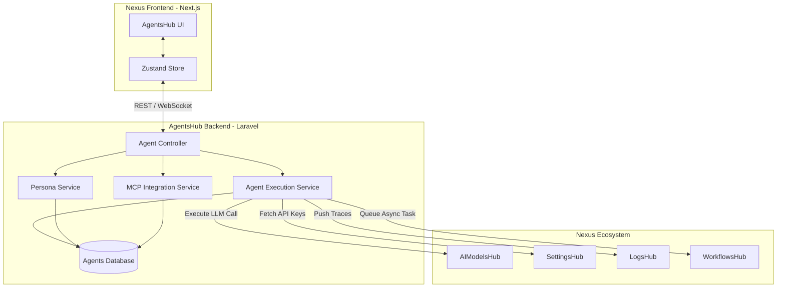
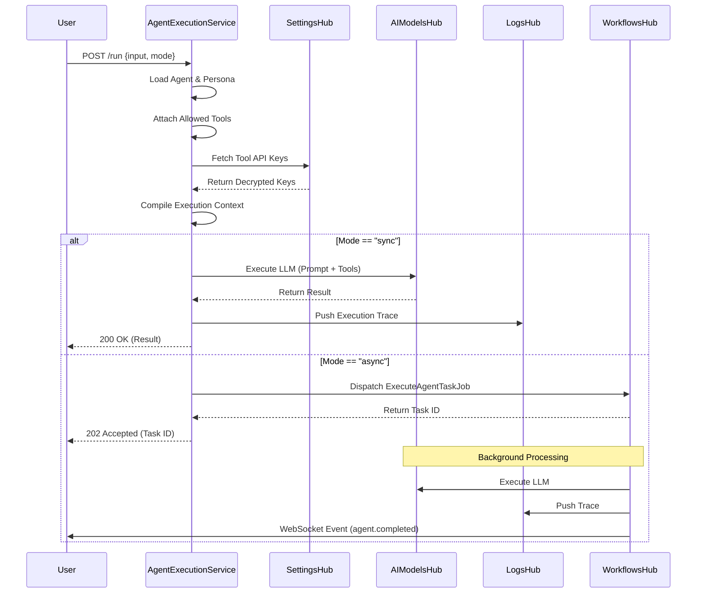
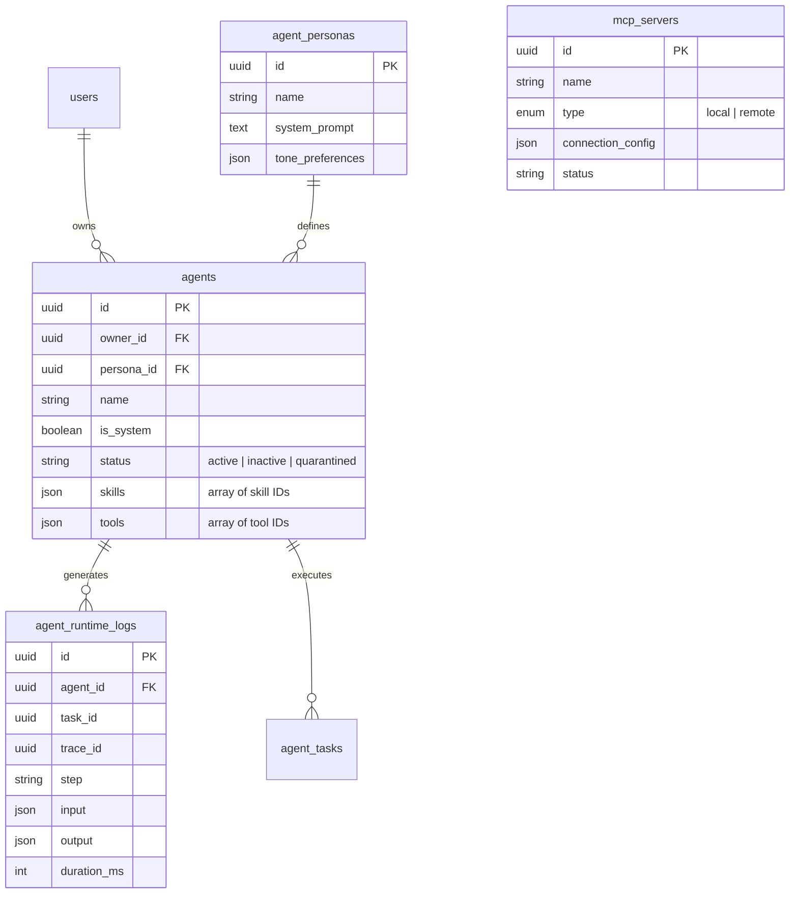
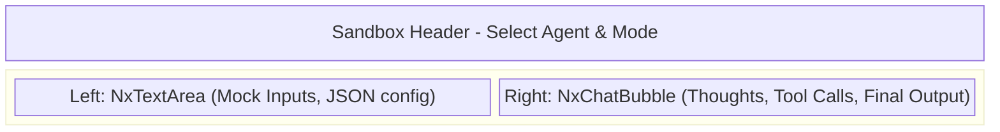

# AgentsHub Visual Architecture & UI Design

This document provides visual diagrams and UI specifications for the AgentsHub implementation, illustrating how the backend architecture, execution flows, and frontend UI components interact.

## 1. System Architecture & Hub Integrations

The AgentsHub acts as the central orchestration engine. It does not execute LLMs directly; instead, it compiles the necessary context (Persona, Tools, API Keys) and interfaces with the broader Nexus ecosystem.



## 2. Agent Execution Flow

The Execution Flow handles both Synchronous (immediate response) and Asynchronous (background processing) modes.



## 3. Database Entity Relationship



## 4. Frontend UI Layout (Next.js)

The AgentsHub UI is a multi-tab interface built with `NxTabs`.

> [!TIP]
> **Design Philosophy**: Use rich aesthetics with glassmorphism, dynamic animations on state changes (e.g., executing agent pulsing), and deep dark modes.

````carousel
```mermaid
%% Slide 1: Main Dashboard Layout
block-beta
    columns 1
    Header["Nexus Header (Breadcrumbs, Profile)"]
    block:MainLayout
        columns 5
        Sidebar["Hub Sidebar Navigation"]:1
        block:Content
            columns 1
            Tabs["NxTabs (Registry | Personas | Skills | Tools | MCP | Sandbox)"]
            Grid["NxDataGrid: Agent Cards (Status, Type, Name)"]
        end:4
    end
```
<!-- slide -->

````

### Key UI Components

1.  **`NxAgentCard`**: Displays the agent's avatar, name, operational status badge (e.g., Green for Active, Red for Quarantined), and a lock icon if `is_system` is true.
2.  **`NxDrawer` (Agent Editor)**: Sliding panel from the right to edit the agent's properties, assign a persona, and toggle skills/tools.
3.  **`NxChatBubble`**: Used in the Sandbox to render streaming thoughts, tool invocations (with collapsible JSON data), and the final result.
4.  **Simulation Playground**: A split-screen layout for testing agents safely with mocked tool responses.
