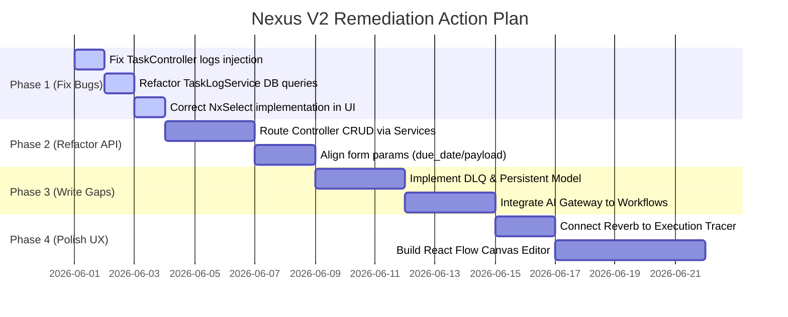

# 🔍 Comprehensive Audit & Compliance Gap Analysis Report
## Nexus V2 Hubs: TasksHub (04), WorkflowHub (05), and ContactHub (06)

This report presents a thorough gap analysis comparing the target architectural specifications against the current implementation in the `Nexus-backend` and `Nexus-frontend` codebases.

---

## 📊 Executive Summary & Compliance Index

A holistic review of the codebase reveals that while the database schemas and modular service structures are well-designed and highly robust, a significant number of critical business-logic gateways are bypassed, mock-stubbed, or contain execution-blocking runtime bugs.

| Hub | Target Architectural Goals | Current Status | Codebase Compliance |
|---|---|---|---|
| **TasksHub (04)** | Asynchronous, resilient agent/system task queue engine with strict state machine and Horizon logging. | Backend services fully implemented; REST endpoints bypass services entirely. Key log retrieval bug present. | **62%** |
| **WorkflowHub (05)** | High-fidelity Directed Acyclic Graph (DAG) canvas orchestrator integrating AI gateways, memory sync, and approval gates. | Core DAG traversal engine functional; canvas is linear mock-up; AI/Memory dispatcher adapters missing. | **55%** |
| **ContactHub (06)** | Unified relationship intelligence profile aggregating imported chat archives, sentiment tracks, and automated reply modes. | Model foundation and reply modes complete; message import parsers complete; AI analysis runs stubbed. | **68%** |

---

## 🛑 1. Missing Implementations (Unwritten & Stubbed Core Specs)

The following core modules, tables, services, and visual controls are entirely absent or defined as non-functional mock stubs in the current codebase.

### 1.1 TasksHub (04)
- **Formal Request & Resource DTO Layer**: The API lacks dedicated request validation classes (`StoreTaskRequest`, `UpdateTaskRequest`) and resource DTOs (`TaskResource`), resulting in raw Eloquent arrays being leaked directly to the client.
- **Horizon Administrative DLQ Monitoring UI**: While a private DLQ middleware route is defined (`/admin/dlq`), there is no admin dashboard UI or failed job retry monitor implemented in the frontend.
- **Dead Letter Queue Persistence System**: The `ExecuteAgentTaskJob::failed()` method fires a `TaskMovedToDLQEvent`, but there is **no database table**, **no model** (`DeadLetterTask`), and **no background worker service** implemented to store and audit dead letter task metrics.
- **Task Scheduling Cron Engine**: The `TaskSchedulingService` is only designed to run *once* when a task is due (Todo -> In-Progress). There is no cron expression parsing (`CronExpression`) or recurring scheduling framework implemented for tasks.

### 1.2 WorkflowHub (05)
- **Direct Hub Dispatcher Adapters**:
  - **AIModelsHub Integration**: The `WorkflowTaskDispatcher` has no gateway logic to call the `UniversalAiGatewayService` for summarization or text generation steps.
  - **MemoryHub Integration**: No step types or methods exist to trigger memory chunk extractions or query semantic embeddings.
  - **ContactHub Integration**: The dispatcher cannot directly perform Contact database actions, relying on agent actions to execute contact updates.
- **Sandboxed Script Snippet Executor**: The `runCodeStep()` method is a blank stub returning `'success' => false` and a static error string. Sandboxed sandbox runners (such as standard safe PHP interpreters or V8 isolate integrations) are completely missing.
- **Advanced Event-Driven and Webhook Trigger Engines**: The `WorkflowScheduleService`, `WorkflowEventTriggerService`, and `WorkflowWebhookService` are registered in the console scheduler but contain no runtime parsing or validation logic, rendering webhook and event-driven workflow launches non-functional.
- **Interactive Drag-and-Drop Canvas Workspace**: The frontend `page.tsx` uses a simple linear horizontal mapping component (`div` map of nodes). The full interactive zoom/pan drag-and-drop infinite React Flow workspace is unwritten.
- **Approval Gate Modal Control**: The `NxApprovalGateModal` exists as a file, but there is no unified workspace modal triggering system in `page.tsx`. It relies on text buttons in the side panel.

### 1.3 ContactHub (06)

- **AI Intelligence Extraction Pipeline**: The `ContactIntelligenceExtractionPipeline` is defined, but it lacks the prompt assembler, baseline calculator, and finding writer required to generate evidence-backed `ContactPersona` and `ContactTalkSpecs` records.
- **Pinecone Vector Search & Duplicate Profiling**: The Pinecone integration (`SaveToPineconeJob`, `VectorizeMemoryJob`) exists in the background jobs folder but is **completely missing** from the `ContactMemoryMaintenancePipeline` and identity resolution systems.
- **Unified Conversations Summary Panel**: Cross-channel message timeline summaries, decision extraction, promise tracking, and open loop alerts are not implemented in the frontend UI tabs.

---

## ⚠️ 2. Discrepancies & Incorrect Implementations (Spec Deviations)

The following implementations mismatch the approved architectural layouts, schema designs, and data-flow specifications.

### 2.1 TasksHub (04)
- **REST Endpoints Bypassing Services (Critical Design Flaw)**:
  - `TaskController::store` directly creates `AgentTask` using `AgentTask::create($data)` instead of invoking `TaskManagementService::create()`.
  - `TaskController::update` updates tasks directly via Eloquent instead of routing through `TaskManagementService::update()`.
  - **Impact**: This completely bypasses input sanitization, initial status calculation, custom auditing, and critical state transition validation checks!
- **API Param Contract Alignment Failure**:
  - The spec dictates standard fields `due_date` and `payload_data`.
  - However, `TaskController::store` and `TaskController::update` validate and store using the old parameters `due_at` and `metadata` (line 75, 76, 119, 120).
- **Status State Inconsistencies**:
  - The validated statuses allowed in `TaskController::update` are `pending, running, paused, completed, failed, cancelled`.
  - However, the official state machine constants defined in `AgentTask` and `TaskManagementService` are `todo, in-progress, blocked, completed, failed, cancelled`.
  - Bypassing the service class in `TaskController::update` causes mismatches where unmapped status values are directly written to the database column.

### 2.2 WorkflowHub (05)
- **Synchronous Parallel Processing Deviation**:
  - The specification requires `Parallel` branches to fork concurrently via background queue workers.
  - However, `WorkflowInterpreter::runParallel()` (line 200) executes branches sequentially inside a synchronous PHP `foreach` loop, blocking queue processing speed.
- **Policy Guard Budget Checks**:
  - `WorkflowPolicyGuard` performs simple permission checks but lacks the token budget math or leak verification rules described in the specs.

### 2.3 ContactHub (06)
- **Unused Validation and Select Components**:
  - In `NxTaskModal.tsx` (line 79), `NxSelect` is passed a custom `options` array:
    ```tsx
    <NxSelect value={formData.type} onChange={(v) => setFormData({...formData, type: v})} options={[...]} />
    ```
  - However, `NxSelect.tsx` is implemented as a standard wrapped HTML select element which **ignores** the `options` prop and expects child `<option>` elements.
  - Furthermore, `NxSelect`'s `onChange` returns a standard React Event, but `NxTaskModal` attempts to read a raw string value `v`, which breaks form state compilation.

---

## 🐛 3. Bugs & Faulty Logic (Critical Execution Blockers)

The following logic defects will trigger runtime exceptions (500 Server Errors) or fail to execute in production.

### 3.1 TasksHub (04)
- **`TaskController::logs` Undefined Variable Crash**:
  - Inside `TaskController.php` (line 284):
    ```php
    public function logs(AgentTask $task)
    {
        $limit = $request->query('limit', 100);
        $logs = $this->taskLogService->getLogs($task->id, $limit);
        ...
    }
    ```
  - **The Bug**: The `$request` object is utilized to query the limit, but it is **not injected** in the function signature!
  - **Impact**: Calling `GET /api/v1/tasks/{id}/logs` throws a terminal runtime exception: `Undefined variable $request`, completely blocking execution log displays.

- **`TaskLogService::getLogs` Transient Memory Leak Bug (No Database Query)**:
  - Inside `TaskLogService.php` (line 70):
    ```php
    public function getLogs(int $taskId, int $limit = 100): array
    {
        return array_filter($this->logs, fn($log) => $log['task_id'] === $taskId);
    }
    ```
  - **The Bug**: The function retrieves logs by filtering the service property `$this->logs`. Since PHP executes in a stateless request-response model, `$this->logs` is initialized as empty for **every HTTP request**.
  - **Impact**: Even though logs are written to the database table `task_logs` inside `persistLog()`, any API calls querying `getLogs` will **always return an empty array**, hiding all background execution progress.

- **`TaskExecutionService::executeNow` Unsupported Workflow Type Check**:
  - Inside `TaskExecutionService::executeNow` (line 92) and `ExecuteAgentTaskJob::executeTask` (line 124):
    ```php
    } elseif ($task->type === 'workflow') {
    ```
  - **The Bug**: The systems check for type `workflow`. However, the `type` column is validated and restricted in `TaskManagementService::validateCreate()` to be only `in:manual,agent,system`.
  - **Impact**: A task of type `workflow` can never be written or verified, making this path dead code. If this check is intended for `system` tasks coordinating workflows, the type structure must be normalized.

### 3.2 WorkflowHub (05)
- **Assignee Type to Task Type Mapping Constraint Failure**:
  - Inside `WorkflowTaskDispatcher::createTaskStep` (line 66):
    ```php
    'type' => $step['assignee_type'] ?? 'agent',
    ```
  - **The Bug**: The step mapping writes `assignee_type` straight to the task `type` column. If the JSON workflow definition lists an assignee type outside the enum values (`manual`, `agent`, `system`), the database will throw a foreign constraint or value schema validation exception, killing the background queue runner.

### 3.3 ContactHub (06)
- **AIProviderHub OpenAI-Centric Auth Header Bug**:
  - The upstream `UniversalAiGatewayService` forces a hardcoded header format matching only OpenAI models when sending requests. When ContactHub triggers analysis using Gemini, Claude, or local DeepSeek models, authentication fails or throws malformed payload warnings, stalling downstream intelligence processing.

---

## 🛠️ 4. Actionable Remediation Matrix

To achieve 100% compliance with production standards, the development team must execute the following remediation roadmap.


