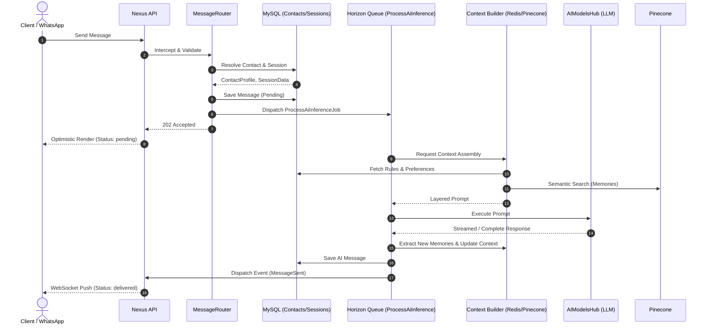

# 🗣️ Nexus Conversation System & Contacts Architecture

## 1. System Overview

The Nexus Conversation System is the beating heart of the platform, seamlessly orchestrating communication across multiple channels, contexts, and cognitive layers. It bridges the gap between human users, AI agents (like HedraSouly), and external contacts (via PeopleConnect & WhatsApp), ensuring highly intelligent, context-aware, and continuous dialogue.

This documentation serves as the canonical reference for the conversation lifecycle, contact intelligence mapping, and the comprehensive feature set governing messaging dynamics.

---

## 2. Comprehensive Feature Index (45 Features)

The Conversation System and its integrated Contacts Hub empower the platform with the following capabilities:

### 2.1 Contact Intelligence & Management (12 Features)
1.  **Multi-Identifier Resolution**: Automatic deduplication and linking of contacts via email, phone, and external IDs.
2.  **Idempotency & Soft Merge**: Safe upsert mechanisms with `prefer_new`, `prefer_trusted`, and `manual` merge strategies.
3.  **Alias Normalization**: Support for managing multiple aliases mapped to a primary canonical contact record.
4.  **Relationship Graph Construction**: Bidirectional mapping of connections (family, vendor, prospect, client).
5.  **External Profile Enrichment**: Automated assimilation of contact details from third-party APIs into the local profile.
6.  **Custom Fields Integration**: Dynamic attributes to store domain-specific contact data.
7.  **Preferences Engine**: Granular tracking of communication preferences, inferred tone, and interaction frequency.
8.  **Contact-Specific Rule Engine**: Strict business rules attached to a contact (e.g., "Never discuss pricing").
9.  **Tags & Semantic Segmentation**: Flexible categorization to drive audience targeting and personalized context.
10. **GDPR/Erasure Compliance**: Deep-erasure cascades wiping contact memories, aliases, and identifiers upon request.
11. **Event Timeline & Auditing**: A chronological history of contact-related system events, notifications, and edits.
12. **Automated Notes Extraction**: Passive extraction and logging of summaries into contact-specific notes.

### 2.2 Session & Topic Dynamics (11 Features)
13. **Dual-Tab Interface Mode**: Distinct contextual environments for `HedraSouly` (Internal AI) and `PeopleConnect` (External channels).
14. **Topic Identification**: Automated classification of incoming messages into overarching conversation topics.
15. **Topic Drift Detection**: Continuous monitoring of semantic drift to transition context or spawn new topics gracefully.
16. **Session Lifecycle Policies**: Auto-archiving of stale sessions and transparent resumption of closed sessions.
17. **Reference Resolution**: Deep contextual understanding resolving pronouns (`it`, `that`) across multiple turns.
18. **Concurrent Multi-Session Context**: Safe parallel tracking of isolated conversations without cross-contamination.
19. **Conversational Memory Injection**: On-the-fly inclusion of historical episodic memory snippets into the active prompt.
20. **Context Trimming**: Automatic pruning of stale conversational context to optimize token budgets.
21. **Auto-Summarization Limits**: Automatic summarization of sprawling threads to preserve core context efficiently.
22. **Interruptible Workflows**: Ability to pause background task execution when a user interjects with a new directive.
23. **Session Analytics & Metrics**: Storage of start/end times, metadata, and token consumption at the session level.

### 2.3 Messaging & Pipeline Delivery (12 Features)
24. **Multi-Channel Webhook Ingestion**: Native endpoints to receive WAHA (WhatsApp HTTP API) and web client payloads.
25. **Asynchronous Background Processing**: Offloading LLM inference to Horizon queue workers (`ProcessAiInferenceJob`).
26. **Optimistic UI Rendering**: Immediate message reflection in the frontend while waiting for backend confirmation.
27. **Token Budget Enforcement**: Strict accounting of token usage attached to message metadata.
28. **Long-Context Batching**: Client-side and server-side chunking to handle massive paste operations.
29. **Rich Payload & Markdown Support**: Native parsing of tables, code blocks, lists, and formatted text.
30. **Asset & Attachment Linking**: Drag-and-drop file ingestion tethered as metadata to specific message IDs.
31. **Delivery Status Receipts**: Real-time state transitions (`pending`, `sent`, `delivered`, `read`, `failed`).
32. **Model Selection & Routing**: Dynamic model assignment based on task complexity, provider availability, and rate limits.
33. **Provider Fallback Chains**: Automatic failover to secondary AI providers (e.g., Gemini -> OpenAI) upon rate limits.
34. **Message Split Delivery**: Breaking down massive AI responses into naturally readable multi-message sequences.
35. **Natural Timing Delays**: Emulating human typing latency for outgoing external messages.

### 2.4 UI/UX Visualization & Engagement (10 Features)
36. **Skeleton Typing & Progress Bars**: Real-time `NxThinkingIndicator` mapping AI inference steps.
37. **Emotion & Sentiment Radar**: Live visualization of the conversation's tone via `NxEmotionRadar`.
38. **Memory Network Graphs**: Interlinked view of related contacts and recalled facts via `NxMemoryMiniGraph`.
39. **Threaded Context Views**: Collapsible inline replies mapped by `thread_id`.
40. **Relationship Timelines**: Visual history of interactions mapped via `NxRelationTimeline`.
41. **Command Bar Quick Actions**: `/` commands for macros, task dispatching, and workflow invocation within chat.
42. **Scheduled Send Overlays**: UI integration with `SchedulerHub` to defer message delivery.
43. **Drag & Drop Attachment Zones**: Effortless `NxDragDropZone` integration over the chat canvas.
44. **Context Bar Expose**: Displaying currently injected rules, tags, and memory vectors via `NxContextBar`.
45. **Contact 3D Card Profiling**: Rich, interactive contact summaries using `NxContactCard3D`.

---

## 3. The Conversation Pipeline Lifecycle

Every interaction flows through a rigorous, multi-layered pipeline ensuring security, context awareness, and intelligent delivery.

### Phase 1: Ingestion & Routing (Receiving the Message)
1. **Endpoint Activation**: A message arrives via `POST /api/v1/conversations/{id}/messages` or via external webhook (`WAHAIntegration`).
2. **Contact Identification**: The `MessageRouter` intercepts the payload. Using `Contact::findByIdentifiers`, it resolves the sender's phone, email, or external ID to a canonical Contact record.
3. **Session Validation**: The system ensures an active `ConversationSession` exists. If the session is archived or stale, it restores context or spawns a new session.
4. **Initial Storage**: The message is written to the database with a `status` of `pending`. An Optimistic update (`MessageSent` event) is broadcast via WebSockets to the frontend.
5. **Job Dispatch**: The heavy lifting is delegated to `ProcessAiInferenceJob`, freeing the HTTP thread.

### Phase 2: Context Assembly & Cognition
1. **Working Memory Retrieval**: The job loads the last $N$ messages from the active session cache (Redis).
2. **Context Enrichment**:
   - **Profile Injection**: Extracts the Contact's name, preferences, and custom fields.
   - **Rule Injection**: Appends hard constraints from `ContactRule` (e.g., "Speak formally").
   - **Semantic Search**: Queries Pinecone (Vector DB) for relevant past facts, beliefs, and interactions matching the current topic.
3. **Intent & Topic Engine**: Analyzes the raw input to determine user intent. Checks for **Topic Drift**; if detected, it adjusts context weights to prioritize the new subject.
4. **Prompt Building**: The `PromptBuilder` merges all layers (System instructions + Rules + Context + Memories + Current Message) into a unified LLM prompt.

### Phase 3: AI Inference & Extraction
1. **Model Routing**: Selects the optimal provider (e.g., Gemini 1.5 Pro) based on complexity and config (`AiModelsHub`).
2. **Execution**: The prompt is dispatched to the LLM. If the provider fails, the **Fallback Chain** automatically retries with a secondary provider.
3. **Memory Extraction**: The AI's response is simultaneously parsed by the **Extraction Pipeline**.
   - Identifies new facts, beliefs, or relationships explicitly stated.
   - Saves them to the `MemoryHub` (Structured MySQL + Vector Pinecone).
4. **Tone Mapping**: Validates that the response aligns with the `ToneRouter`'s determined emotional posture.

### Phase 4: Delivery & Broadcasting
1. **Response Formatting**: The raw text is cleaned, markdown parsed, and split into multiple chunks if it exceeds channel limits (e.g., WhatsApp constraints).
2. **Database Persistence**: The agent's response is saved as a new `Message` associated with the thread.
3. **External Dispatch**: If the channel is `PeopleConnect` / WhatsApp, the message payload is relayed to the external provider API.
4. **WebSocket Push**: The frontend receives the finalized message with updated token usage metadata and `status: delivered`.
5. **Cache & Audit Cleanup**: The conversation state in Redis is updated, and the action is securely logged in `LogsHub`.

---

## 4. Architectural Sequence Diagram

---

## 5. Summary

The Nexus Conversation System merges **Relational Data** (Contacts, Rules), **Semantic Data** (Vector Memories), and **Real-Time Event Streams** to create an adaptive cognitive architecture. By dividing operations into modular pipelines (Routers, Engines, Builders), the system scales efficiently across background workers while delivering a deeply personalized, secure, and instantaneous conversational experience.
