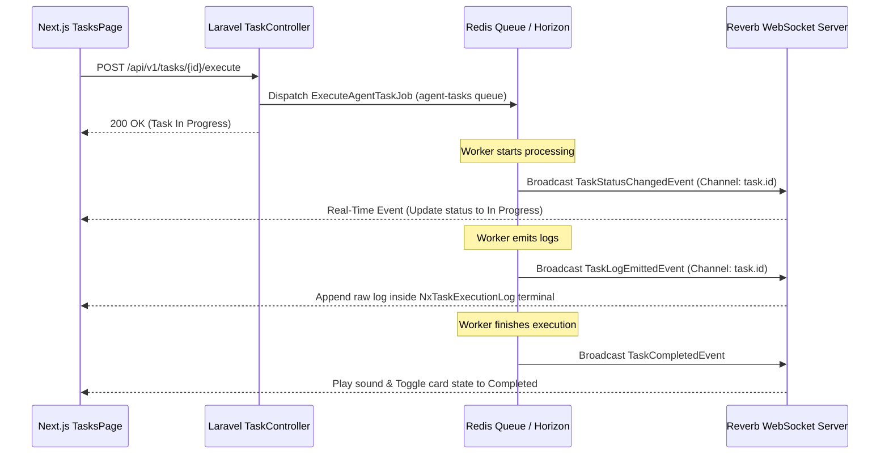
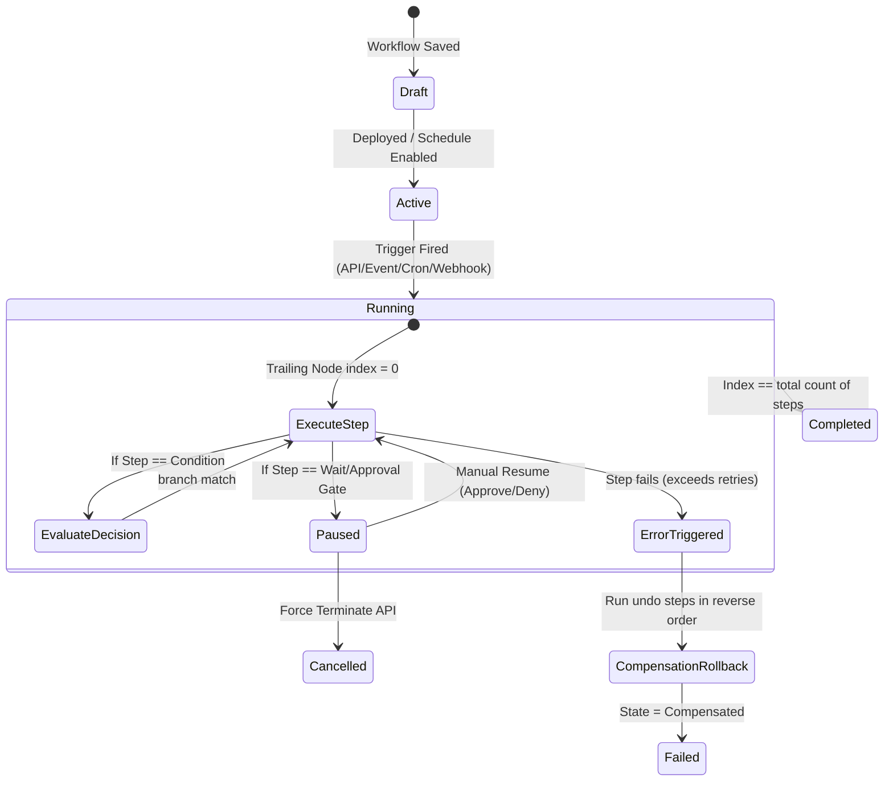

# 🎨 Visual Architecture & UI Specification - Nexus V2 Hubs
## System Design, Visual Grammar, and Frontend Component Blueprint for TasksHub, WorkflowHub, and ContactHub

This specification defines the unified design system, structural architecture, page layouts, interactive visual components, state management, and real-time state synchronization for **TasksHub (04)**, **WorkflowHub (05)**, and **ContactHub (06)** in the Nexus V2 platform.

---

## 🪐 1. Global Visual Design System & Aesthetics

Nexus is engineered as a premium, state-of-the-art interface tailored for intensive individual workflow orchestration and relationship intelligence. The design avoids browser defaults and boring generic color patterns, utilizing a curated dark mode palette with a high-fidelity glassmorphic overlay system, smooth micro-animations, and precise typographic hierarchy.

### 1.1 Curated Color Palette (HSL & Sleek Dark Tokens)

We employ a unified, multi-dimensional semantic HSL color system that remains stable across light/dark contrast layers.

| Token | Semantic Purpose | Dark Mode HSL | Hex Value Equivalent | Visual Effect |
|---|---|---|---|---|
| `--bg-deep` | Core System Backdrop | `hsl(224, 71%, 4%)` | `#02040a` | Absolute depth background |
| `--surface-base` | Low-elevation Card / Panel | `hsl(222, 47%, 7%)` | `#060b13` | Subtle contrast separator |
| `--surface-glass` | Elevated Interactive Glass | `hsla(223, 47%, 11%, 0.6)` | `#0f172a / 60%` | Backed by `backdrop-blur-md` |
| `--nexus-blue` | Primary / Core Action / Intelligence | `hsl(217, 91%, 60%)` | `#3b82f6` | Vibrant neon glow |
| `--nexus-teal` | Agent Status / Execution / Processing | `hsl(174, 90%, 41%)` | `#14b8a6` | Deep, alive electric cyan |
| `--success` | Complete / Safe Status | `hsl(142, 72%, 29%)` | `#16a34a` | Balanced botanical green |
| `--amber` | Paused / Pending / Warning state | `hsl(38, 92%, 50%)` | `#f59e0b` | Soft security amber |
| `--error` | Fault / DLQ / Critical Alert | `hsl(0, 84%, 60%)` | `#ef4444` | High-chroma indicator red |
| `--text-primary` | High Contrast Text | `hsl(210, 40%, 98%)` | `#f8fafc` | Crisp off-white |
| `--text-secondary` | Low Contrast Utility Text | `hsl(215, 20%, 65%)` | `#94a3b8` | Neutral cool gray |

### 1.2 Glassmorphism & Depth Specs
Every floating panel or card uses a complex CSS composite style:
```css
.nx-glass-panel {
  background: linear-gradient(135deg, rgba(15, 23, 42, 0.6) 0%, rgba(30, 41, 59, 0.4) 100%);
  backdrop-filter: blur(12px) saturate(160%);
  border: 1px solid rgba(255, 255, 255, 0.08);
  box-shadow: 0 8px 32px 0 rgba(0, 0, 0, 0.37);
  border-radius: 12px;
}
```

### 1.3 Typography
Nexus uses modern, high-legibility geometric sans-serif typefaces loaded dynamically from Google Fonts.
- **Primary Typeface**: `Inter` (UI elements, labels, dense grids)
- **Display / Headers**: `Outfit` (Visual summaries, metric cards, titles)
- **Monospace / System**: `JetBrains Mono` (Terminal logs, execution tracers, code steps)

---

## 🛠️ 2. Hub 04: TasksHub Visual Architecture

TasksHub acts as the orchestrator of action items in Nexus, classified into **Manual**, **Agentic**, and **System** tasks.

### 2.1 Component Specifications

#### A. `NxTaskCard`
- **Visual Design**: Sleek glass container (`nx-glass-panel`) with a dynamic left-border indicating the task priority. Includes type icon (hand for manual, robot for agentic, terminal for system).
- **Interactive State**: Hover scales card slightly (`scale-102`), glows borders with `--nexus-blue` and shows administrative action controls (Execute, Edit, Cancel, Delete).
- **Progress Track**: A micro-line at the card bottom indicating progress (e.g. 0-100% gradient using `--nexus-teal`).

#### B. `NxTaskModal`
- **Visual Design**: Center-aligned heavy backdrop-blur overlay modal (`NxModal` wrapper). Fits a form targeting fields: Title, Description, Type, Contact/Conversation contextual dropdowns, Priority, Due Date, and Payload Data.
- **Dynamic Field rendering**: If Type = `agent`, reveals a detailed Agent Assignment drop-down. If Type = `system`, details targeted execution script parameters.
- **Code Payload Editor**: An integrated code editor block using `JetBrains Mono` for specifying complex `payload_data` JSON.

#### C. `NxTaskExecutionLog`
- **Visual Design**: Styled as a premium command-line retro terminal. Integrated background (`hsl(224, 71%, 2%)`) with text using `--nexus-teal` (info) and `--error` (fail logs).
- **Log Streaming Indicator**: A pulsating green cursor (`_`) at the bottom of the log list.
- **Connection**: Streams incoming real-time logs by subscribing to Reverb channels on `task.{taskId}` events.

### 2.2 TasksHub Page Layout Blueprint (Kanban vs Grid View)

```
+----------------------------------------------------------------------------------------------------+
| [Hub Icon] Task Objectives                                     [Stats: Active (5) Stale (2) DLQ (0)]|
| SEARCH: [____________________]  TYPE: [All v]  PRIORITY: [All v]    [+ New Objective] [Toggle Grid] |
+----------------------------------------------------------------------------------------------------+
|                                                                                                    |
|  +---------------------------+  +---------------------------+  +---------------------------+       |
|  |  TO DO (2)                |  |  IN PROGRESS (1)          |  |  COMPLETED (2)            |       |
|  |  +---------------------+  |  |  +---------------------+  |  |  +---------------------+  |       |
|  |  | [Robot] Task #104   |  |  |  | [Term] SysSync #92  |  |  |  | [Hand] Call Contact |  |       |
|  |  | Priority: High (Red)|  |  |  | Priority: Low (Gray)|  |  |  | Priority: Med (Amber)|  |       |
|  |  | Progress: [        ]|  |  |  | Progress: [████░░░░]|  |  |  | Progress: [████████]|  |       |
|  |  | Due: Tomorrow       |  |  |  | [▶ Run] [⏸ Pause]    |  |  |  | [♻ Re-run] [✕ Erase] |  |       |
|  |  +---------------------+  |  |  +---------------------+  |  |  +---------------------+  |       |
|  +---------------------------+  +---------------------------+  +---------------------------+       |
|                                                                                                    |
+----------------------------------------------------------------------------------------------------+
```

### 2.3 Real-Time WebSocket Synchronization Pipeline


---

## ⚙️ 3. Hub 05: WorkflowHub Visual Architecture

WorkflowHub provides a high-fidelity visual layout for building, tracking, and executing Directed Acyclic Graphs (DAG) of system automations.

### 3.1 Canvas Design & Layout Specs

#### A. Left Node Library Drawer (`NxWorkflowSidebar`)
- Vertical list of draggable node building blocks categorized by:
  - **Triggers**: Webhooks, Chronological Schedule (Cron), Event Emitter triggers.
  - **Actions**: AI Inference gateway, WhatsApp notify templates, contact database writes.
  - **Conditionals**: Boolean Decision splits, Array Loop wrappers.
  - **Gates**: Human-in-the-loop Approval halts.

#### B. The Canvas Workspace (`NxWorkflowCanvas`)
- An infinite grid backdrop (pixel size: `24px` pattern, dark contrast lines).
- Implements Zoom controls, Pan actions, and Drag-and-Drop integration using React Flow.
- Connection Edges (`NxFlowLines`): Dynamic SVG lines glowing with electric `--nexus-blue` for active routes, and dotted grey for inactive decision paths.

#### C. Right Properties & Terminal Drawer
- Opened automatically when clicking a node. Details parameters specific to node type (e.g. prompt template context for AI models, retry configuration, fallback strategies).
- Houses the live terminal tracer (`NxExecutionTracer`) printing structured logs in real-time.

### 3.2 Visual Node Specifications (`NxWorkflowNode`)

A compact glass container that represents a step in the DAG. It includes input/output connection handles at precise boundaries.

```
       [ Trigger: Event-Driven ]  <- Node Type Indicator (-Top)
  +---------------------------------+
  | (⚡)  ContactCreated            | <- Step Icon & Step Name
  | ------------------------------- |
  | Type: EventTrigger              | <- Operational metadata
  | Status: [ Success (Green Border)] <- Dynamic Glow border
  +---------------------------------+
```

#### Node HSL Status Indicator Rules:
- **Pending**: Solid gray border `hsl(215, 20%, 30%)`.
- **Running**: Pulsating cyan/teal glow `hsl(174, 90%, 41%)` using a custom breathing keyframe animation.
- **Success**: Vibrant green border `hsl(142, 72%, 29%)` with double tick icon.
- **Failed**: High-chroma solid red border `hsl(0, 84%, 60%)` with warning indicator.
- **Paused / Approval Gate**: Soft warning amber border `hsl(38, 92%, 50%)` with a blinking standby orb.

### 3.3 State Machine and Event flow


---

## 👥 4. Hub 06: ContactHub Visual Architecture

ContactHub aggregates identity canonicalization, structured profiles, unified messaging context, and machine learning intelligence into the **Contact360 Profile Layout**.

### 4.1 Component Specifications

#### A. `NxContactCard3D`
A dense grid card that leverages CSS 3D perspective offsets to show relationship context at a glance.
- **Visual indicators**:
  - **WhatsApp number**: Highlighted with custom icon.
  - **Contact Type badge**: Color coded (Personal = Blue, Professional = Purple, Critical VIP = Red).
  - **Gender badge**: Configurable icon or typography label.
  - **Global & Local Reply Mode Indicator**: Green lock indicator for Autopilot, Orange for Copilot, Gray with strike-through for Manual.
  - **Profile Confidence Gauge**: Compact circular percentage ring (0-100%) indicating quality of canonical identity.
  - **Memory Freshness Label**: Date stamp colored green (fresh < 3 days), orange (stale > 14 days), or flashing red (conflicting facts discovered).
  - **Emotional Baseline Chip**: Dynamic HSL background mirroring Contact's calculated longitudinal emotion (Positive = Emerald, Angry = Crimson, Neutral = Cobalt blue).

#### B. `ContactHubTopbarControls`
- **Global Reply Mode**: Segmented panel (Manual, Copilot, Autopilot). Choosing **Autopilot** triggers a visual flashing orange border across the screen top with clear text warning: `⚠️ SYSTEM AUTOPILOT ENGAGED GLOBALLY`.
- **Core Operations**: Quick launch buttons for **Memory Maintenance**, **Batch Analyze**, and **Import Pipeline** with an active job queue counter.

### 4.2 Unified Contact360 Profile Tabbed Layout Spec

A 3-column dense dashboard layout optimized for horizontal tabs.

```
+----------------------------------------------------------------------------------------------------+
|  [Avatar] HÉDRA SOUL   (Type: Critical VIP)  [Autopilot Override: Enabled]  Profile Confidence: 98%|
|  Channels: [WA: +2010... ] [FB: hedra.soul] [Email: hs@nexus.ai]    [Analyze Now] [Maintain Memory] |
+----------------------------------------------------------------------------------------------------+
|  [ LEFT: Identity Details ]    |  [ CENTER: Dynamic Workspace Content ]    | [ RIGHT: Intelligence ]|
|  - Aliases: Hedra, Master      |  +-------------------------------------+  | - Emotional Baseline  |
|  - Preferred Lang: Arabic      |  | Tabs: Overview | Conversations |   |   |   Positive / Calm     |
|  - Primary Channel: WhatsApp   |  +-------------------------------------+  |                       |
|  - Active Tasks: 2             |  |                                     |  | - ContactPersona      |
|  - Active Workflows: 1         |  | Unified Timeline of WhatsApp and    |  |   Tech CEO, egypt-based|
|                                |  | Facebook Messenger messages.        |  |   Prefers short text. |
|  [ Action Buttons ]            |  | Includes Search, Attachment filter. |  |                       |
|  [ Merge Contact ]             |  |                                     |  | - ContactTalkSpecs    |
|  [ Export Profile ]            |  |                                     |  |   Egyptian Egyptian,  |
|  [ Hard Erase Profile ]        |  |                                     |  |   High directness,    |
|                                |  +-------------------------------------+  |   Formality: Low      |
+----------------------------------------------------------------------------------------------------+
```

### 4.3 Interactive Modals Specification

#### A. `NxImportModal`
- **Drag-and-Drop Area**: Glassmorphic zone to drop WhatsApp (`.txt`/`.json`) or Facebook message files.
- **Dry-run Preview step**: Displays total message metrics, earliest/latest timestamps, and identified duplicate counts before writing to database.
- **Rollback Interface**: A historical log showing all import batches with a distinct red "Rollback" trigger button to erase batch message records in one transaction.

#### B. `NxAiAnalysisModal`
- **Scope selector**: Range input for choosing message depth (last 100 messages, specific date ranges, or full history).
- **Extraction options**: Toggle switches to configure what metrics to extract (ContactPersona, TalkSpecs, Reply Rules, Emotional Baselines).
- **Approval Gate Panel**: Highlights AI-suggested changes side-by-side with original contact properties, allowing single-click apply, ignore, or edit.

#### C. `NxMemoryMaintenanceModal`
- **Administrative actions panel**: Checkboxes triggering: Recompute Embeddings, Dedupe Profiles, Detect Conflict Facts, Prune Low-Confidence Memory.
- **Progress Gauge**: Real-time visual layout linking worker status events (emitted by Redis queue) directly to progress bars.

---

## 🎨 5. Styling Rules & CSS Tokens Implementation Plan

To keep styling robust and aligned with `<web_application_development>` premium aesthetics guidelines, developers must implement the following variables inside `globals.css` or `index.css`:

```css
@layer base {
  :root {
    --bg-deep: 224 71% 4%;
    --surface-base: 222 47% 7%;
    --surface-glass: 223 47% 11%;
    --nexus-blue: 217 91% 60%;
    --nexus-teal: 174 90% 41%;
    --success: 142 72% 29%;
    --amber: 38 92% 50%;
    --error: 0 84% 60%;
    
    --text-primary: 210 40% 98%;
    --text-secondary: 215 20% 65%;
  }
}

/* Base Micro-Animations */
@keyframes breathing-glow {
  0%, 100% {
    box-shadow: 0 0 4px hsla(174, 90%, 41%, 0.2), 0 0 12px hsla(174, 90%, 41%, 0.1);
    border-color: hsla(174, 90%, 41%, 0.4);
  }
  50% {
    box-shadow: 0 0 12px hsla(174, 90%, 41%, 0.5), 0 0 24px hsla(174, 90%, 41%, 0.2);
    border-color: hsla(174, 90%, 41%, 1);
  }
}

.nx-node-running {
  animation: breathing-glow 2s infinite ease-in-out;
}

@keyframes flash-warning {
  0%, 100% {
    box-shadow: inset 0 0 20px rgba(245, 158, 11, 0.15);
  }
  50% {
    box-shadow: inset 0 0 40px rgba(245, 158, 11, 0.45);
  }
}

.nx-autopilot-warning-pulse {
  animation: flash-warning 3s infinite ease-in-out;
  border-top: 2px solid hsl(38, 92%, 50%);
}
```

### Micro-Transitions Specifications
- **Hover Scale**: Use `transition: all 0.25s cubic-bezier(0.4, 0, 0.2, 1)` to animate size, box-shadows, and scale profiles.
- **Tab Switching**: Cross-fade panels using a CSS opacity transition `opacity 0.2s linear` coupled with CSS translation off-sets.
- **Drawer Slide**: Animate drawer positioning (left/right off-sets) using `transition: transform 0.3s cubic-bezier(0.32, 0.94, 0.6, 1)`.
